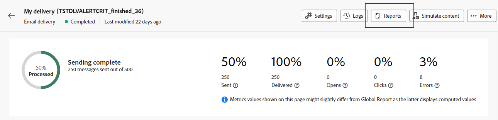

# 동적 보고서 시작 {#about-dynamic-reports}

Dynamic Reporting은 완전히 맞춤화가 가능한 실시간 보고서를 제공합니다. 프로필 데이터에 대한 액세스를 추가하여 열기 및 클릭과 같은 실용적인 이메일 캠페인 데이터 외에도 성별, 도시 및 연령 등의 프로필 차원별 인구 통계 분석을 활성화합니다. 드래그 앤 드롭 인터페이스에서 데이터를 탐색하고, 가장 중요한 고객 세그먼트에 대한 이메일 캠페인의 성과를 확인하고 수신자에게 미치는 영향을 측정할 수 있습니다.

## 동적 보고서 액세스 {#accessing-dynamic-reports}

보고서는 각 캠페인 및 게재에서 다음을 클릭하여 액세스할 수 있습니다. **보고서**. 에 리디렉션됨을 알리는 팝업 창이 나타납니다. **동적 보고서** 새 브라우저 탭의 페이지입니다.

특정 보고서는 정보를 수집하고 처리하는 데 걸리는 시간에 따라 배달 후 즉시 사용할 수 없습니다.

동적 보고서는 다음 두 가지 범주로 나뉩니다.

* **템플릿**, 다음을 사용하여 복사하여 수정할 수 있음 **다른 이름으로 저장** 옵션(**프로젝트 > 다른 이름으로 저장..**)을 클릭하여 제품에서 사용할 수 있습니다.
* **사용자 정의 보고서** (파란색으로 표시됨) - 다음을 클릭하여 직접 만들 수 있음 **새 프로젝트 만들기** 단추 **보고서** 홈 페이지입니다.

