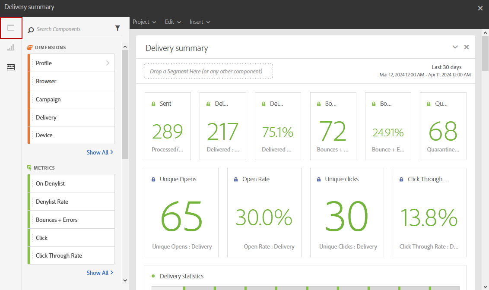

# 패널 추가{#adding-panels}

## 빈 패널 추가 {#adding-a-blank-panel}

보고서를 시작하려면 기본 제공 또는 사용자 지정 보고서에 패널 세트를 추가할 수 있습니다. 각 패널에는 다양한 데이터 세트가 포함되어 있으며 자유 형식 테이블 및 시각화로 구성됩니다.

이 패널을 통해 필요에 따라 보고서를 작성할 수 있습니다. 보고서에 원하는 만큼 패널을 추가하여 데이터를 다양한 기간으로 필터링할 수 있습니다.

1. 다음을 클릭합니다. **패널** 아이콘. 패널을 추가하려면 **삽입 탭** 및 선택 **새 빈 패널**.

   

1. 을(를) 끌어다 놓습니다. **빈 패널** 을 클릭하여 대시보드에 넣습니다.

   

이제 자유 형식 테이블을 패널에 추가하여 데이터 타깃팅을 시작할 수 있습니다.

## 자유 형식 테이블 추가 {#adding-a-freeform-table}

자유 형식 테이블을 사용하면 다음에서 사용할 수 있는 다양한 지표 및 차원을 사용하여 데이터를 분석하는 테이블을 만들 수 있습니다. **구성 요소** 테이블.

각 테이블 및 시각화는 크기가 변경될 수 있으며, 보고서를 더 잘 사용자 지정하기 위해 이동할 수 있습니다.

1. 다음을 클릭합니다. **[!UICONTROL 패널]** 아이콘.

   

1. 을(를) 끌어다 놓습니다. **[!UICONTROL 자유 형식]** 항목을 대시보드에 넣습니다.

   다음을 클릭하여 테이블을 추가할 수도 있습니다. **[!UICONTROL 삽입]** 탭 및 선택 **[!UICONTROL 새 자유 형식]** 또는 를 클릭하여 **[!UICONTROL 자유 형식 테이블 추가]** 을 클릭합니다.

   

1. 다음에서 **[!UICONTROL 여기에 세그먼트 놓기]** 필드, 추가 **[!UICONTROL 세그먼트]** 다음에서 **[!UICONTROL 구성 요소]** 상단 표시줄에 탭합니다.

   

1. 에서 항목 드래그 앤 드롭 **[!UICONTROL 구성 요소]** 을 열과 행에 탭하여 표를 작성합니다.

   

1. 다음을 클릭합니다. **[!UICONTROL 설정]** 열에 데이터가 표시되는 방식을 변경하는 아이콘입니다.

   

   다음 **[!UICONTROL 열 설정]** 는 다음으로 구성됩니다.

   * **[!UICONTROL 숫자]**: 열에서 요약 번호를 표시하거나 숨길 수 있습니다.
   * **[!UICONTROL 백분율]**: 열에서 비율을 표시하거나 숨길 수 있습니다.
   * **[!UICONTROL 0을 값 없음으로 해석]**: 값이 0일 때 표시하거나 숨길 수 있습니다.
   * **[!UICONTROL 배경]**: 셀에서 가로 진행률 표시줄을 표시하거나 숨길 수 있습니다.
   * **[!UICONTROL 재시도 포함]**: 결과에 재시도를 포함할 수 있습니다. 다음에만 사용할 수 있습니다. **[!UICONTROL 전송됨]** 및 **[!UICONTROL 바운스 + 오류]**.

1. 하나 이상의 행을 선택하고 **[!UICONTROL 시각화]** 아이콘. 선택한 행을 반영하도록 시각화가 추가됩니다.

   

이제 필요한 만큼 구성 요소를 추가하고 시각화를 추가하여 데이터를 그래픽으로 표시할 수도 있습니다.
