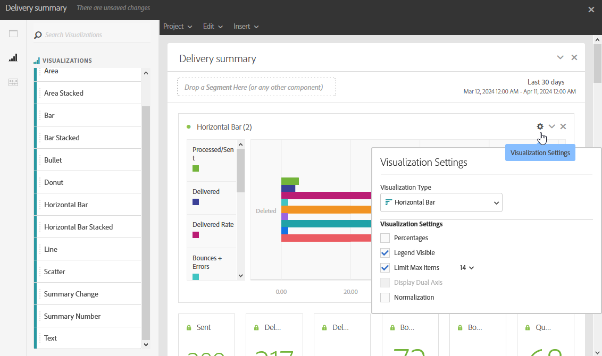

# 시각화 추가{#adding-visualizations}

**시각화** 탭을 사용하여 영역, 도넛 및 그래프와 같은 시각화 항목을 끌어서 놓을 수 있습니다. 시각화는 데이터를 그래픽으로 표시합니다.

1. **[!UICONTROL 시각화]** 탭에서 시각화 항목을 패널로 끌어서 놓습니다.

   

1. 시각화를 패널에 추가하면 다이내믹 보고서가 자유 형식 테이블의 데이터를 자동으로 검색합니다. 시각화에 대한 설정을 선택합니다.
1. 자유 형식 테이블이 두 개 이상인 경우 **데이터 Source 설정** 창에서 그래프에 추가할 사용 가능한 데이터 원본을 선택하십시오. 이 창은 시각화 제목 옆에 있는 색상이 지정된 점을 클릭해도 사용할 수 있습니다.

   

1. 그래프 유형 또는 표시되는 내용을 직접 변경하려면 **[!UICONTROL 시각화]** 설정 단추를 클릭하십시오. 예:

   * **백분율**: 값을 백분율로 표시합니다.
   * **Y축을 0에 고정**: 값이 0보다 큰 경우에도 y축을 0으로 강제 적용합니다.
   * **범례 표시**: 범례를 숨길 수 있습니다.
   * **정규화**: 값을 강제로 일치시킵니다.
   * **이중 축 표시**: 그래프에 다른 축을 추가합니다.
   * **최대 항목 수 제한**: 표시되는 그래프 수를 제한합니다.
   * **임계값**: 그래프에 임계값을 설정할 수 있습니다. 검은색 점선으로 표시됩니다.

   

이 시각화를 사용하면 보고서에서 데이터를 더 명확하게 볼 수 있습니다.
