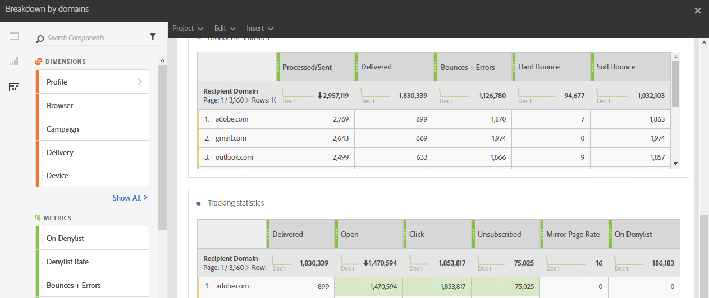

# 도메인별 분류{#breakdown-by-domains}

이 보고서에는 이메일 게재 대상자에 표시된 각 도메인의 성능 데이터가 포함됩니다. 캠페인 또는 프로그램 보고서인 경우, 여러 대상에 대해 성과 데이터를 사용할 수 있습니다. 이 데이터를 사용하면 특정 이벤트에 대한 반응으로 각 도메인의 동작을 분석할 수 있습니다. 예를 들어 링크 표시, URL on 차단 목록 등이 있습니다.

테이블 **브로드캐스트 통계**&#x200B;에는 다음과 같이 각 도메인에서 발생할 수 있는 오류에 대한 사용 가능한 데이터가 포함되어 있습니다.

* **처리됨/전송됨**: 전송된 전자 메일 수입니다.
* **배달됨**: 배달된 전자 메일 수입니다.
* **바운스 + 오류**: 배달할 수 없는 메시지 수입니다.
* **하드 바운스**: 잘못된 전자 메일 주소와 같은 총 영구 오류 수입니다.
* **소프트 바운스**: 전체 받은 편지함과 같은 총 임시 오류 수입니다.

두 번째 테이블인 **추적 통계**&#x200B;에는 다음과 같이 게재에 대한 수신자 반응성에 사용할 수 있는 데이터가 포함되어 있습니다.

* **배달됨**: 배달된 이메일 수
* **열기**: 게재 중 메시지가 열린 횟수입니다.
* **클릭**: 게재에서 콘텐츠를 클릭한 횟수입니다.
* **구독 취소됨**: 구독 링크를 클릭한 횟수.
* **미러 페이지**: 미러 페이지 링크를 클릭한 횟수.
* **차단 목록에 있는 받는 사람**: 스팸이나 정크라고 선언한 받는 사람의 수입니다.
