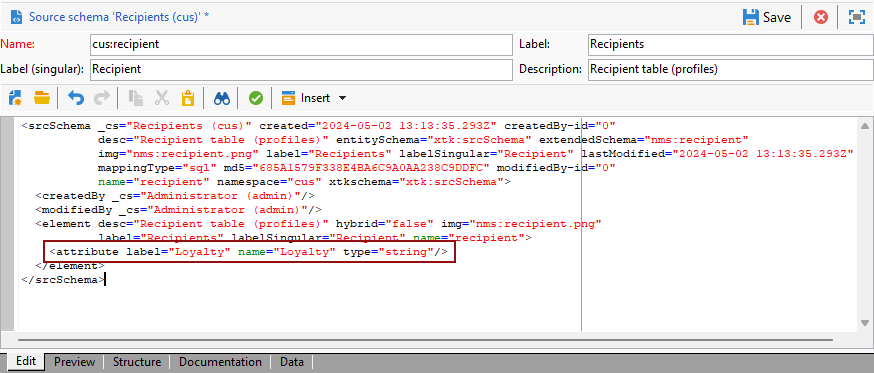

# 프로필 차원 만들기{#creating-a-custom-profile-dimension}

수신자 스키마 확장 중에 생성된 프로필 데이터를 기반으로 보고서를 만들고 관리할 수도 있습니다.

* [1단계: 수신자 스키마 확장](##extend-schema)
* [2단계: 새 사용자 정의 필드 연결](#link-custom)
* [3단계: 동적 보고서를 만들어 프로필 차원으로 수신자를 필터링합니다](#create-report)

## 1단계: 수신자 스키마 확장 {#extend-schema}

새 프로필 필드를 추가하려면 스키마를 확장해야 합니다. 아래 단계를 따르십시오.

1. 탐색기에서 **[!UICONTROL 관리]** > **[!UICONTROL 구성]** > **[!UICONTROL 데이터 스키마]** 폴더로 이동합니다.

   

1. 사용자 지정 수신자 스키마를 식별하고 선택합니다. 기본 제공 nms:recipient 스키마를 아직 확장하지 않은 경우 [이 프로시저](https://experienceleague.adobe.com/en/docs/campaign/campaign-v8/developer/shemas-forms/extend-schema)를 참조하세요.

1. 스키마 편집기에 사용자 정의 필드를 추가합니다.

   예를 들어 수신자 스키마에 충성도 사용자 정의 필드를 추가하려면:

   ```
   <attribute label="Loyalty" name="loyalty" type="string"/>
   ```

   

1. **[!UICONTROL 저장]**&#x200B;을 클릭합니다.

1. 그런 다음 사용자 정의 broadLogRcp 스키마를 식별하고 선택합니다. 기본 제공 게재 로그 스키마를 아직 확장하지 않은 경우 [이 절차](https://experienceleague.adobe.com/en/docs/campaign/campaign-v8/developer/shemas-forms/extend-schema)를 참조하세요.

1. 스키마 편집기에 수신자 스키마와 동일한 사용자 지정 필드를 추가합니다.

   

1. **[!UICONTROL 저장]**&#x200B;을 클릭합니다.

1. 스키마에 수정 사항을 적용하려면 **[!UICONTROL 도구]** > **[!UICONTROL 고급]** > **[!UICONTROL 데이터베이스 구조 업데이트]**&#x200B;를 통해 데이터베이스 업데이트 마법사를 시작하고 데이터베이스 구조 업데이트를 실행하십시오. [자세히 알아보기](https://experienceleague.adobe.com/en/docs/campaign/campaign-v8/developer/shemas-forms/update-database-structure)

   

이제 수신자가 새 프로필 필드를 사용하고 선택할 준비가 되었습니다.

## 2단계: 새 사용자 정의 필드 연결 {#link-custom}

>[!NOTE]
>
> 동적 보고서에 최대 20개의 사용자 지정 필드만 추가할 수 있습니다.

프로필 필드가 생성되었으므로 해당 동적 보고 차원에 연결해야 합니다.

프로필 필드로 로그를 확장하기 전에 PII 창이 동적 보고서에 PII 데이터를 보낼 수 있도록 허용되었는지 확인하십시오. 자세한 정보는 이 [페이지](pii-agreement.md)를 참조하십시오.

1. 탐색기에서 **[!UICONTROL 관리]** > **[!UICONTROL 구성]** > **[!UICONTROL 데이터 스키마]** > **[!UICONTROL 추가 보고 필드]** 폴더로 이동합니다.

   

1. 해당 동적 보고 차원을 만들려면 **[!UICONTROL 새로 만들기]**&#x200B;를 클릭합니다.

1. **[!UICONTROL 표현식 편집]**&#x200B;을(를) 선택하고 받는 사람 스키마를 검색하여 이전에 만든 프로필 필드를 찾으십시오.

   

1. **[!UICONTROL 마침을 클릭합니다]**.

1. 동적 보고에 표시되는 **[!UICONTROL 레이블]** 차원을 입력한 다음 **[!UICONTROL 저장]**&#x200B;을 클릭합니다.

   

이제 프로필 필드를 보고서에서 프로필 차원으로 사용할 수 있습니다. 프로필 차원을 삭제하려면 해당 차원을 선택하고 **[!UICONTROL 삭제]** 아이콘을 클릭합니다.

이제 수신자 스키마가 이 프로필 필드로 확장되고 사용자 지정 차원이 생성되었으므로 게재에서 수신자를 타겟팅할 수 있습니다.

## 3단계: 동적 보고서를 만들어 프로필 차원으로 수신자를 필터링합니다 {#create-report}

게재를 보낸 후 프로필 차원을 사용하여 보고서를 분류할 수 있습니다.

1. **[!UICONTROL 보고서]** 탭에서 기본 제공 보고서를 선택하거나 **[!UICONTROL 만들기]** 단추를 클릭하여 보고서를 처음부터 시작합니다.

   

1. **[!UICONTROL Dimension]** 카테고리에서 **[!UICONTROL 프로필]**&#x200B;을(를) 클릭한 다음 프로필 차원을 자유 형식 테이블로 끌어서 놓습니다.

   

1. 지표를 드래그하여 놓아 데이터 필터링을 시작합니다.

1. 필요한 경우 작업 공간에 시각화를 끌어서 놓습니다.

