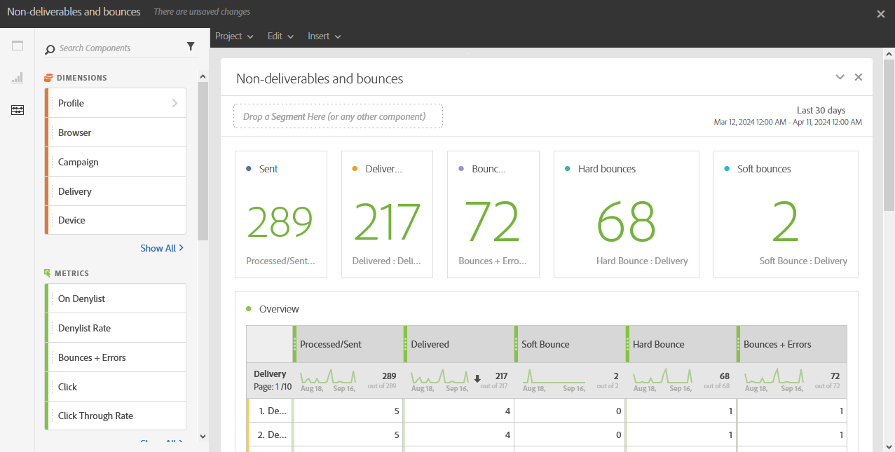

# 비게재 항목 및 바운스{#non-deliverables-and-bounces}

**[!UICONTROL 게재 불가 및 바운스 수]** 보고서는 게재 중 발생한 모든 오류에 대한 세부 정보를 제공합니다.

**[!UICONTROL 개요]** 표에는 다음과 같이 각 게재에 대해 발생할 수 있는 오류에 대해 사용할 수 있는 데이터가 포함되어 있습니다.

* **처리됨/전송됨**: 전송된 전자 메일 수입니다.
* **배달됨**: 배달된 전자 메일 수입니다.
* **소프트 바운스**: 전체 받은 편지함과 같은 총 임시 오류 수입니다.
* **하드 바운스**: 잘못된 전자 메일 주소와 같은 총 영구 오류 수입니다.
* **바운스 + 오류**: 배달할 수 없는 메시지 수입니다.

**도메인별 분류** 표에는 수신자의 도메인별 바운스 수가 나열되어 있습니다.
