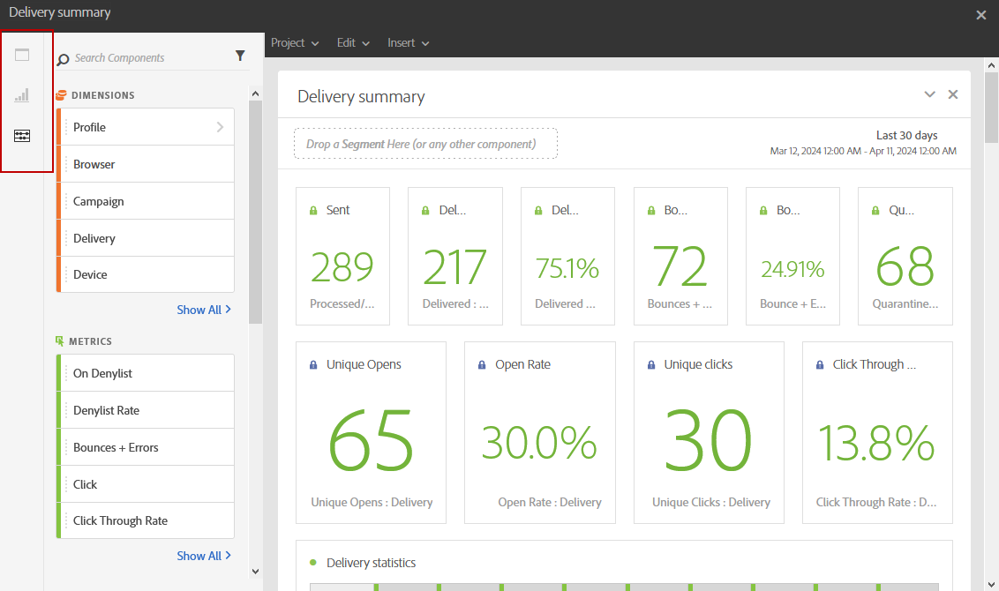
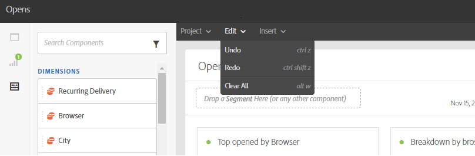

# 보고 인터페이스{#reporting-interface}

예를 들어, 상단 도구 모음을 사용하여 보고서를 수정, 저장 또는 인쇄할 수 있습니다.

**프로젝트** 탭을 사용하여 다음을 수행할 수 있습니다.

* **열기...**: 이전에 만든 보고서나 템플릿을 엽니다.
* **다른 이름으로 저장...**: 템플릿을 복제하여 수정할 수 있습니다.
* **프로젝트 새로 고침**: 새 데이터 및 필터 변경 사항을 기반으로 보고서를 업데이트합니다.
* **CSV 다운로드**: 보고서를 CSV 파일로 내보냅니다.

**편집** 탭에서는 다음 작업을 수행할 수 있습니다.

* **실행 취소**: 대시보드에서 마지막 작업을 취소합니다.
* **모두 지우기**: 대시보드의 모든 패널을 삭제합니다.

**삽입** 테이블을 사용하면 대시보드에 그래프 및 표를 추가하여 보고서를 사용자 지정할 수 있습니다.

* **새 빈 패널**: 대시보드에 새 빈 패널을 추가합니다.
* **새 자유 형식**: 대시보드에 새 자유 형식 테이블을 추가합니다.
* **새 줄**: 대시보드에 새 줄 그래프를 추가합니다.
* **새 막대**: 대시보드에 새 막대 그래프를 추가합니다.

**관련 항목:**

* [패널 추가](adding-panels.md)
* [시각화 추가](adding-visualizations.md)
* [구성 요소 추가](adding-components.md)

## 탭 {#tabs}

왼쪽 탭을 사용하여 보고서를 작성하고 필요에 따라 데이터를 필터링할 수 있습니다.

이 탭에서는 다음 항목에 액세스할 수 있습니다.

* **[!UICONTROL 패널]**: 데이터 필터링을 시작하려면 보고서에 빈 패널 또는 자유 형식을 추가하십시오. 자세한 내용은 패널 추가 섹션을 참조하십시오
* **[!UICONTROL 시각화]**: 선택한 시각화 항목을 끌어다 놓아 보고서에 그래픽 차원을 제공합니다. 자세한 내용은 시각화 추가 섹션을 참조하십시오.
* **[!UICONTROL 구성 요소]**: 다양한 차원, 지표, 세그먼트 및 기간을 사용하여 보고서를 사용자 지정합니다.

## 도구 모음 {#toolbar}

도구 모음은 작업 영역 위에 있습니다. 서로 다른 탭으로 구성된 이 탭에서는 보고서를 수정, 저장, 공유 또는 인쇄할 수 있습니다.

**관련 항목:**

* [패널 추가](adding-panels.md)
* [시각화 추가](adding-visualizations.md)
* [구성 요소 추가](adding-components.md)

### 프로젝트 탭 {#project-tab}

**프로젝트** 탭을 사용하여 다음을 수행할 수 있습니다.

* **열기...**: 이전에 만든 보고서나 템플릿을 엽니다.
* **다른 이름으로 저장...**: 템플릿을 복제하여 수정할 수 있습니다.
* **프로젝트 새로 고침**: 새 데이터 및 필터 변경 사항을 기반으로 보고서를 업데이트합니다.
* **CSV 다운로드**: 보고서를 CSV 파일로 내보냅니다.
* **[!UICONTROL 인쇄]**: 보고서를 인쇄합니다.

### 편집 탭 {#edit-tab}

**편집** 탭에서는 다음 작업을 수행할 수 있습니다.

* **실행 취소**: 대시보드에서 마지막 작업을 취소합니다.
* **모두 지우기**: 대시보드의 모든 패널을 삭제합니다.

### 삽입 탭 {#insert-tab}

**삽입** 탭에서는 그래프와 표를 대시보드에 추가하여 보고서를 사용자 지정할 수 있습니다.

* **새 빈 패널**: 대시보드에 새 빈 패널을 추가합니다.
* **새 자유 형식**: 대시보드에 새 자유 형식 테이블을 추가합니다.
* **새 줄**: 대시보드에 새 줄 그래프를 추가합니다.
* **새 막대**: 대시보드에 새 막대 그래프를 추가합니다.
