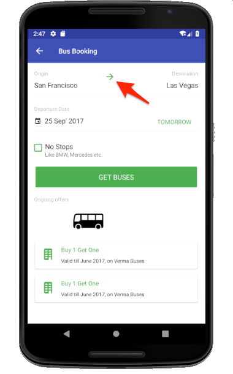

# Adobe Analytics 추가

이 단원에서는 앱에서 Adobe Analytics 추적을 활성화합니다.

[Adobe Analytics](https://docs.adobe.com/content/help/en/analytics/landing/home.html)는 고객 인텔리전스로 고객을 사람으로 이해하고 고객 인텔리전스로 비즈니스를 이끌어 나갈 수 있는 업계 선도적인 솔루션입니다.

익스텐션 [추가](launch-add-extensions.md) 및 [Mobile SDK](launch-install-the-mobile-sdk.md) 설치 수업에서 Adobe Analytics 익스텐션을 Launch 속성에 추가하고 샘플 애플리케이션으로 가져왔습니다.  이제 앱에서 상태와 동작을 추적하기 위해 코드를 추가하면 됩니다.

## 학습 목표

이 단원을 마치면 다음을 수행할 수 있습니다.

* 라이프사이클 지표가 Adobe Analytics로 전송되는지 확인
* 추가 데이터를 사용하여 앱의 상태를 추적하는 코드 추가
* 코드를 추가하여 추가 데이터를 사용하여 앱의 동작 추적

Launch에서 Analytics에 대해 구현할 수 있는 것은 많습니다. 이 단원에서는 앱에서의 구현에 필요한 주요 기술에 대해 간략하게 설명합니다.

## 전제 조건

You should have already completed the lessons in the [Configure Launch](launch-create-a-property.md) section. 이 섹션에서는 Analytics 확장을 추가하고 추적 서버 및 보고서 세트 ID를 구성했습니다.

## 라이프사이클 지표 및 Adobe Analytics

라이프사이클 지표는 Experience Platform Mobile SDK를 사용하여 앱에서 쉽게 활성화할 수 있는 환경 기반 지표 및 차원입니다.

속성에 코어 확장을 추가하고 인터페이스에 제공된 모바일 설치 지침을 따르면 라이프사이클 지표를 이미 활성화했습니다. 앱 버전, 참여 사용자 수, OS 버전, 시간 분할, 마지막 사용 이후 일 수 등과 같은 환경 및 앱별 지표를 비롯한 지표 및 차원. 앱의 분석에 매우 도움이 될 수 있습니다. 특히 모든 보고서에 적용할 Analytics 세그먼트를 만들 때 유용합니다. 지표의 전체 목록은 [문서에서](https://docs.adobe.com/content/help/en/mobile-services/android/metrics.htmlh)사용할 수 있습니다.

## ACPCore 라이브러리 가져오기

"Mobile SDK [설치"라는](launch-install-the-mobile-sdk.md)이전 단원에서 BusBookingActivity 파일에서 AdobeCore 라이브러리를 사용할 수 있도록 가져오기 문을 추가했습니다. 이 라이브러리는 이 단원의 활동에서 추가 API 호출에 사용됩니다. 다음 연습에서는 API를 사용하여 AdobeCore 라이브러리에 정의된 앱의 상태("trackState")와 작업("trackAction")을 추적합니다.  새로운 Experience Cloud Platform Mobile SDK에서 trackState 및 trackAction API가 Analytics 라이브러리에서 핵심 라이브러리로 이동되었으므로, Adobe Analytics 추적 이외의 목적으로 이러한 API를 활용할 수 있습니다.

## 상태 추적

앱에서 사용자에게 제공하는 다양한 컨텐츠 화면이 있을 수 있습니다. 웹 사이트의 페이지와 같습니다. Adobe Analytics에서는 이러한 "페이지 보기 히트"로 보내고 웹 속성에 사용된 것과 동일한 보고서에서 볼 수 있는 방법을 제공합니다. 이 메서드를 "trackState"라고 합니다.

이 자습서에서는 trackState 호출에 대한 코드를 앱의 한 화면(페이지)에만 삽입하게 됩니다. 실제로 앱의 다른 모든 화면/상태에 대해 이를 복제하게 됩니다.

다음은 이 자습서 또는 자신의 앱에서 복사하여 붙여넣을 수 있는 설명서의 구문과 코드 예입니다.

**구문:**

```java
public static void trackState(final String state, final Map<String, String> contextData)
```

**예:**

```java
HashMap cData = new HashMap<String, String>();
contextData.put("key", "value");
MobileCore.trackState("state name",contextData);
```

### 데이터 없이 상태 추적

1. Android Studio에서 샘플 앱을 열고 BusBookingActivity로 이동한 다음 아래쪽에서 onResume 함수로 스크롤합니다
1. trackState 메서드 호출 추가
1. "예약 화면" `state name` 으로 설정
1. 추가 데이터를 추가하는 대신 API 호출에서 자리 표시자로 추가합니다. `null`
1. 또는 다음을 복사하여 붙여 넣습니다.

   ```java
   MobileCore.trackState("Booking Screen", null);
   ```


**trackState의 유효성을 확인하려면**

1. 프로젝트 저장, 빌드 및 실행
1. 시뮬레이터가 실행되고 앱의 홈 화면이 열리면 Android Studio Logcat 디버깅 콘솔을 봅니다
1. 콘솔 검색 `pageName=Booking%20Screen`
1. pageName 변수는 %20을(를) 인코딩된 `Booking Screen` 공간으로 설정하고 다른 사용자 지정 데이터 쌍은 없습니다. 기술적으로 "페이지 이름"이 아닌 "상태 이름"을 설정하지만 사용된 매개 변수 이름은 웹 사이트 구현과 일관성을 제공하기 `pageName` 위한 것입니다.

   

### 데이터를 사용하여 상태 추적

1. BusBookingActivity로 돌아가서 기존 가져오기 아래의 파일 맨 위에 가져오기를 추가합니다. `import java.util.HashMap;`
1. 함수에서 마지막 `onResume()` 연습에서 기본 trackState 호출을 주석 처리(또는 삭제)합니다.
1. 이번에는 HashMap을 만들고 이름을 지정하고, 일부 키/값 쌍을 포함하도록 "put" 명령을 사용한 다음, trackState 호출에서 해당 HashMap을 호출하여 데이터를 사용하여 새 trackState 메서드 호출을 추가합니다
1. "예약 화면" `state name` 으로 두십시오.
1. 복사 및 붙여넣기:

   ```java
   HashMap cData = new HashMap<String, String>();
   cData.put("cd.section", "Bus Booking");
   cData.put("cd.subSection", "Booking");
   cData.put("cd.conversionType", "Landing");
   MobileCore.trackState("Booking Screen", cData);
   ```

   

**데이터를 사용하여 trackState의 유효성을 확인하려면**

1. 프로젝트를 다시 저장, 빌드 및 실행
1. 시뮬레이터가 실행되고 앱의 홈 화면이 열리면 Android Studio Logcat 디버깅 콘솔을 봅니다
1. 코드에 입력한 키 `subSection` 또는 값 검색
1. 이제 설정할 pageName 외에도 히트에서 전송된 키/값 쌍도 있습니다

   

>[!NOTE] Analytics의 "prop 및 eVar"에 익숙한 경우 이러한 변수 이름이 SDK에 없는 것을 확인할 수 있습니다. SDK에서 오는 모든 키/값 데이터는 [contextData 변수로](https://docs.adobe.com/content/help/en/analytics/implementation/javascript-implementation/variables-analytics-reporting/context-data-variables.html)전송되며, 따라서 Analytics UI의 처리 규칙을 사용하여 prop 또는 eVar(또는 기타 변수) [에](https://docs.adobe.com/content/help/en/analytics/admin/admin-tools/processing-rules/processing-rules.html) 매핑해야 합니다.

## 동작 추적

웹 사이트에서 페이지 로딩이 아닌 작업을 추적하는 것과 마찬가지로 사용자가 앱에서 수행하는 작업(예: 다른 화면을 로드하지 않는 클릭)을 추적하려는 경우가 많습니다. 이 메서드는 호출된다는 점을 제외하고 위에서 사용한 trackState와 매우 유사하게 `trackAction`처리됩니다.

다음은 구문과 설명서의 코드 예입니다.

**구문:**

```java
public static void trackAction(final String action, final Map<String, String> contextData) data;
```

**예:**

```java
HashMap<String, String> contextData = new HashMap<String, String>();
contextData.put("key", "value");
MobileCore.trackAction("action taken", contextData);
```

### 대상 전환기를 사용한 상호 작용 추적

이 샘플 버스 예약 앱에서 두 값 사이의 화살표를 클릭하여 원본 도시를 대상 시로 전환할 수 있습니다. Adobe Analytics에서 이 기능과의 상호 작용을 추적하기로 결정했습니다.



이 전환기는 샘플 프로젝트의 BusBookingActivity 파일에서 제어됩니다. 이 연습에서는 사람들이 클릭할 때마다 trackAction 히트를 보냅니다.

#### trackAction 코드를 추가하려면

1. Android Studio에서 샘플 프로젝트를 열고 BusBookingActivity로 이동합니다.
1. "mBtnFlip.setOnClickListener" 함수를 57행에서 또는 그 주변에서 찾습니다.
1. 필요한 경우 함수를 확장하여 모든 코드를 볼 수 있습니다
1. onClick 함수의 호출에서 `flipSourceDesti()``trackAction()` 호출을 추가합니다.
1. 작업 이름을 "Flip Destination"으로 설정하고 contextData 매개 변수에 대해 "null"을 추가합니다(이번에는 추가 정보를 보낼 필요가 없습니다).
1. 다음 코드를 복사하여 붙여넣을 수 있습니다

   ```java
   MobileCore.trackAction("Flip Destination", null);
   ```

이제 함수가 다음과 같이 표시됩니다.


#### trackAction 코드의 유효성을 검사하려면

1. 코드를 추가한 후 프로젝트를 저장하고 실행 및 빌드합니다
1. 가비지 아이콘을 클릭하여 Logcat 콘솔을 지웁니다
1. 시뮬레이터에서 대상 전환기 화살표를 클릭하면 콘솔에 새 요청이 표시됩니다.
1. Logcat `Flip%20Destination` 에서 검색
1. 작업 및 pev2 매개 변수 Flip%20Destination(인코딩된 공간 포함) 모두
1. trackAction에 의해 트리거된 "사용자 지정 링크" 히트임을 보여주는 동일한 줄의 `pe=lnk_o` 키/값을 확인합니다.

   <!---->

잘했어! Analytics 단원을 완료했습니다. 물론 Adobe Analytics 구현을 향상시키기 위해 할 수 있는 다른 많은 기능이 있지만 이를 통해 나머지 요구 사항을 해결하는 데 필요한 핵심 기술이 제공될 것입니다.

## trackState 및 trackAction의 추가 혜택

이러한 마지막 연습에서는 trackState 및 trackAction API를 사용하여 앱의 데이터를 Adobe Analytics로 전송할 수 있었습니다. Experience Platform Mobile SDK는 Launch에 포함되어 있으므로 방금 추가한 코드를 활용하는 Launch 인터페이스에서 더 많은 작업을 수행할 수 있습니다.

Launch에서는 trackState 및 trackAction API에 의해 트리거된 규칙을 만들고, 다른 Adobe 솔루션 또는 외부 파트너에 요청하는 것과 같은 추가 작업을 수행하도록 할 수 있습니다.

[다음 "Adobe Audience Manager 추가" &gt;](audience-manager.md)
