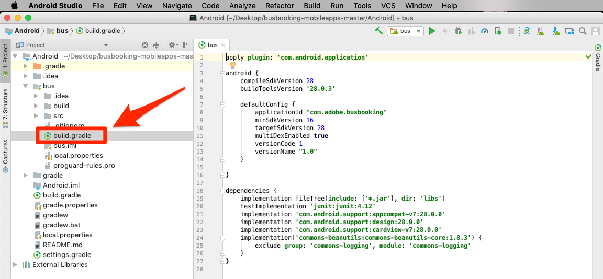
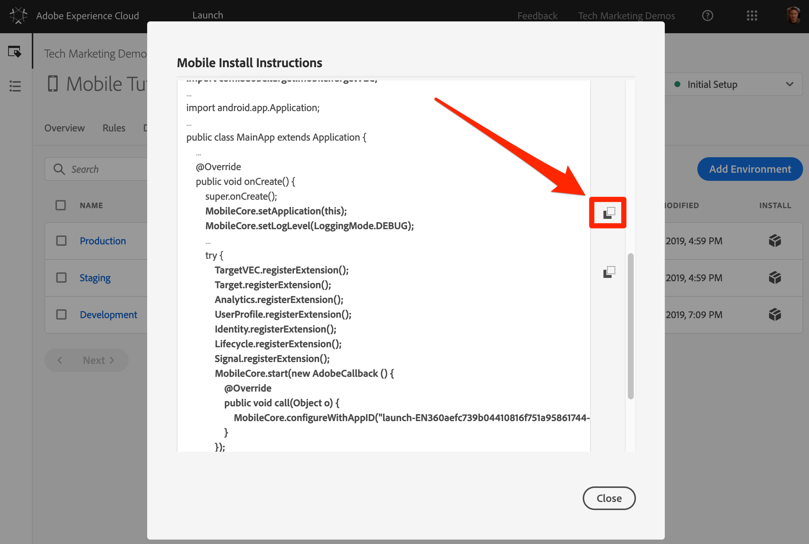

# Mobile SDK 설치

이 단원에서는 Launch 속성의 개발 환경에 해당하는 확장 및 설정과 함께 Mobile SDK를 구현합니다.

## 전제 조건

이 단원에서는 버스 예약 앱에 코드를 추가하기 시작하므로 아직 코드를 추가하지 않은 경우 다음을 수행합니다.

1. Android Studio 다운로드 및 [설치](https://developer.android.com/studio)
1. 버스 [예약 앱 다운로드](https://github.com/Adobe-Marketing-Cloud/busbooking-mobileapps)

## 학습 목표

이 단원을 마치면 다음을 수행할 수 있습니다.

* 모바일 Launch 속성에 대한 설치 지침을 얻습니다.
* 개발, 스테이징 및 프로덕션 환경의 차이점 이해
* Mobile SDK를 추가하려면 `build.gradle` 파일을 업데이트하십시오.
* Mobile SDK를 앱으로 가져오기
* SDK가 성공적으로 구현되었는지 확인
* 앱에서 라이프사이클 지표 활성화

## 설치 지침 다운로드

모바일 시작을 위한 설치 지침은 모바일 앱의 특정 위치에 추가하는 코드 조각 모음입니다.

위쪽 탐색의 `Environments` 탭을 클릭하여 환경 페이지로 이동합니다. 개발, 스테이징 및 프로덕션 환경은 미리 만들어져 있습니다. 이는 코드 개발 및 릴리스 프로세스의 일반적인 환경에 해당합니다. 코드는 개발 환경에서 개발자가 처음 작성합니다. 개발자가 코드 작업을 마치면 QA 및 다른 팀이 검토할 수 있도록 스테이징 환경으로 보냅니다. QA와 다른 팀이 만족하면 코드가 프로덕션 환경에 게시됩니다. 프로덕션 환경은 방문자가 앱을 다운로드할 때 경험하는 공개 환경입니다.

Launch는 여러 개발자가 동시에 서로 다른 프로젝트에서 작업하고 있는 대규모 조직에서 유용한 추가 개발 환경을 제공합니다.

개발, 스테이징 및 프로덕션은 튜토리얼을 완료하는 데 필요한 유일한 환경입니다.


개발 **[!UICONTROL 행에서]** 설치 아이콘 설치 아이콘을  모달을 엽니다.


단계별 지침을 살펴보죠.

## build.gradle 파일 업데이트

이전에 웹 사이트에서 Launch를 사용한 적이 있는 경우, 가장 먼저 눈에 띄는 것은 웹 사이트보다 모바일 앱에 대한 설치 지침이 더 많다는 것입니다.

Android용 Adobe Mobile SDK 파섹 우선 Adobe Mobile SDK 종속성을 버스 예약 앱의 build.gradle 파일에 추가하는 것이 좋습니다.

**build.gradle 파일을 업데이트하려면**

1. Android Studio 열기
1. "기존 Android Studio 프로젝트 열기"를 선택합니다.

   

1. Bus Booking Android 폴더의 루트에서 build.gradle 파일을 엽니다.

   

1. 드롭다운을 열고 프로젝트 보기로 전환

   

1. Android &gt; **버스 &gt; build.gradle** 파일 열기

   

1. 시작 인터페이스에서 운영 체제가 `Android`

1. 복사 아이콘을 클릭하여 클립보드에 종속성을 

   

1. Android Studio에서 기존 종속성 바로 뒤에 클립보드의 종속성을 붙여 넣습니다(닫기 전 `}`).
1. 또한 Adobe Target VEC 확장을 설치하는 경우 다음 종속성을 추가해야 합니다.

   ```java
   implementation 'com.google.code.gson:gson:2.8.2'
   implementation 'android.arch.lifecycle:extensions:1.1.1'
   implementation 'io.github.sac:SocketclusterClientJava:1.7.5'
   implementation 'com.android.support:support-annotations:28.0.0'
   implementation 'com.android.support:support-compat:28.0.0'
   implementation 'com.android.support:design:28.0.0'
   ```

1. "지금 동기화" 링크를 클릭하여 프로젝트를 동기화합니다.

   

## 애플리케이션 업데이트

이제 앱을 업데이트하여 SDK를 가져올 때입니다

**SDK를 가져오려면**

1. Android &gt; 버스 &gt; src &gt; **main &gt; java &gt; com.adobe.busbooking &gt; DemoApplication에 있는 Bus Booking 앱에서 Main Application 파일을 엽니다.**

   

1. 론치 인터페이스에서 초기화 코드 **[!UICONTROL 추가 섹션으로]** 스크롤합니다.
1. 초기화 코드 추가 섹션에서 첫 번째  아이콘을 클릭하여 **[!UICONTROL 가져오기 문을 복사합니다]** .

   

1. Android Studio에서 이러한 가져오기 문을 ** `DemoApplication` 파일에서 기존 가져오기 전에 붙여 넣습니다. 코어 익스텐션에는 콜백, ID 서비스, 라이프사이클 지표 및 다른 기능 간의 콘솔 로깅을 지원하는 라이브러리가 포함되어 있습니다.

   

1. 론치 인터페이스에서 초기화 코드 추가 섹션에서 두 번째  아이콘을 클릭하여 코어 확장명과 관련된 두 **[!UICONTROL 줄을]** 복사합니다. 두 번째 줄은 콘솔 로깅 문을 설정합니다(사용 가능한 옵션은 "DEBUG", "VERBOSE", "WARNING" 및 "ERROR").

   

1. Android Studio에서 다음 Core 문을 `DemoApplication` 파일에 바로 붙여넣습니다 `super.onCreate()`
1. 및 `//` 줄 앞에 `try` `catch` 있는 주석 제거

   

1. Launch 인터페이스에서 Add Initialization Code  Copy [!UICONTROL 아이콘을 클릭하여 확장] 문을 복사합니다.

   

1. Android Studio에서 이러한 확장 문을 `try` 섹션에 붙여 넣습니다. 속성의 Launch 개발 환경의 식별자가 `MobileCore.configureWithAppID` 포함되어 있습니다. 프로덕션 환경에 앱을 배포할 준비가 되면 이 값을 업데이트해야 하므로 이 값이 중요합니다.

   

>[!NOTE] Launch 인터페이스에 제공된 모바일 설치 지침에는 Identity, Lifecycle 및 Signal 확장명에 대한 가져오기 및 등록 문과 Lifecycle 지표의 초기화가 포함됩니다. 이러한 익스텐션은 Mobile Core 익스텐션의 일부로 간주됩니다. 앱에서 이러한 익스텐션을 사용하지 않으려면 이러한 익스텐션과 관련된 다른 코드를 가져오거나 등록하거나 구현할 필요가 없습니다.
>
> 또한 이러한 확장을 사용할 때 고려해야 하는 추가 구현 옵션이 있습니다(예: 사용자 배경이 앱을 미리 그라운드에 있을 때 라이프사이클 수집을 일시 중지/다시 시작할 수 있습니다). Mobile Core 확장 설명서에서 자세한 내용을 [살펴볼 수 있습니다](https://aep-sdks.gitbook.io/docs/using-mobile-extensions/mobile-core)

## 구현 확인

1. Android Studio 프로젝트 저장
1. 앱을 실행하고 에뮬레이터에서 실행합니다. 에뮬레이터 장치가 구성되지 않은 경우 지금 에뮬레이터를 구성하되 Android 4.1(API 16) 이상을 실행하는 장치를 구성해야 합니다.

   

1. 에뮬레이터가 실행될 때까지 기다렸다가 앱을 예약 화면으로 완전히 엽니다(몇 분 정도 걸릴 수 있음)

   

1. Android Studio Logcat에서 Adobe 서버에 대한 호출이 수행되는지 확인

   

다음은 찾을 수 있는 몇 가지 특정 호출의 예입니다.

1. **론치 구성을** 검색하기 위한 호출(다음으로 Logcat 필터링) `adobedtm.com`. 이전 단원에서 입력한 익스텐션 구성을 확인하십시오. 익스텐션을 추가하려면 앱에 업데이트가 필요합니다. 이러한 설정은 Launch에서 외부에서 관리되고 언제든지 변경할 수 있습니다.

   ```java
   03-14 16:30:29.484 24869-24930/com.adobe.busbooking D/ADBMobile: ConfigurationExtension - Cached configuration loaded.
    {"target.propertyToken":"","target.timeout":5,"global.privacy":"optedin","analytics.backdatePreviousSessionInfo":true,"analytics.offlineEnabled":true,"build.environment":"dev","rules.url":"https://assets.adobedtm.com/launch-EN360aefc739b04410816f751a95861744-development-rules.zip","experienceCloud.org":"7ABB3E6A5A7491460A495D61@AdobeOrg","target.clientCode":"techmarketingdemos","target.autoFetch":true,"target.fetchBackground":false,"lifecycle.sessionTimeout":300,"target.environmentId":"busbookingapp","analytics.server":"tmd.sc.omtrdc.net","analytics.rsids":"tmd-mobile-dev1","analytics.batchLimit":0,"property.id":"PRb4881271498b4f2cbaf67d38a8f3891a","global.ssl":true,"analytics.aamForwardingEnabled":true}
   ```

1. **ID 서비스에** 요청(다음으로 로그인 필터링) `IdentityExtension`이 예에서는 ID(`d_mid`)가 이미 설정되었으며 다시 보고되고 있습니다.

   ```java
   03-14 17:01:18.526 7743-7803/com.adobe.busbooking D/ADBMobile: IdentityExtension - Sending request (https://dpm.demdex.net/id?d_mid=59651426340521082405908216148091920022&d_ver=2&d_orgid=7ABB3E6A5A7491460A495D61%40AdobeOrg)
   ```

1. **Analytics 요청** (Logcat를 필터링하여 `AnalyticsExtension`)

   ```java
   03-14 17:01:18.509 7743-7777/com.adobe.busbooking D/ADBMobile: AnalyticsExtension - Sending Analytics ID call (https://tmd.sc.omtrdc.net/id?mcorgid=7ABB3E6A5A7491460A495D61%40AdobeOrg&mid=59651426340521082405908216148091920022)
   ```

축하합니다. 모바일 앱에 SDK를 추가했습니다.

## 앱에서 라이프사이클 지표 활성화

라이프사이클 지표는 Experience Platform Mobile SDK를 사용하여 앱에서 쉽게 활성화할 수 있는 환경 기반 지표 및 차원입니다. 여러 Experience Cloud 솔루션에서 사용할 수 있으므로 개별 솔루션으로 더 깊이 자리매김하기 전에 여기에서 사용할 수 있습니다. 이는 정확한 위치에서 앱에 몇 줄의 코드를 추가하는 것만큼 간단합니다.

### BusBookingActivity 파일로 코어 라이브러리 가져오기

Adobe Experience Platform Mobile SDK 파섹 이 경우 라이프사이클 API 호출을 활용하려면 핵심 라이브러리를 가져와야 합니다.

1. Android Studio에서 앱을 열고 작업 중인 DemoApplication 파일과 동일한 디렉토리에 있는 BusBookingActivity 파일을 엽니다.
1. 파일 맨 위에 연결된 API 호출을 사용할 수 있도록 다음 MobileCore import 문을 추가합니다
   `import com.adobe.marketing.mobile.MobileCore;`


### 라이프사이클 코드 추가

이제 라이프사이클 함수를 트리거하기 위해 앱의 기본 onResume() 함수에 라이프사이클 코드를 추가합니다.

1. BusBookingActivity 파일을 엽니다.
1. 파일 아래쪽으로 스크롤하여 onResume() 함수를 찾습니다.
1. 줄 아래에 다음 두 줄의 코드를 추가합니다. `super.onResume()`

   ```java
    MobileCore.setApplication(getApplication());
    MobileCore.lifecycleStart(null);
   ```


### 라이프사이클 히트 유효성 확인

이제 앱을 실행할 때 Android Studio의 디버그 섹션에서 라이프사이클 메시지를 하나 이상 받아야 합니다.

1. 빌드를 실행하고 시뮬레이터를 선택하여 앱을 실행합니다.
1. 시뮬레이터가 작동되고 실행 중이면 Android Studio에서 디버거의 "실행" 섹션을 클릭합니다
1. 검색 `internalaction=Lifecycle`
1. 이 키/값 쌍과 다른 라이프사이클 지표가 포함된 라인이 있는지 확인하십시오.

표시되는 줄은 실제로 라이프사이클 지표가 있는 Analytics 호출입니다.


[다음 "Adobe Experience Platform ID 서비스 추가" &gt;](id-service.md)