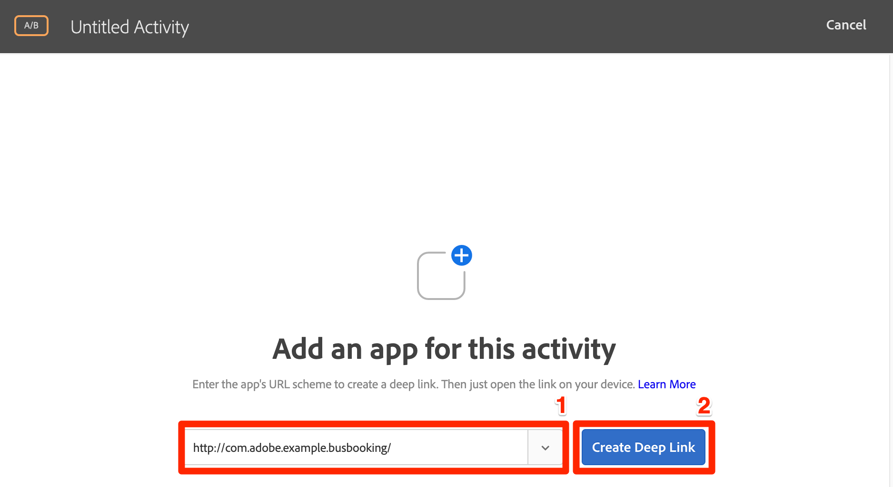
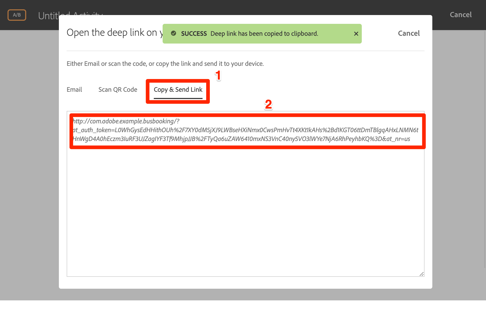

# Adobe Target의 VEC(Visual Experience Composer) 추가

이 단원에서는 모바일 앱용 VEC(Target Visual Experience Composer)를 활성화합니다.

[Adobe](https://docs.adobe.com/content/help/en/target/using/target-home.html) Target은 고객의 경험을 맞춤화 및 개인화하여 웹 및 모바일 사이트, 앱, 소셜 미디어 및 기타 디지털 채널에서 매출을 극대화하는 데 필요한 모든 것을 제공하는 Adobe Experience Cloud 솔루션입니다.

기본 모바일 앱용 VEC(시각적 경험 작성기)를 사용하면 연속적인 개발 종속성 및 앱 릴리스 주기 없이 자체적인 방식으로 기본 모바일 앱에 대한 활동을 만들고 콘텐츠를 개인화할 수 있습니다.

익스텐션 [추가](launch-add-extensions.md)단원에서 Target VEC 익스텐션을 Launch 속성에 추가했습니다. Mobile SDK [설치 단원에서](launch-install-the-mobile-sdk.md) 익스텐션을 샘플 애플리케이션으로 가져왔습니다. Target의 모바일 시각적 경험 작성기에서 활동을 설정하려면 몇 가지 간단한 업데이트만 필요합니다.

>[!IMPORTANT] 모바일 애플리케이션에서 Target VEC를 사용하려면 Target 및 Target VEC Launch 확장 기능이 모두 필요합니다.

## 학습 목표

이 단원을 마치면 다음을 수행할 수 있습니다.

* Target VEC에 대한 샘플 앱 활성화
* Target VEC 요청에 매개 변수 추가
* VEC와 장치 연결
* VEC를 사용하여 활동 만들기

## 전제 조건

이 섹션의 학습 내용을 수료하려면 다음을 수행해야 합니다.

* 론치 구성 [섹션의 지침을](launch-create-a-property.md) 완료합니다.
* Adobe Target 인터페이스에 대한 승인자 수준 액세스 권한 부여

## 앱 로드 요청

Target VEC 확장을 구성할 때 선택한 설정 때문에 앱이 처음 로드되면 Target에서 "앱 로드" 요청을 실행합니다. 이 요청은 앱에 대해 만든 모든 Target VEC 활동을 프리페치합니다.

Android 스튜디오에서 Logcat을 "Target r"로 필터링하여 Target 요청 및 응답을 표시합니다. 애플리케이션 이름과 버전에 대한 매개 변수를 확인합니다. 사용자가 만드는 모든 Target VEC 활동은 이러한 속성에 자동으로 타깃팅됩니다.


## 매개 변수 추가

지난 연습에서 보듯이 앱 라이프사이클 지표는 Target VEC 요청에 매개 변수로 자동으로 포함됩니다. 사용자 지정 매개 변수를 요청에 전체적으로 또는 앱의 특정 보기에 추가할 수도 있습니다.

**사용자 지정 매개 변수를 전체적으로 추가하려면**

1. Android Studio에서 `DemoApplication` 파일을 엽니다.
1. 기존 가져오기 아래에 추가하여 Target VEC 익스텐션을 `import ACPTargetVEC` 가져옵니다.
1. 익스텐션이 등록되기 전에 다음 샘플 코드를 `onCreate()` 함수에 추가합니다. 이 예제 코드는 정규 매개 변수, 프로필 매개 변수, 제품(또는 엔티티) 매개 변수 및 주문 매개 변수를 TargetVEC 요청에 추가하는 방법을 보여줍니다. 이 예에서는 정적 값을 사용하는 반면 실제 앱에서는 동적 변수를 사용하여 값을 채울 수 있습니다. 또한 모든 뷰와 관련된 매개 변수만 채울 수 있습니다.

   ```java
   Map<String, String>targetParams = new HashMap<>(); //params
   targetParams.put( "param1", "value1");
   Map<String, String>taregtProfileParams = new HashMap<>(); //profile params
   taregtProfileParams.put("profilekey1","profilevalue1");
   
   TargetVEC.setGlobalRequestParameters(new TargetParameters.Builder()
            .parameters(targetParams)
            .profileParameters(taregtProfileParams)
            .product(new TargetProduct("1234", "furniture"))
            .order(new TargetOrder("12343", 123.45, Arrays.asList("100", "200")))
            .build());
   ```

1. 위의 매개 변수 코드에는 파일에 추가해야 하는 다음 가져오기가 필요하므로 Android Studio에서 오류가 발생할 수 있습니다.

   ```java
   import com.adobe.marketing.mobile.TargetOrder;
   import com.adobe.marketing.mobile.TargetProduct;
   import com.adobe.marketing.mobile.TargetParameters;
   import java.util.Arrays;
   import java.util.Map;
   import java.util.HashMap;
   ```

   

이제 앱에 매개 변수를 추가했으므로 이제 요청에서 매개 변수가 전달되는지 확인할 때입니다.

**매개 변수를 확인하려면**

1. Android Studio 프로젝트 저장
1. 앱을 다시 빌드하고 에뮬레이터에서 다시 열 때까지 기다립니다
1. Android Studio의 Logcat 창 열기
1. "Target r"을 사용하여 모든 문을 표시하는 필터
1. 방금 추가한 사용자 지정 매개 변수는 요청에 표시되어야 합니다.

   

매개 변수를 특정 보기로 전달하는 방법에 대한 자세한 내용 및 자세한 내용은 설명서를 [참조하십시오](https://docs.adobe.com/content/help/en/target/using/implement-target/mobile-apps/composer/mobile-visual-experience-composer-android.html#parameters).

## Target 인터페이스와 모바일 앱 연결

Target 인터페이스에서 VEC 활동을 만들려면 먼저 Target을 앱과 페어링해야 합니다. 이러한 연결은 딥 링크 사용으로 얻어집니다.

### 딥 링크 만들기

Android는 딥 [링크 및 Android](https://developer.android.com/training/app-links/deep-linking) 앱 링크를 사용하여 앱의 특정 위치로 직접 이동하는 URL을 만들 수 있도록 지원합니다. 이미 앱에서 사용하고 있을 수 있습니다. 그런 경우 기존 URL 구조를 사용하여 Target과 연결할 수 있습니다. 이 자습서에서는 버스 예약 앱에서 미리 정의된 딥 링크를 검토하여 제대로 작동하는지 확인한 다음, 앱을 모바일 앱용 Target VEC와 페어링합니다.

**딥 링크 설정을 검토하려면**

1. Android Studio에서 AndroidManifest.xml 파일을 엽니다
1. 버스 예약 앱의 딥 링크 구성표에 대해 구성된 의도 필터가 이미 있습니다
1. 및 `Host` 는 `Scheme` 이미 `com.adobe.example.busbooking` 및 `http`로 설정되어 있습니다. 즉, 에뮬레이터에서 열 `http://com.adobe.example.busbooking` 때와 같은 URL은 샘플 앱을 자동으로 열어야 합니다

   

다음 단계는 딥 링크 구성표가 작동하는지 확인하는 것입니다

### 딥 링크 확인

이제 딥 링크가 에뮬레이터에서 앱을 열도록 하겠습니다. 반드시 사용할 수 있는 adb 명령을 실행하는 것이 좋습니다.

**adb를 사용하여 딥 링크를 확인하려면(Mac®)**

1. Android 에뮬레이터가 실행 중인지 확인
1. 이미 열려 있는 경우 버스 예약 앱을 닫습니다.
1. 터미널 창 열기
1. Android 플랫폼-tools 디렉토리로 이동합니다. `cd Library/Android/sdk/platform-tools/`
1. 에뮬레이터가 연결되어 있는지 확인합니다. `./adb devices`
1. adb 쉘을 엽니다. `./adb shell`
1. adb 셸 테스트에서 딥 링크는 다음과 같습니다. `am start -W -a android.intent.action.VIEW -d "http://com.adobe.example.busbooking" "com.adobe.busbooking"`
1. 버스 예약 앱이 에뮬레이터에서 실행되었는지 확인

   

딥 링크 구조가 설정되었으므로 이제 타겟 VEC를 사용하여 활동을 설정할 준비가 되었습니다!

## 모바일 VEC에서 활동 만들기

이제 Target 인터페이스에서 활동을 만듭니다.

**Target VEC를 사용하여 활동 만들기**

1. Adobe Experience [Cloud에 로그인](https://experiencecloud.adobe.com)
1. 솔루션 전환기를 사용하여 Target으로 이동

   

1. Target 시작

   

1. 활동 **[!UICONTROL 만들기]** 단추를 클릭하고 A/ **[!UICONTROL B 테스트를 선택합니다]**
1. 모바일 **[!UICONTROL 앱 선택]**
1. Experience **[!UICONTROL Composer]** 선택 아래에서 **[!UICONTROL Visual이 선택되었는지 확인합니다.]**
1. 다음 **[!UICONTROL 단추]** 클릭

   

1. 사용할 **[!UICONTROL 앱 선택]** 화면에서 새 앱 **[!UICONTROL 추가를 클릭합니다]**

   

1. [URL 체계 입력] 필드에 방금 정의한 **[!UICONTROL URL]** 체계를 입력합니다(예: `http://com.adobe.example.busbooking/`
1. 딥 **[!UICONTROL 링크 만들기를 클릭합니다]**

   

   >[!NOTE] 앱에 대한 딥 링크를 전송할 수 있는 몇 가지 옵션이 있습니다. 다음을 수행할 수 있습니다.
   >
   >   1. 유효한 이메일 주소로 딥 링크를 이메일로 보낸 다음 장치에서 이메일 응용 프로그램으로 링크를 엽니다
   >   1. Android 장치에서 QR 코드 사진 만들기(자습서에서는 장치가 Android Studio에 연결되어 있어야 함)
   >   1. Target 인터페이스에서 딥 링크를 복사하여 원하는 디바이스에 전송합니다.


1. 링크 복사 **[!UICONTROL 및 보내기 탭을]** 클릭합니다.
1. 생성된 URL을 클릭합니다(URL을 클릭하면 클립보드에 자동으로 복사됨).

   

1. 터미널 창을 엽니다(또는 열려 있는 경우 다시 전환).
1. Android 플랫폼-tools 디렉토리로 이동합니다(이미 여기에 있을 수 있음). `cd Library/Android/sdk/platform-tools/`
1. 에뮬레이터가 연결되어 있는지 확인합니다. `./adb devices`
1. adb 쉘을 엽니다. `./adb shell`
1. adb 셸에서 다음 [명령의 YOUR_TARGET_URL_WITH] _TOKEN을 클립보드에 복사한 URL로 바꿉니다. `am start -W -a android.intent.action.VIEW -d "[YOUR_TARGET_URL_WITH_TOKEN]" "com.adobe.busbooking"`
1. 앱이 로드되면 Target을 연 브라우저 탭으로 다시 전환하십시오. VEC에서 앱을 로드한 것이 표시됩니다.
1. 앱에서 텍스트 및 이미지 에셋을 클릭하면 편집 및 바꾸기 옵션이 표시됩니다.

   

   > [!TIP] 모바일 장치에서 딥 링크를 연 후 Target 인터페이스에서 Mobile VEC가 자동으로 열리지 않는 경우 다음과 같이 하십시오.
   >
   >   1. Target 인터페이스에서 동일한 URL을 사용하고 있으며 실수로 문자를 잘라내지 않았는지 확인합니다. adb 쉘에서 명령을 실행할 때 URL이 따옴표로 묶었는지 확인합니다
      >
      >
      >   

   1. Target VEC에 필요한 build.gradle 파일에 추가 종속성을 추가했는지 확인합니다. 이러한 종속성은 Mobile SDK 설치 [강의 중에 추가되어야 합니다.](https://docs.adobe.com/content/help/en/experience-cloud/implementing-in-mobile-android-apps-with-launch/configure-launch/launch-install-the-mobile-sdk.html#update-the-buildgradle-file)
      >
      >
      >   

   1. 아래 그림에 자세히 나와 있는 앱에 저장된 데이터를 지우십시오
      >
      >       
      


1. 앱의 첫 번째 화면을 일부 변경합니다.
1. 이제 VEC가 열려 있는 브라우저 옆에 에뮬레이터를 배치합니다.
1. 앱의 다른 화면으로 이동하여 VEC가 에뮬레이터로 어떻게 업데이트되는지 확인합니다.
1. 하나의 활동에서 앱에서 여러 뷰를 업데이트할 수 있습니다.

   

1. 클릭 추적 지표를 시각적으로 추가할 수도 있습니다.
1. 활동 저장 및 승인 및 샘플 앱에서 볼 수 있는지 확인

VEC와 장치를 연결하는 것은 일회성 작업입니다. 동일한 장치에서 나중에 더 많은 활동을 만들 때 아래 그림과 같이 목록에서 장치를 선택할 수 있습니다.


>[!TIP] 장치를 열었지만 선택 메뉴에서 "사용할 수 없음"인 경우, 에뮬레이터나 장치에서 앱을 닫았다가 다시 열어 보십시오.

## 라이프사이클 지표를 기반으로 고객 구축

Adobe Mobile SDK에서 수행한 호출에 자동으로 포함되는 방문자의 앱 사용에 대한 라이프사이클 지표 내장. 이러한 지표를 기반으로 Target에서 대상을 쉽게 만들 수 있습니다.

**대상을 만들려면**

1. Target 인터페이스에서 위쪽 **탐색에서** 대상을 클릭합니다
1. Click the **Create Audience** button

   

1. Name the Audience `Launches < 5`
1. Click **Add Rule &gt; Custom**

   

1. 첫 번째 드롭다운에서 a.Launches **매개 변수를** 선택합니다. 모든 라이프사이클 지표 매개 변수는 "a"로 시작합니다. 접두사를 사용합니다. 사용자의 앱 실행 수를 기반으로 콘텐츠를 타깃팅합니다. 이는 FTUE(교육 방식의 첫 번째 사용자 경험)를 통해 앱의 처음 사용자를 타깃팅하는 탁월한 방법입니다.
1. 다음 드롭다운에서 다음을 **보다 작음**
1. 세 번째 드롭다운에서 **5를 입력합니다.**
1. **저장**&#x200B;을 클릭합니다

   

Target에는 기본적으로 다양한 고객 빌드 옵션이 있습니다. 또한 대상 작성을 위해 Target 요청에서 사용자 지정 데이터를 보내고, Audience Manager 및 Analytics와 같은 다른 Experience Cloud 솔루션에서 공유된 대상을 사용하고, People 코어 서비스의 고객 속성 기능을 사용하여 Target에 공유된 CRM 데이터를 사용할 수 있습니다.

[다음 "Adobe Target 추가" &gt;](target.md)