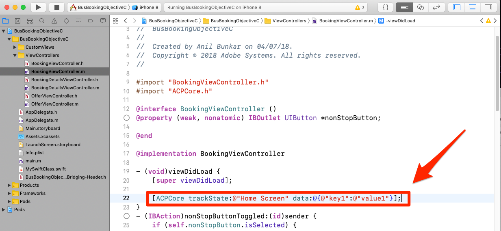

# Adobe Analytics 추가

이 단원에서는 앱에서 Adobe Analytics 추적을 활성화합니다.

[Adobe Analytics](https://docs.adobe.com/content/help/en/analytics/landing/home.html)는 고객 인텔리전스로 고객을 사람으로 이해하고 고객 인텔리전스로 비즈니스를 이끌어 나갈 수 있는 업계 선도적인 솔루션입니다.

익스텐션 [추가](launch-add-extensions.md) 및 [Mobile SDK](launch-install-the-mobile-sdk.md) 설치 수업에서 Adobe Analytics 익스텐션을 Launch 속성에 추가하고 샘플 애플리케이션으로 가져왔습니다.  이제 앱에서 상태와 동작을 추적하기 위해 코드를 추가하면 됩니다.

## 학습 목표

이 단원을 마치면 다음을 수행할 수 있습니다.

* 라이프사이클 지표가 Adobe Analytics로 전송되는지 확인
* 추가 데이터를 사용하여 앱의 상태를 추적하는 코드 추가
* 코드를 추가하여 추가 데이터를 사용하여 앱의 동작 추적

Launch에서 Analytics에 대해 구현할 수 있는 것은 많습니다. 이 단원에서는 앱에서의 구현에 필요한 주요 기술에 대해 간략하게 설명합니다.

## 전제 조건

You should have already completed the lessons in the [Configure Launch](launch-create-a-property.md) section. 이 섹션에서는 Analytics 확장을 추가하고 추적 서버 및 보고서 세트 ID를 구성했습니다.

## 라이프사이클 지표 및 Adobe Analytics

라이프사이클 지표는 Experience Platform Mobile SDK를 사용하여 앱에서 쉽게 활성화할 수 있는 환경 기반 지표 및 차원입니다. 사실, 이미 추가하셨습니다!

속성에 코어 확장을 추가하고 인터페이스에 제공된 모바일 설치 지침을 따르면 라이프사이클 지표를 이미 활성화했습니다. 앱 버전, 참여 사용자 수, OS 버전, 시간 분할, 마지막 사용 이후 일 수 등과 같은 환경 및 앱별 지표를 비롯한 지표 및 차원. 앱의 분석에 매우 도움이 될 수 있습니다. 특히 모든 보고서에 적용할 Analytics 세그먼트를 만들 때 유용합니다. 지표의 전체 목록은 [문서에서](https://docs.adobe.com/content/help/en/mobile-services/ios/metrics.html)사용할 수 있습니다.

### Analytics 라이프사이클 히트 보기

디버깅 프로그램/패킷 스니퍼에서 라이프사이클 히트를 볼 수 있지만 Xcode 디버깅 콘솔에서는 간단히 보여 줍니다.

1. Xcode에서 프로젝트를 빌드하고 실행하여 시뮬레이터를 실행합니다
1. Xcode 디버깅 콘솔에서 `lifecycle` 맨 아래의 필터를 입력하여 표시되는 내용을 표시한 다음 항목의 맨 아래로 스크롤합니다
1. 섹션 `Analytics request was sent with body` 확인
1. 라이프사이클 지표에는 AppID, CarrierName, DayOfWeek, DaysSinceFirstUse 및 [문서에 나열된 기타 지표/차원과 같은 것이 포함됩니다](https://docs.adobe.com/content/help/en/mobile-services/ios/metrics.html)

   

## ACPCore 라이브러리 가져오기

다음 연습에서는 API를 사용하여 앱의 상태("trackState")와 작업("trackAction")을 추적합니다. 이러한 API를 사용하려면 API가 포함된 라이브러리를 가져와야 합니다.  새로운 Experience Cloud Platform Mobile SDK에서 trackState 및 trackAction API가 Analytics 라이브러리에서 핵심 라이브러리로 이동되었으므로, Adobe Analytics 추적 이외의 목적으로 이러한 API를 활용할 수 있습니다.

이 자습서에서는 한 상태만 추적하지만 실제 앱에서는 여러 상태를 추적해야 합니다.

**ACPCore 라이브러리를 가져오려면**

1. Xcode에서 BookingViewController.m 파일 열기
1. 일반적으로 다른 가져오기 문과 함께 파일 맨 위에 추가 `#import "ACPCore.h"`
1. 저장
1. 이제 이 파일에서 trackState 또는 trackAction API를 사용할 준비가 되었습니다.

   <!---->

## 상태 추적

앱에서 사용자에게 제공하는 다양한 컨텐츠 화면이 있을 수 있습니다. 웹 사이트의 페이지와 같습니다. Adobe Analytics에서는 이러한 "페이지 보기 히트"로 보내고 웹 속성에 사용된 것과 동일한 보고서에서 볼 수 있는 방법을 제공합니다. 이 메서드를 "trackState"라고 합니다.

이 자습서에서는 trackState 호출에 대한 코드를 앱의 한 화면(페이지)에만 삽입하게 됩니다. 실제로 앱의 다른 모든 화면/상태에 대해 이를 복제하게 됩니다. 또한 히트와 함께 데이터를 보내는 몇 가지 방법(키/값 쌍)을 살펴볼 수 있습니다.

다음은 구문과 설명서의 코드 예제입니다. 이 자습서 또는 앱에서 복사하여 붙여 넣을 수 있습니다.

**구문:**

```objective-c
+ (void) trackState: (nullable NSString*) state data: (nullable NSDictionary*) data;
```

**예:**

```objective-c
[ACPCore trackState:@"state name" data:@{@"key":@"value"}];
```

### 데이터 없이 상태 추적

1. Xcode에서 샘플 앱을 열고 BookingViewController.m으로 이동한 다음 `viewDidLoad()` 함수에서 trackState 메서드 호출을 추가합니다
1. Set the `state name` to "Home Screen"
1. 추가 데이터를 추가하는 대신 메서드 호출에 자리 표시자로 추가합니다. `null`
1. 또는 다음을 복사하여 붙여 넣습니다.

   ```objective-c
   [ACPCore trackState:@"Home Screen" data:nil];
   ```

   

>[!NOTE] Target의 VEC를 구현하는 방법을 수료한 경우 이 연습의 스크린샷에 표시되지 않는 viewDidLoad() 함수에 추가 코드가 표시됩니다. 이것은 예상된 것이며, 현재 그 일에 초점을 맞추도록 하기 위한 것입니다.

**trackState의 유효성을 확인하려면**

1. 프로젝트 저장, 빌드 및 실행
1. 시뮬레이터가 실행되고 앱의 홈 화면이 열리면 Xcode 콘솔을 봅니다
1. 콘솔을 "홈"으로 필터링하고 `Analytics request was sent with body`
1. pageName 변수는 로 설정되어 `Home Screen`있으며 다른 사용자 지정 데이터 쌍은 없습니다. 기술적으로 "페이지 이름"이 아닌 "상태 이름"을 설정하지만 사용된 매개 변수 이름은 웹 사이트 구현과 일관성을 제공하기 `pageName` 위한 것입니다.

   

### 데이터를 사용하여 상태 추적

1. BookingViewController.m으로 다시 돌아가서 `viewDidLoad()` 함수에서 마지막 연습에서 기본(추가된 데이터 없음) trackState 호출을 주석 처리(또는 삭제)합니다.
1. 이번에는 키와 값으로 데이터를 사용하여 새 trackState 메서드 호출을 `key1` `value1` 추가합니다.
1. "홈 `state name` 스크린"으로 유지
1. 복사 및 붙여넣기:

   ```objective-c
   [ACPCore trackState:@"Home Screen" data:@{@"key1":@"value1"}];
   ```

   

**데이터를 사용하여 trackState의 유효성을 확인하려면**

1. 프로젝트를 다시 저장, 빌드 및 실행
1. 시뮬레이터가 실행되고 앱의 홈 화면이 열리면 Xcode 콘솔을 봅니다
1. 필터를 "home"으로 유지하고 아래 항목을 보면 `Analytics request was sent with body`
1. 이제 설정할 pageName 외에도 히트에서 전송된 키/값 쌍도 있습니다

   

>[!NOTE] Analytics의 "prop 및 eVar"에 익숙한 경우 이러한 변수 이름이 SDK에 없는 것을 확인할 수 있습니다. SDK에서 오는 모든 키/값 데이터는 [contextData 변수로](https://docs.adobe.com/content/help/en/analytics/implementation/javascript-implementation/variables-analytics-reporting/context-data-variables.html)전송되며, 따라서 Analytics UI의 처리 규칙을 사용하여 prop 또는 eVar(또는 기타 변수) [에](https://docs.adobe.com/content/help/en/analytics/admin/admin-tools/processing-rules/processing-rules.html) 매핑해야 합니다.

### 추가 데이터 전송 옵션

이전 두 연습에서는 추가 데이터가 있는 요청과 없는 요청과 함께 두 개의 요청을 했습니다. 그러나 화면 또는 상태 로드와 함께 여러 데이터 포인트를 Analytics로 보내려면 어떻게 해야 합니까? 아래에는 두 가지 옵션이 있습니다.

#### 옵션 1:여러 키/값 쌍

trackState 호출에서는 데이터 세트에서 쉼표로 구분하여 여러 키/값 쌍을 전송하는 옵션이 있습니다. 예:

```objective-c
[ACPCore trackState:@"Home Screen" data:@{@"key1":@"value1",@"key2":@"value2",@"key3":@"value3"}];
```

#### 옵션 2:사전 개체

코드에서 사전을 정의한 다음 trackState를 사용하여 전송할 수도 있습니다. 물론 코드에 일부 사전 개체를 이미 정의했으며 Analytics로 전송하려는 경우 완벽한 옵션이 될 수 있습니다. 예:

```objective-c
NSDictionary *theStuff = @{@"key1": @"value1",@"key2": @"value2"};
[ACPCore trackState:@"Home Screen" data:theStuff];
```

**추가**&#x200B;크레딧이 포함된 두 옵션을 코드에서 시도해 보고 Xcode 디버깅 콘솔에서 결과를 확인합니다. 전과 동일한 필터를 사용하고 결과를 확인하여 변수 및 값이 전달되는지 확인할 수 있습니다

## 동작 추적

웹 사이트에서 페이지 로딩이 아닌 작업을 추적하는 것과 마찬가지로 사용자가 앱에서 수행하는 작업(예: 다른 화면을 로드하지 않는 클릭)을 추적하려는 경우가 많습니다. 이 메서드는 호출된다는 점을 제외하고 위에서 사용한 trackState와 매우 유사하게 `trackAction`처리됩니다.

다음은 이 자습서 또는 자신의 앱에서 복사하여 붙여넣을 수 있는 구문과 설명서의 코드 예입니다.

**구문:**

```objective-c
+ (void) trackAction: (nullable NSString*) action data: (nullable NSDictionary*) data;
```

**예:**

```objective-c
[ACPCore trackAction:@"action name" data:@{@"key":@"value"}];
```

### '정지 없음' 확인란을 사용하여 상호 작용 추적

이 샘플 버스 예약 앱에는 사용자가 검색 결과를 옵션으로 제한할지 여부를 결정할 수 있는 확인란이 있습니다. Adobe Analytics에서 해당 확인란과 상호 작용을 추적하기로 결정했습니다.


이 확인란은 샘플 프로젝트의 BookingViewController.m 파일에서 제어됩니다. 이 연습에서는 사람들이 상자를 선택하거나 선택 취소할 때마다 trackAction 히트를 보냅니다.

#### trackAction 코드 설정

1. Xcode에서 샘플 프로젝트를 열고 BookingViewController.m으로 이동하여 "nonStopButtonToggled" 함수를 찾습니다
1. 문에서, `if` 상자가 이미 선택된 경우 첫 번째 섹션에서 상자의 선택을 취소합니다. 이 시나리오에서는 다음 코드를 사용하여 "off" 값이 있는 히트를 전송하려고 합니다.

   ```objective-c
   [ACPCore trackAction:@"NonStop Button Interaction" data:@{@"NonStop":@"off"}];
   ```

1. 다음 섹션("else" 섹션)에서는 상자가 선택되어 있지 않으면 해당 상자가 선택됩니다. 이 시나리오에서는 다음 코드를 사용하여 값이 "on"인 히트를 전송하려고 합니다.

   ```objective-c
   [ACPCore trackAction:@"NonStop Button Interaction" data:@{@"NonStop":@"on"}];
   ```

코드의 다른 사용자 지정 사항에 주의하십시오.

* 을 "NonStop 단추 상호 작용" `action name` 으로 설정합니다. 이 값은 요청의 "action" 매개 변수와 Adobe Analytics의 사용자 지정 링크 보고서/차원을 채웁니다
* 사용 중인 `key` 파일의 이름은 "NonStop"입니다. 이 이름은 Analytics 관리 콘솔의 처리 규칙에서 찾을 수 있는 주요 이름으로, 이 값을 prop 또는 eVar에 매핑할 수 있습니다.

이제 함수가 다음과 같이 표시됩니다.


#### trackAction 코드의 유효성을 검사하려면

1. 코드를 추가한 후 프로젝트를 저장하고 실행 및 빌드합니다
1. 가비지 아이콘을 클릭하여 콘솔을 지웁니다
1. 시뮬레이터에서 상자를 체크 표시하여 콘솔에 두 개의 요청이 나타납니다. 마지막 방법은 방금 추가한 코드에서 Adobe Analytics로 데이터를 전송하는 것입니다.
1. 작업 및 pev2 매개 변수가 모두 인코딩된 공백이 있는 "NonStop 단추 상호 작용"으로 설정되어 있습니다.
1. "NonStop=on" 키/값 쌍이 있고 처리 규칙에서 prop/eVar에 할당할 수 있습니다.
1. "pe=lnk_o" 키/값이 trackAction에 의해 트리거된 "사용자 지정 링크" 히트임을 표시합니다.

   

잘했어! Analytics 단원을 완료했습니다. 물론 Adobe Analytics 구현을 향상시키기 위해 할 수 있는 다른 많은 기능이 있지만 이를 통해 나머지 요구 사항을 해결하는 데 필요한 핵심 기술이 제공될 것입니다.

## trackState 및 trackAction의 추가 혜택

이러한 마지막 연습에서는 trackState 및 trackAction API를 사용하여 앱의 데이터를 Adobe Analytics로 전송할 수 있었습니다. Experience Platform Mobile SDK는 Launch에 포함되어 있으므로 방금 추가한 코드를 활용하는 Launch 인터페이스에서 더 많은 작업을 수행할 수 있습니다.

Launch에서는 trackState 및 trackAction API에 의해 트리거된 규칙을 만들고, 다른 Adobe 솔루션 또는 외부 파트너에 요청하는 것과 같은 추가 작업을 수행하도록 할 수 있습니다.

[다음 "Adobe Audience Manager 추가" &gt;](audience-manager.md)
