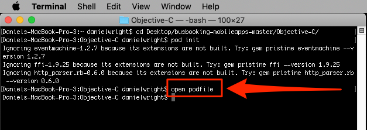
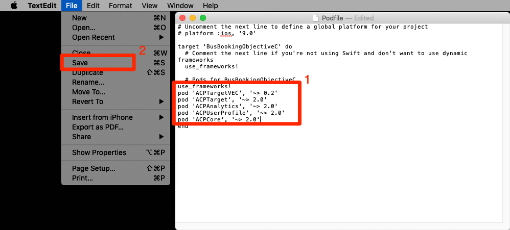
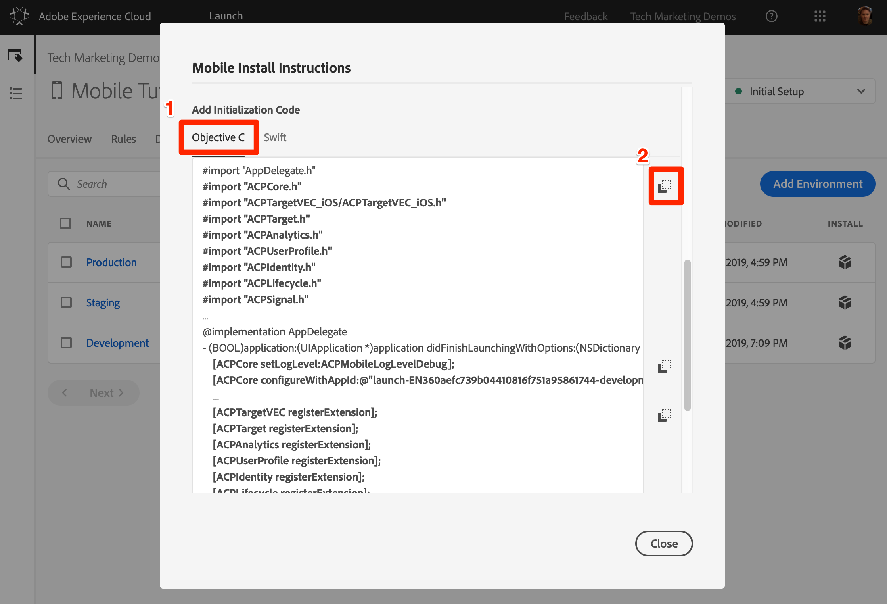
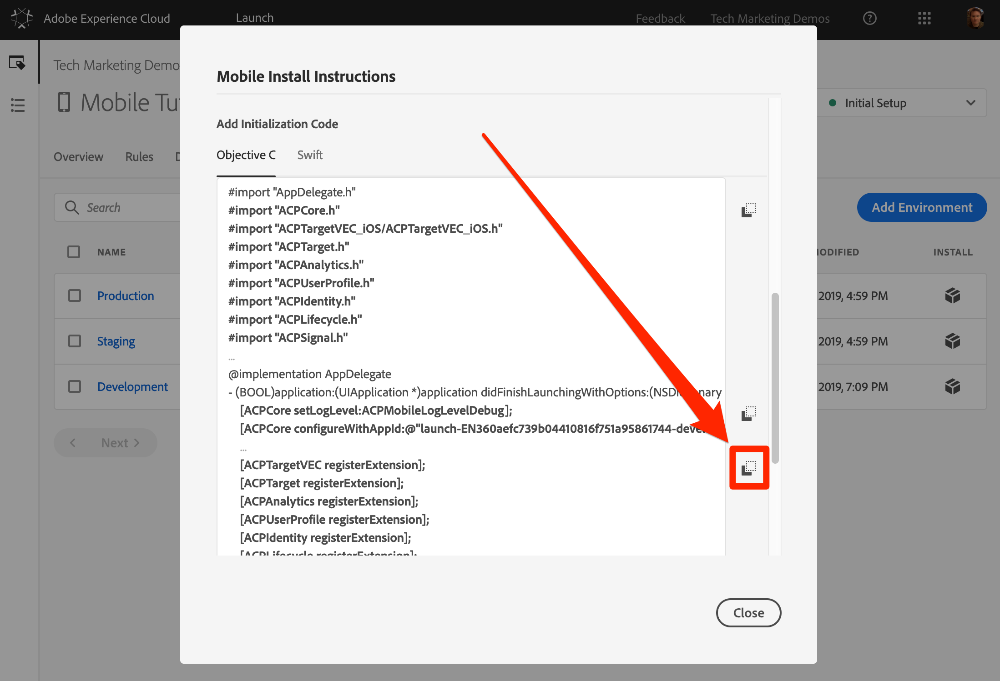

# Mobile SDK 설치

이 단원에서는 Launch 속성의 개발 환경에 해당하는 확장 및 설정과 함께 Mobile SDK를 구현합니다.

## 학습 목표

이 단원을 마치면 다음을 수행할 수 있습니다.

* 모바일 Launch 속성에 대한 설치 지침을 얻습니다.
* 개발, 스테이징 및 프로덕션 환경의 차이점 이해
* 포드파일 만들기 및 편집
* AppDelegate 파일로 Mobile SDK 가져오기
* SDK가 성공적으로 구현되었는지 확인

## 설치 지침 다운로드

모바일 시작을 위한 설치 지침은 터미널에서 실행하거나 모바일 앱의 특정 위치에 추가하는 코드 조각 모음입니다.

위쪽 탐색의 `Environments` 탭을 클릭하여 환경 페이지로 이동합니다. 개발, 스테이징 및 프로덕션 환경은 미리 만들어져 있습니다. 이는 코드 개발 및 릴리스 프로세스의 일반적인 환경에 해당합니다. 코드는 개발 환경에서 개발자가 처음 작성합니다. 개발자가 코드 작업을 마치면 QA 및 다른 팀이 검토할 수 있도록 스테이징 환경으로 보냅니다. QA와 다른 팀이 만족하면 코드가 프로덕션 환경에 게시됩니다. 프로덕션 환경은 방문자가 앱을 다운로드할 때 경험하는 공개 환경입니다.

Launch는 여러 개발자가 동시에 서로 다른 프로젝트에서 작업하고 있는 대규모 조직에서 유용한 추가 개발 환경을 제공합니다.

개발, 스테이징 및 프로덕션은 튜토리얼을 완료하는 데 필요한 유일한 환경입니다.


개발 **[!UICONTROL 행에서]** 설치 아이콘 설치 아이콘을  모달을 엽니다.


단계별 지침을 살펴보죠.

## 포드파일 만들기 및 창 설치

이전에 웹 사이트에서 Launch를 사용한 적이 있는 경우, 먼저 눈에 띄는 점은 웹 속성보다 이 모달에 더 많은 정보가 있다는 것입니다.

iOS용 Adobe Mobile SDK는 CocoaPods를 사용하여 다양한 구성 요소 간의 종속성을 관리합니다. 개발 환경에 CocoaPods [가](https://cocoapods.org/) 설치되어 있지 않은 경우 웹 사이트의 설치 지침을 따르십시오. 또한 버스 예약 앱을 아직 다운로드하지 않은 경우 [로컬 컴퓨터에](https://github.com/Adobe-Marketing-Cloud/busbooking-mobileapps)저장하고 데스크탑에 zip 아카이브를 추출합니다.

**포드파일을 만들려면**

1. Mac `Terminal` ®에서 애플리케이션 열기

1. 버스 예약 목표-C 앱을 저장한 프로젝트 폴더(예:( `cd Desktop/busbooking-mobileapps-master/Objective-C/`)

   

1. 시작 인터페이스에서 운영 체제를 `iOS`

1. 복사 아이콘을 클릭하여 첫 번째 iOS 명령을 `pod init`복사합니다 

   

1. 터미널 앱에서 `pod init` 명령을 실행하고 완료될 때까지 기다립니다

   

1. 터미널 앱에서 `open podfile` 명령을 사용하여 포드파일을 엽니다

   

1. 컴퓨터에서 podfile을 열 응용 프로그램을 묻는 대화 상자가 열릴 수 있습니다. 텍스트 편집기 선택 `TextEdit`

1. 시작 인터페이스에서 복사 아이콘을 클릭하여 종속성 목록을  . 이전 단원에서 추가한 각 익스텐션에 해당하는 라인이 있는지 확인하십시오. 각 익스텐션에는 Mobile Core 익스텐션을 기반으로 빌드되고 앱 업데이트에서만 추가 또는 제거할 수 있는 자체 코드 세트가 있습니다.

   

1. 텍스트 편집기에서 행 바로 뒤에 클립보드의 종속성을 붙여 넣습니다 `# Pods for BusBookingObjectiveC`

1. 텍스트 편집기에서 포드파일에 대한 업데이트 저장

   

1. 이제 텍스트 편집기를 닫을 수 있습니다

1. 시작 인터페이스에서 복사 아이콘을 클릭하여 다음 iOS 지침을 `pod repo update`복사합니다 

   

1. 터미널 앱에서 `pod repo update` 명령을 실행하고 완료될 때까지 기다립니다(몇 분 정도 걸릴 수 있음).

   

1. 시작 인터페이스에서 복사 아이콘을 클릭하여 다음 iOS 지침을 `pod install`복사합니다 

   

1. 터미널 앱에서 `pod install` 명령을 실행하고 완료될 때까지 기다립니다

   

1. 이제 터미널 창을 닫을 수 있습니다

1. Finder 창을 열고 버스 예약 앱을 저장한 폴더로 이동한 다음 BusBookingObjectiveC.xcworkspace 파일, Podfile, Podfile.lock 파일 및 Pods 폴더가 만들어졌는지 확인합니다

   

## AppDelegate 업데이트

이제 앱을 업데이트하여 SDK를 가져올 차례입니다.

1. XCode에서 `BusBookingObjectiveC.xcworkspace` 파일 열기
1. 파일 `AppDelegate.m` 열기

   

1. 시작 인터페이스에서 초기화 코드 추가 **[!UICONTROL 섹션으로 스크롤하고]** 사용 **[!UICONTROL 중인 iOS]** 언어로 목표C를 선택합니다.
1. 초기화 코드 추가 섹션에서 첫 번째  아이콘을 클릭하여 **[!UICONTROL 가져오기 문을 복사합니다]** .

   

1. XCode에서 이러한 import 문을 `AppDelegate.m``AppDelegate.h`

   

1. 론치 인터페이스에서 초기화 코드 추가 섹션에서 두 번째  아이콘을 클릭하여 코어 확장명과 관련된 두 **[!UICONTROL 줄을]** 복사합니다. 첫 번째 줄은 콘솔 로깅 문을 설정합니다(사용 가능한 옵션은 "debug", "verbose", "warning" 및 "error"). 두 번째 줄은 Launch 환경의 고유 식별자를 가리킵니다. 프로덕션 환경에 앱을 배포할 준비가 되면 이 값을 업데이트해야 하므로 이 값이 중요합니다.

   

1. XCode에서 다음 Core 문을 `application(_:didFinishLaunchingWithOptions:)` 메서드 맨 위의 AppDelegate 파일에 붙여 넣습니다.

   

1. Launch 인터페이스에서 Add Initialization Code  Copy [!UICONTROL 아이콘을 클릭하여 확장 문을 복사합니다] .

   

1. XCode에서 다음 확장 문을 `return true` `application(_:didFinishLaunchingWithOptions:)` 메서드의 줄 바로 앞에 AppDelegate 파일에 붙여 넣습니다.

   

>[!NOTE] Launch 인터페이스에 제공된 모바일 설치 지침에는 Identity, Lifecycle 및 Signal 확장명에 대한 가져오기 및 등록 문과 Lifecycle 지표의 초기화가 포함됩니다. 이러한 익스텐션은 Mobile Core 익스텐션의 일부로 간주됩니다. 앱에서 이러한 익스텐션을 사용하지 않으려면 이러한 익스텐션과 관련된 다른 코드를 가져오거나 등록하거나 구현할 필요가 없습니다.
>
> 또한 이러한 확장을 사용할 때 고려해야 하는 추가 구현 옵션이 있습니다(예: 사용자 배경이 앱을 미리 그라운드에 있을 때 라이프사이클 수집을 일시 중지/다시 시작할 수 있습니다). Mobile Core 확장 설명서에서 자세한 내용을 [살펴볼 수 있습니다](https://aep-sdks.gitbook.io/docs/using-mobile-extensions/mobile-core)

## 구현 확인

1. XCode 프로젝트 저장
1. 앱을 실행하고 시뮬레이터에서 실행합니다. 구성된 시뮬레이터 장치가 없는 경우 iOS 10+를 실행하는 장치를 구성해야 합니다. iPhone 8 시뮬레이터는 마우스로 `Home` 버튼을 클릭하는 것이 쉽기 때문에 사용하는 것이 좋습니다.

   

1. 시뮬레이터가 실행될 때까지 기다렸다가 앱을 예약 화면으로 완전히 엽니다(몇 분 정도 걸릴 수 있음).

   

1. XCode 콘솔에서 Adobe 서버에 대한 호출이 수행되는지 확인

   

다음은 찾을 수 있는 몇 가지 특정 호출의 예입니다.

1. **론치 구성을** 검색하는 호출(콘솔 필터링 대상 `adobedtm.com`). 이전 단원에서 입력한 익스텐션 구성을 확인하십시오. 익스텐션을 추가하려면 앱에 업데이트가 필요합니다. 이러한 설정은 Launch에서 외부에서 관리되고 언제든지 변경할 수 있습니다.

   ```objective-c
   2019-03-13 16:53:26.633816-0400 BusBookingObjectiveC[56630:3854917] [AMSDK DEBUG <RulesDownloader>]: Successfully downloaded Rules from 'https://assets.adobedtm.com/launch-EN360aefc739b04410816f751a95861744-development-rules.zip'
   
   {"target.propertyToken":"","target.timeout":5,"global.privacy":"optedin","analytics.backdatePreviousSessionInfo":true,"analytics.offlineEnabled":true,"build.environment":"dev","rules.url":"https://assets.adobedtm.com/launch-EN360aefc739b04410816f751a95861744-development-rules.zip","experienceCloud.org":"7ABB3E6A5A7491460A495D61@AdobeOrg","target.clientCode":"techmarketingdemos","target.autoFetch":true,"target.fetchBackground":false,"lifecycle.sessionTimeout":300,"target.environmentId":"busbookingapp","analytics.server":"tmd.sc.omtrdc.net","analytics.rsids":"tmd-mobile-dev1","analytics.batchLimit":0,"property.id":"PRb4881271498b4f2cbaf67d38a8f3891a","global.ssl":true,"analytics.aamForwardingEnabled":true}
   ```

1. **ID 서비스에** 요청(다음으로 콘솔 필터링) `demdex.net`이 예에서는 ID(`d_mid`)가 이미 설정되었으며 다시 보고되고 있습니다.

   ```objective-c
   2019-03-13 16:53:26.655908-0400 BusBookingObjectiveC[56630:3854937] [AMSDK DEBUG <com.adobe.module.identity>]:
   
   Sending request (https://dpm.demdex.net/id?d_rtbd=json&d_ver=2&d_orgid=7ABB3E6A5A7491460A495D61@AdobeOrg&d_mid=67027929491180584128922600814231770586)
   ```

1. **ID 서비스에서 응답** (콘솔 필터링 대상 `ID Service`). 이 `mid` 값이 위의 요청에서 `d_mid` 값과 일치하는 방식을 확인하십시오.

   ```objective-c
   2019-03-13 16:53:27.397048-0400 BusBookingObjectiveC[56630:3854937] [AMSDK DEBUG <com.adobe.module.identity>]:
   
   ID Service - Got ID Response (mid: 67027929491180584128922600814231770586, blob: j8Odv6LonN4r3an7LhD3WZrU1bUpAkFkkiY1ncBR96t2PTI, hint: 9, ttl: "604800000 ms")
   ```

1. **Analytics 요청** (콘솔 필터링 대상 `Analytics request`)

   ```objective-c
   2019-03-13 16:53:27.689061-0400 BusBookingObjectiveC[56630:3855024] [AMSDK DEBUG <AnalyticsHitDatabase>]: Analytics request was sent with body
   
   (ndh=1&c.&a.&AppID=BusBookingObjectiveC%201%20%281.0%29&CarrierName=%28null%29&DailyEngUserEvent=DailyEngUserEvent&DayOfWeek=4&DeviceName=x86_64&HourOfDay=16&InstallDate=3%2F13%2F2019&InstallEvent=InstallEvent&LaunchEvent=LaunchEvent&Launches=1&MonthlyEngUserEvent=MonthlyEngUserEvent&OSVersion=iOS%2012.1&Resolution=750x1334&RunMode=Application&TimeSinceLaunch=1&internalaction=Lifecycle&locale=en-US&.a&.c&ce=UTF-8&cp=foreground&mid=67027929491180584128922600814231770586&pageName=BusBookingObjectiveC%201%20%281.0%29&pe=lnk_o&pev2=ADBINTERNAL%3ALifecycle&t=00%2F00%2F0000%2000%3A00%3A00%200%20240&ts=1552510406)
   ```

축하합니다. 모바일 앱에 SDK를 추가했습니다.

[다음 "Adobe Experience Platform ID 서비스 추가" &gt;](id-service.md)