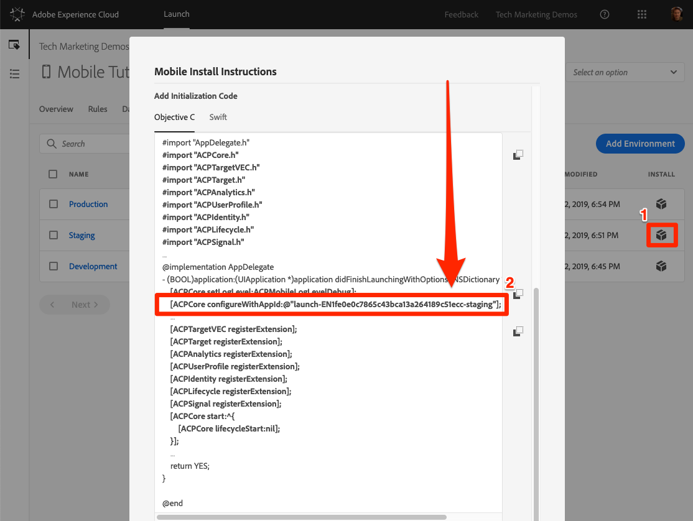
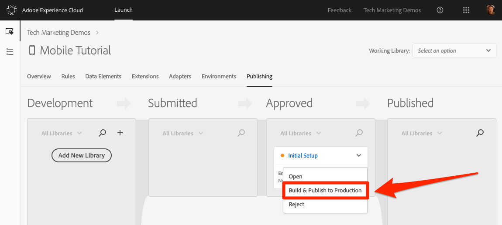

# 론치 속성 게시

개발 환경에서 Adobe Experience Cloud의 몇 가지 주요 솔루션을 구현했으므로 이제 출판 워크플로우를 배울 때입니다.

## 전제 조건

이 단원을 완료하려면 Launch 사용자 계정에 "승인" 및 "게시" 권한이 있어야 합니다. 사용자 인터페이스 옵션을 사용할 수 없으므로 이러한 단계를 완료할 수 없는 경우 Experience Cloud 관리자에게 문의하여 액세스 권한을 요청하십시오. For more information on Launch permissions, see [the documentation](https://docs.adobe.com/content/help/en/launch/using/reference/admin/user-permissions.html).

## 학습 목표

이 단원을 마치면 다음을 수행할 수 있습니다.

1. 스테이징 환경에 개발 라이브러리 게시
1. 앱을 업데이트하여 다른 Launch 환경 로드
1. 프로덕션 환경에 스테이징 라이브러리 게시

## 스테이징에 게시

개발 환경에서 라이브러리를 만들고 유효성을 검사했으므로 이제 스테이징에 게시할 때입니다.

1. Go to the **[!UICONTROL Publishing]** page

1. 라이브러리 옆의 드롭다운을 열고 승인을 위해 **[!UICONTROL 제출을 선택합니다.]**

   

1. 대화 상자에서 **[!UICONTROL [제출]** ] 단추를 클릭합니다.

   

1. 이제 라이브러리가 [제출됨] [!UICONTROL 열에] [작성됨] 상태로 표시됩니다.

1. 드롭다운을 열고 스테이징용 **[!UICONTROL 빌드를 선택합니다]**.

   
1. 녹색 점이 있는 아이콘이 나타나면 스테이징 환경에서 라이브러리를 미리 볼 수 있습니다.

실제 시나리오에서는 프로세스의 다음 단계에서 QA 팀이 스테이징 라이브러리의 변경 사항에 대한 유효성을 검사하도록 해야 합니다.

**스테이징 라이브러리에서 변경 내용의 유효성 검사를 수행하려면**

1. Launch 속성에서 환경 [!UICONTROL 페이지를 엽니다]

1. 스테이징 [!UICONTROL 행에서] 설치 아이콘을 클릭합니다

    사용하여 모달 열기
   

스테이징 앱에 대해 다른 작업 영역을 사용하는 경우 이 작업 영역에 이 자습서 전체에서 수행한 모든 창 및 앱 업데이트가 있는지 확인해야 합니다. 이 시점에서 개발 환경의 설치 지침에 대한 유일한 차이는 코어 구성의 시작 참조이며, 위의 스크린샷에 강조 표시되어 있습니다. AppDelegate.h 파일에서 해당 줄을 업데이트하고 앱을 다시 빌드해야 합니다.

실시간으로 QA 팀이 스테이징 환경에서 변경 사항을 검토하여 서명하면 프로덕션에 게시할 때입니다.

## 프로덕션에 게시

1. Go to the [!UICONTROL Publishing] page

1. 드롭다운에서 게시를 **[!UICONTROL 위한 승인을 클릭합니다]**.

   

1. 대화 상자에서 **[!UICONTROL 승인]** 단추를 클릭합니다.

   

1. 이제 라이브러리가 빌드되지 않은 상태( [!UICONTROL 노란색 점] )의 승인됨 열에 표시됩니다.

1. 드롭다운을 열고 제작 **[!UICONTROL 및 프로덕션에 게시를 선택합니다]**.

   

1. 대화 **[!UICONTROL 상자에서]** 게시를 클릭합니다.

   를 클릭합니다

1. 이제 라이브러리가 게시된 열에 [!UICONTROL 표시됩니다] .

   

프로덕션 환경에서는 아래 스크린샷에 강조 표시된 대로 코어 구성에서 론치 참조를 사용합니다.  스테이징 앱에 대해 다른 작업 영역을 사용하는 경우 이 작업 영역에 이 자습서 전체에서 수행한 모든 창 및 앱 업데이트가 있는지 확인해야 합니다.

>[!WARNING] 다음에 론치 구성을 변경하면 개발 환경에서 새 라이브러리를 만들어야 합니다. 익스텐션을 추가하거나 제거하려면 앱 자체에 업데이트가 필요합니다. Launch 환경과 앱 코드를 서로 동기화하여 문제를 방지하십시오.

그거야! 튜토리얼을 완료하고 Launch에서 첫 번째 모바일 속성을 게시했습니다.