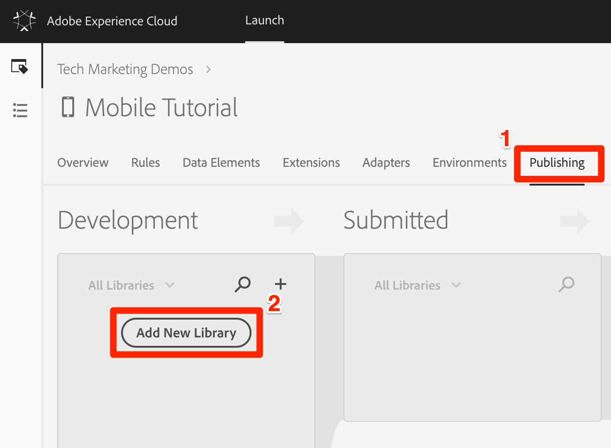

# 라이브러리 추가

이 단원에서는 새 Launch 속성에 대한 라이브러리를 만듭니다. 라이브러리는 원하는 모든 Launch 설정을 함께 패키지화하고 모바일 앱에 라이브러리를 설치하는 데 필요한 특정 구현 지침을 생성합니다.

## 학습 목표

이 단원을 마치면 다음을 수행할 수 있습니다.

* 라이브러리 만들기
* 라이브러리에 변경 사항 추가
* 라이브러리 만들기

## 라이브러리에 변경 내용 저장

확장 기능을 구성한 후 솔루션을 사용할 수 있도록 앱에서 배포할 수 있는 라이브러리에 익스텐션을 패키징해야 합니다.

**라이브러리 추가 및 빌드**

1. Go to the **[!UICONTROL Publishing]** tab

1. Click **[!UICONTROL Add New Library]**

   

1. Name the Library `Initial Setup`

1. 환경 **[!UICONTROL &gt; 개발을 선택합니다.]**

1. 변경된 모든 리소스 추가&#x200B;**[!UICONTROL 를 클릭합니다]**

   

1. 변경된 모든 리소스 **[!UICONTROL 추가를 클릭하면]** 익스텐션을 추가할 때 수행한 변경 사항이 요약됩니다.

1. **[!UICONTROL 개발을 위한 저장 및 구축]**&#x200B;을 클릭합니다

   

1. 잠시 후 상태 점이 녹색으로 바뀝니다. 이는 라이브러리가 성공적으로 빌드되었음을 나타냅니다.

   

[다음 "시작 속성 및 SDK 설치" &gt;](launch-install-the-mobile-sdk.md)
