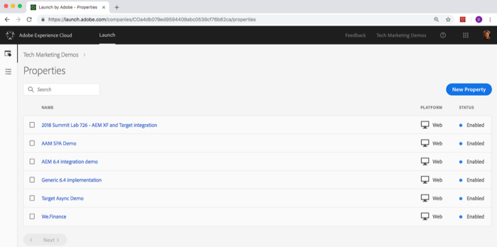
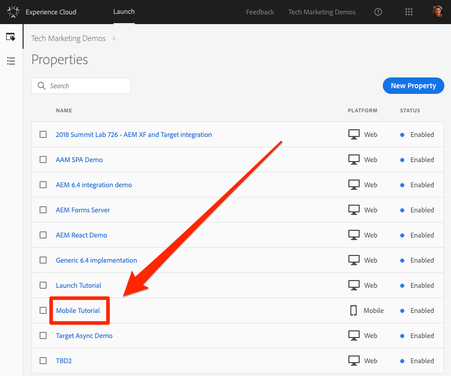

# 론치 속성 만들기

Adobe Experience Platform Launch는 차세대 모바일 SDK 및 웹 사이트 태그 관리 기능입니다. Launch를 사용하면 고객의 기대에 부응하는 경험을 제공하는 데 필요한 모든 분석, 마케팅 및 광고 솔루션을 간단하게 배포하고 관리할 수 있습니다. Launch에는 추가 비용이 없습니다. 모든 Adobe Experience Cloud 고객이 이용할 수 있습니다.

이 단원에서는 모바일 앱용 Launch 속성을 만듭니다.

## 전제 조건

다음 몇 가지 강의를 마치려면 Launch에서 환경 개발, 승인, 게시, 관리 및 게시 권한이 있어야 합니다. 사용자 인터페이스 옵션을 사용할 수 없으므로 이러한 단계를 완료할 수 없는 경우 Experience Cloud 관리자에게 문의하여 액세스 권한을 요청하십시오. For more information on Launch permissions, see [the documentation](https://docs.adobe.com/content/help/en/launch/using/reference/admin/user-permissions.html).

## 학습 목표

이 단원을 마치면 다음을 수행할 수 있습니다.

* Launch 사용자 인터페이스에 로그인
* 새 Launch 모바일 속성 만들기
* Launch 모바일 속성 구성

## Launch로 이동

**Launch에 액세스하려면**

1. Adobe Experience [Cloud에 로그인](https://experiencecloud.adobe.com)

1. 솔루션  을 클릭하여 솔루션 전환기를 엽니다

1. Select **[!UICONTROL Launch]** from the menu

   

1. Adobe **[!UICONTROL Experience Cloud Launch]**&#x200B;에서 시작으로 **[!UICONTROL 이동 단추를 클릭합니다]**

   

You should now see the `Properties` screen (if no properties have ever been created in the account, this screen might be empty):

Launch를 자주 사용하는 경우 다음 URL을 책갈피로 지정하고 직접 https://launch.adobe.com에 로그인할 수도 [있습니다.](https://launch.adobe.com)

## 속성 만들기

속성은 기본적으로 앱에 태그를 배포할 때 익스텐션, 규칙, 데이터 요소 및 라이브러리로 채우는 컨테이너입니다. 앱에 유사한 기능이 포함되어 있고 동일한 솔루션을 구현해야 하는 경우 단일 모바일 속성을 여러 앱 플랫폼(예: iOS 및 Android)에서 사용할 수 있습니다.  속성 만들기에 대한 자세한 내용은 [제품 설명서의 "모바일 속성 설정"](https://aep-sdks.gitbook.io/docs/getting-started/create-a-mobile-property) 을 참조하십시오.

**속성 만들기**

1. 새 **[!UICONTROL 속성]** 단추를 클릭합니다.

   

1. 속성 이름 지정(예:( `Mobile Tutorial`)
1. 플랫폼으로서 모바일을 **[!UICONTROL 클릭합니다]**
1. 저장 **[!UICONTROL 단추를]** 클릭합니다

   

새 속성은 속성 페이지에 표시됩니다. Note that if you check the box next to the property name, options to **[!UICONTROL Configure]** or **[!UICONTROL Delete]** the property appear above the property list. 속성 이름(예:) `Mobile Tutorial`to open the `Overview` screen.

[다음 "확장 추가" &gt;](launch-add-extensions.md)
