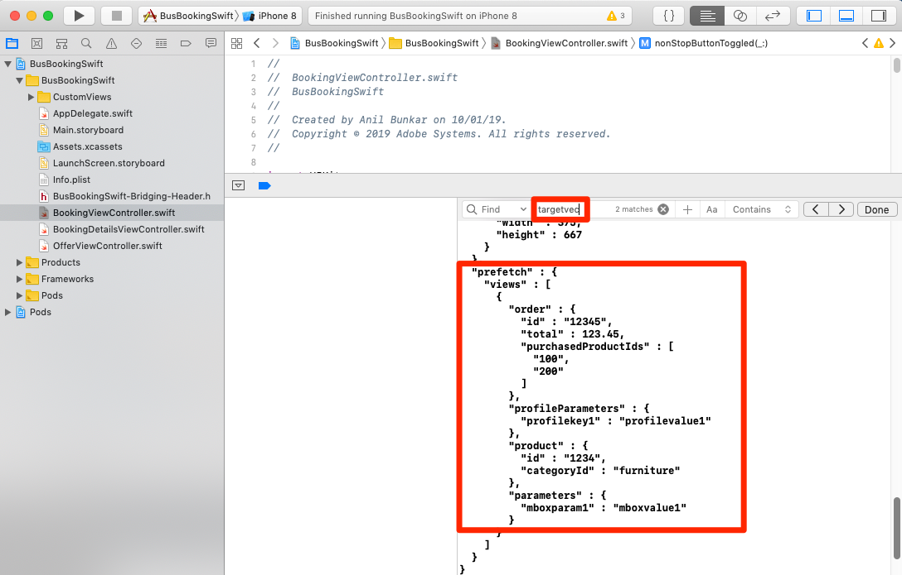
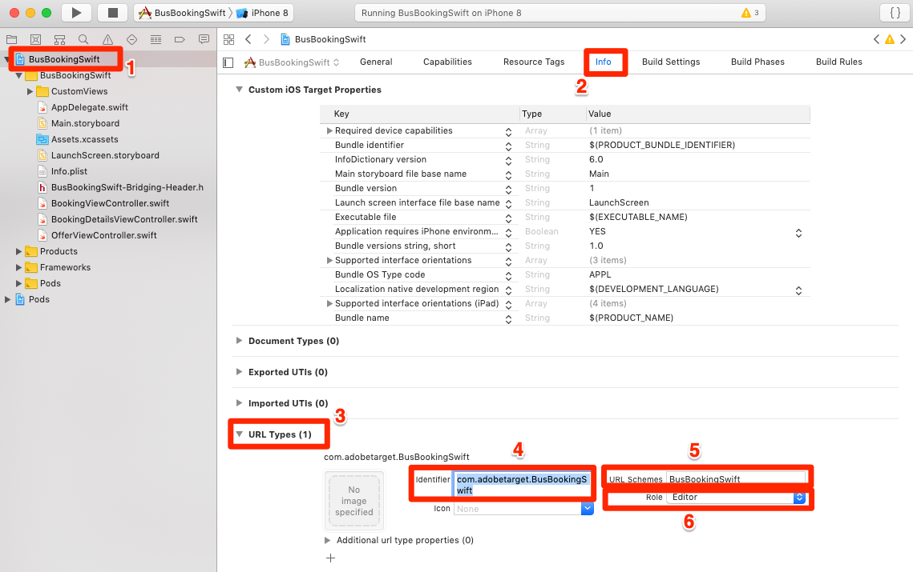
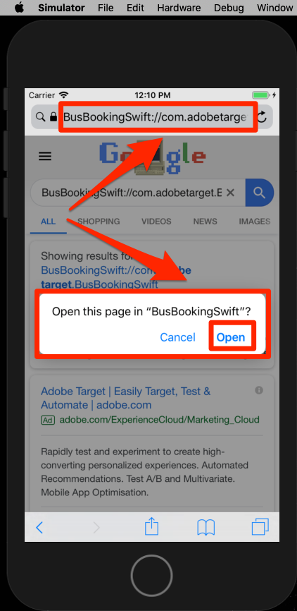
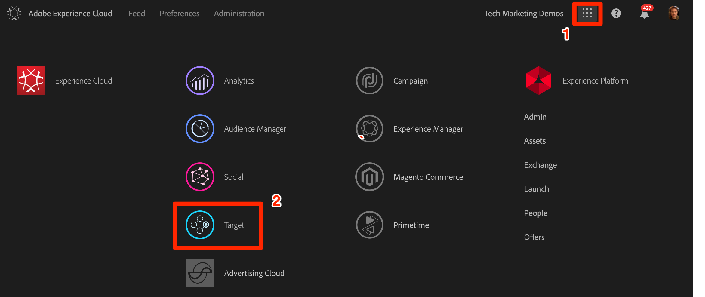
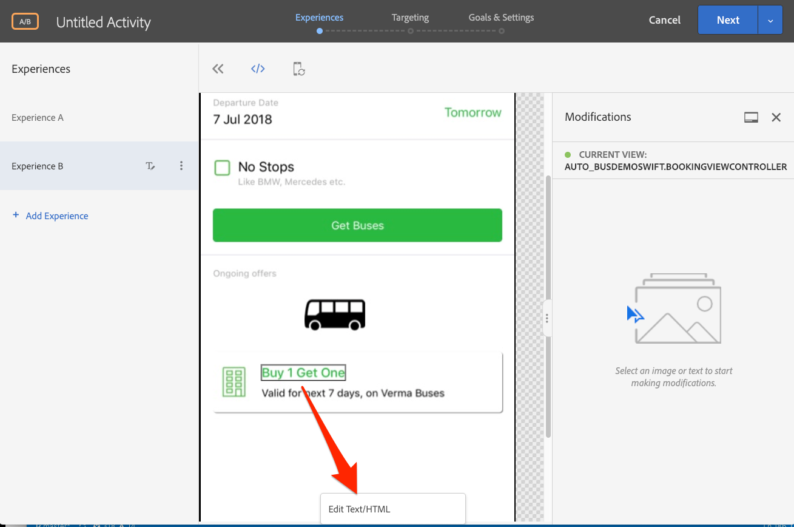

# Adobe Target의 VEC(Visual Experience Composer) 추가

이 단원에서는 모바일 앱용 VEC(Target Visual Experience Composer)를 활성화합니다.

[Adobe](https://docs.adobe.com/content/help/en/target/using/target-home.html) Target은 고객의 경험을 맞춤화 및 개인화하여 웹 및 모바일 사이트, 앱, 소셜 미디어 및 기타 디지털 채널에서 매출을 극대화하는 데 필요한 모든 것을 제공하는 Adobe Experience Cloud 솔루션입니다.

기본 모바일 앱용 VEC(시각적 경험 작성기)를 사용하면 연속적인 개발 종속성 및 앱 릴리스 주기 없이 자체적인 방식으로 기본 모바일 앱에 대한 활동을 만들고 콘텐츠를 개인화할 수 있습니다.

익스텐션 [추가](launch-add-extensions.md)단원에서 Target VEC 익스텐션을 Launch 속성에 추가했습니다. Mobile SDK [설치 단원에서](launch-install-the-mobile-sdk.md) 익스텐션을 샘플 애플리케이션으로 가져왔습니다. Target의 모바일 시각적 경험 작성기에서 활동을 설정하려면 몇 가지 간단한 업데이트만 필요합니다.

>[!WARNING] 모바일 애플리케이션에서 Target VEC를 사용하려면 Target 및 Target VEC Launch 확장 기능이 모두 필요합니다.

## 학습 목표

이 단원을 마치면 다음을 수행할 수 있습니다.

* Target VEC에 대한 샘플 앱 활성화
* Target VEC 요청에 매개 변수 추가
* VEC와 장치 연결
* VEC를 사용하여 활동 만들기

## 전제 조건

이 섹션의 학습 내용을 수료하려면 다음을 수행해야 합니다.

* 시작 섹션 [구성에 대한](launch-create-a-property.md) 강의 완료
* Adobe Target 인터페이스에 대한 승인자 수준 액세스 권한 부여

## 매개 변수 추가

라이프사이클 지표는 Target VEC 요청에 매개 변수로 자동으로 포함됩니다. 요청에 사용자 지정 매개 변수를 추가할 수도 있습니다.

**사용자 정의 매개 변수를 추가하려면**

1. Xcode에서 `BookingViewController.swift` 파일을 엽니다. 이 파일은 홈 화면에서 사용됩니다.
1. 기존 가져오기 아래에 Target 및 Target VEC 확장 가져오기

   ```swift
   import ACPTarget
   import ACPTargetVEC
   ```

1. 함수에서 다음 코드를 포함하는 줄 뒤에 `viewDidLoad()` `super.viewDidLoad()` 추가합니다. 이 예제 코드는 매개 변수, 프로필 매개 변수, 제품(또는 엔티티) 매개 변수 및 주문 매개 변수를 TargetVEC 요청에 추가하는 방법을 보여줍니다. 이 예에서는 정적 값을 사용하지만 실제 앱에서 동적 변수를 사용하여 값을 채우고자 합니다. 또한 다음과 같은 뷰와 관련된 매개 변수만 채울 수 있습니다.

   ```swift
   let params = ["param1":"value1"]
   let profileParams = ["profilekey1":"profilevalue1"]
   let product : ACPTargetProduct = ACPTargetProduct.init(id: "1234", categoryId: "furniture")
   let order : ACPTargetOrder = ACPTargetOrder.init(id: "12345", total: 123.45, purchasedProductIds: ["100", "200"])
   let targetParams : ACPTargetParameters = ACPTargetParameters.init(parameters: params, profileParameters: profileParams, product: product, order: order)
   ACPTargetVEC.setGlobalRequest(targetParams)
   ```

   

이제 앱에 매개 변수를 추가했으므로 이제 요청에서 매개 변수가 전달되는지 확인할 때입니다.

**매개 변수를 확인하려면**

1. Xcode 프로젝트 저장
1. 앱을 다시 빌드하고 시뮬레이터에서 다시 열 때까지 기다립니다
1. Xcode의 콘솔 창에서 클릭
1. F를 ⌘ 사용하여 찾기 상자 열기
1. 찾기 `targetvec` 상자에서 검색
1. Target 요청 및 게시물 `Enter` 본문으로 이동하려면 을 누릅니다. 요청에 방금 추가한 사용자 지정 매개 변수를 찾습니다.

   

## Target 인터페이스와 모바일 앱 연결

Target 인터페이스에서 VEC 활동을 만들려면 먼저 Target을 앱과 페어링해야 합니다. 이러한 연결은 딥 링크 사용으로 얻어집니다.

### 딥 링크 체계 만들기

iOS는 유니버설 [링크](https://developer.apple.com/documentation/uikit/core_app/allowing_apps_and_websites_to_link_to_your_content) 및 [사용자 지정 URL 스키마를](https://developer.apple.com/documentation/uikit/core_app/allowing_apps_and_websites_to_link_to_your_content/defining_a_custom_url_scheme_for_your_app) 사용하여 앱에 대한 딥 링크를 만들 수 있도록 지원합니다. 이미 앱에서 사용자 정의 URL 스키마를 사용하고 있을 수 있습니다. 이 경우 이러한 기존 링크를 사용하여 Target과 연결할 수 있습니다. 이 자습서의 경우 사용자 정의 URL 체계를 만들어야 합니다.

**URL 체계를 등록하려면**

1. Xcode에서 앱을 두 번 클릭하여 설정 화면을 엽니다
1. 설정 화면에서 `Info` 탭을 클릭합니다
1. 섹션 `URL Types` 확장
1. 식별자는 **[!UICONTROL 로]** 설정되어 `com.adobetarget.BusBookingSwift`있습니다. 이 식별자를 사용하거나 원하는 경우 변경할 수 있습니다.
1. URL **[!UICONTROL 구성표는]** 입니다 `BusBookingSwift`. 이 구성표를 사용하거나 원하는 경우 변경할 수 있습니다.
1. 역할이 **[!UICONTROL 편집기로]** 설정되어 있는지 **[!UICONTROL 확인]**

   

1. 식별자나 구성표를 업데이트한 경우 `General` 탭을 클릭하면 구성표가 저장됩니다.  탭을 클릭하고 `Info` 섹션을 `URL type` 확장한 다음 식별자나 구성표를 저장하고 저장했는지 확인합니다.

다음 단계는 딥 링크에 처리기를 추가하는 것입니다.

**딥 링크를 처리하려면**

1. 파일 `AppDelegate.swift` 열기
1. 아래 그림과 같이 `ACPCore.collectLaunchInfo(["adb_deeplink": url.absoluteString])` 섹션에 `AppDelegate:application:openURL` 줄을 추가합니다.
   

### 딥 링크 확인

이제 앱이 설치되어 있는 사용자가 시뮬레이터에서 `BusBookingSwift://com.adobetarget.BusBookingSwift` (또는 정의한 구성표)와 같은 URL을 열면 애플리케이션이 열립니다.

**딥 링크 체계를 확인하려면**

1. Xcode 프로젝트 저장
1. 앱 다시 빌드
1. 시뮬레이터에서 Safari 열기
1. 주소 표시줄에 URL `BusBookingSwift://com.adobetarget.BusBookingSwift` (또는 정의한 구성표)을 입력합니다. 문제가 있는 경우 아래 팁 섹션을 참조하십시오.
1. "BusBookingSwift에서 이 페이지를 엽니다"라는 모달이 표시됩니다. 문제가 있는 경우 아래 팁 섹션을 참조하십시오.
1. 클릭 `Open`
1. 버스 예약 앱을 열어야 합니다.

   > [!TIP] URL을 데스크탑에서 시뮬레이터로 복사하여 붙여넣을 때 성공하지 못한 경우 일반적으로 다음 두 가지 이유 중 하나에 해당합니다.
   >
   >   1. **Target 인터페이스에서 복사한 URL은 시뮬레이터에 붙여넣어지지 않습니다.** 데스크톱 및 시뮬레이터 클립보드가 동기화되지 않은 경우 이 문제가 발생합니다.  이러한 경우 시뮬레이터의 `Automatically Sync Pasteboard` 설정을 전환하여 다시 복사/붙여넣기를 시도하십시오.
      >
      >      
      
      >
      >   
   1. **Google 검색 결과 페이지에** URL을 붙여 넣습니다. 딥 링크 URL을 주소 표시줄에 다시 붙여 넣은 후 `Enter`표시합니다. 몇 번 반복해 보세요.


   

딥 링크 구조가 설정되었으므로 이제 타겟 VEC를 사용하여 활동을 설정할 준비가 되었습니다!

## 모바일 VEC에서 활동 만들기

이제 Target UI에서 활동을 만듭니다.

**Target VEC를 사용하여 활동 만들기**

1. Adobe Experience [Cloud에 로그인](https://experiencecloud.adobe.com)
1. 솔루션 전환기를 사용하여 Target으로 이동

   

1. Target 시작

   

1. 활동 **[!UICONTROL 만들기]** 단추를 클릭하고 A/ **[!UICONTROL B 테스트를 선택합니다]**
1. 모바일 **[!UICONTROL 앱 선택]**
1. Experience **[!UICONTROL Composer]** 선택 아래에서 **[!UICONTROL Visual이 선택되었는지 확인합니다.]**
1. 다음 **[!UICONTROL 단추]** 클릭

   

1. 사용할 **[!UICONTROL 앱 선택]** 화면에서 새 앱 **[!UICONTROL 추가를 클릭합니다]**

   

1. [URL 체계 입력] 필드에 방금 정의한 **[!UICONTROL URL]** 체계를 입력합니다(예: `BusBookingSwift://com.adobetarget.BusBookingSwift`
1. 딥 **[!UICONTROL 링크 만들기를 클릭합니다]**

   

   >[!NOTE] 앱에 대한 딥 링크를 전송할 수 있는 몇 가지 옵션이 있습니다. 다음을 수행할 수 있습니다.
   >
   >   1. 유효한 이메일 주소로 딥 링크를 이메일로 보낸 다음 장치에서 이메일 응용 프로그램으로 링크를 엽니다
   >   1. iOS 장치에서 QR 코드 사진 촬영(자습서에서는 장치가 Xcode에 연결되어 있어야 함)
   >   1. Target 인터페이스에서 딥 링크를 복사하여 원하는 디바이스에 전송합니다.


1. 링크 복사 **[!UICONTROL 및 보내기 탭을]** 클릭합니다.
1. 링크를 클릭하면 링크가 클립보드에 자동으로 복사됩니다.

   

1. 시뮬레이터로 다시 전환
1. 시뮬레이터에서 Safari 열기
1. 주소 표시줄에 딥 링크 URL 붙여넣기
1. 단추를 클릭하여 앱을 `Open` 엽니다.

   > [!TIP] URL을 데스크탑에서 시뮬레이터로 복사하여 붙여넣을 때 성공하지 못한 경우 일반적으로 다음 두 가지 이유 중 하나에 해당합니다.
   >
   >   1. **Target 인터페이스에서 복사한 URL은 시뮬레이터에 붙여넣어지지 않습니다.** 데스크톱 및 시뮬레이터 클립보드가 동기화되지 않은 경우 이 문제가 발생합니다.  이러한 경우 시뮬레이터의 `Automatically Sync Pasteboard` 설정을 전환하여 다시 복사/붙여넣기를 시도하십시오.
      >
      >      
      
      >
      >   
   1. **Google 검색 결과 페이지에** URL을 붙여 넣습니다. 딥 링크 URL을 주소 표시줄에 다시 붙여 넣은 후 `Enter`표시합니다. 몇 번 반복해 보세요.


   

1. 앱이 로드되면 Target을 연 브라우저 탭으로 다시 전환하십시오. VEC에서 앱을 로드한 것이 표시됩니다.
1. 앱에서 텍스트 및 이미지 에셋을 클릭하면 편집 및 바꾸기 옵션이 표시됩니다.

   

1. 앱의 첫 번째 화면을 일부 변경합니다.
1. 이제 VEC를 열어 브라우저 옆에 시뮬레이터 위치를 지정합니다
1. 앱의 다른 화면으로 이동한 다음 시뮬레이터로 VEC가 어떻게 업데이트되는지 확인합니다.
1. 하나의 활동에서 앱에서 여러 뷰를 업데이트할 수 있습니다.
   
1. 클릭 추적 지표를 시각적으로 추가할 수도 있습니다.
1. 활동 저장 및 승인 및 샘플 앱에서 볼 수 있는지 확인

VEC와 장치를 연결하는 것은 일회성 작업입니다. 동일한 장치에서 나중에 더 많은 활동을 만들 때 아래 그림과 같이 목록에서 장치를 선택할 수 있습니다.


>[!TIP] 장치를 열었지만 선택 메뉴에서 "사용할 수 없음"인 경우, 홈 화면으로 돌아온 다음 앱을 다시 전경 상태로 이동하여 "사용 가능"으로 만듭니다.

## 라이프사이클 지표를 기반으로 고객 구축

Adobe Mobile SDK에서 수행한 호출에 자동으로 포함되는 방문자의 앱 사용에 대한 라이프사이클 지표 내장. 이러한 지표를 기반으로 Target에서 대상을 쉽게 만들 수 있습니다.

**대상을 만들려면**

1. Target 인터페이스에서 위쪽 **탐색에서** 대상을 클릭합니다
1. Click the **Create Audience** button

   

1. Name the Audience `Launches < 5`
1. Click **Add Rule &gt; Custom**

   

1. 첫 번째 드롭다운에서 a.Launches **매개 변수를** 선택합니다. 모든 라이프사이클 지표 매개 변수는 "a"로 시작합니다. 접두사를 사용합니다. 사용자의 앱 실행 수를 기반으로 콘텐츠를 타깃팅합니다. 이는 FTUE(교육 방식의 첫 번째 사용자 경험)를 통해 앱의 처음 사용자를 타깃팅하는 탁월한 방법입니다.
1. 다음 드롭다운에서 다음을 **보다 작음**
1. 세 번째 드롭다운에서 **5를 입력합니다.**
1. **저장**&#x200B;을 클릭합니다

   

Target에는 기본적으로 다양한 고객 빌드 옵션이 있습니다. 또한 대상 작성을 위해 Target 요청에서 사용자 지정 데이터를 보내고, Audience Manager 및 Analytics와 같은 다른 Experience Cloud 솔루션에서 공유된 대상을 사용하고, People 코어 서비스의 고객 속성 기능을 사용하여 Target에 공유된 CRM 데이터를 사용할 수 있습니다.

[다음 "Adobe Target 추가" &gt;](target.md)