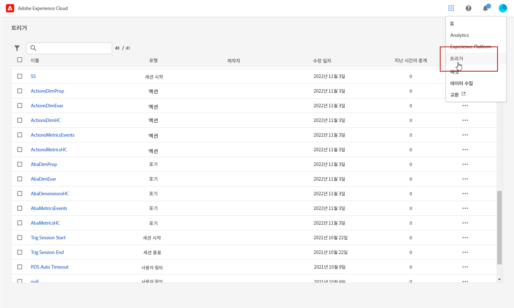
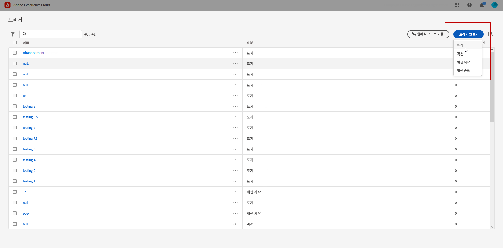
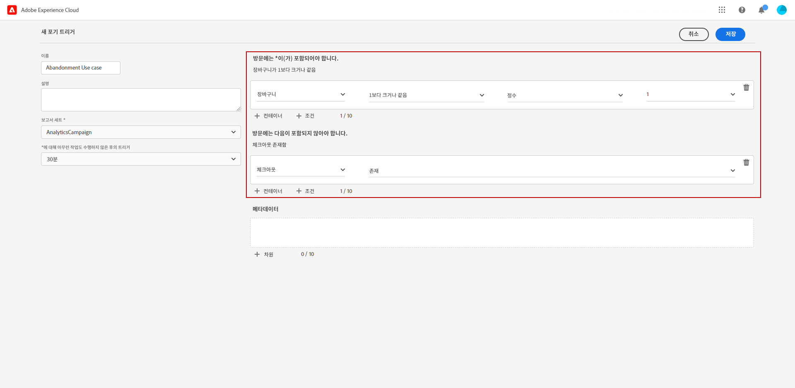
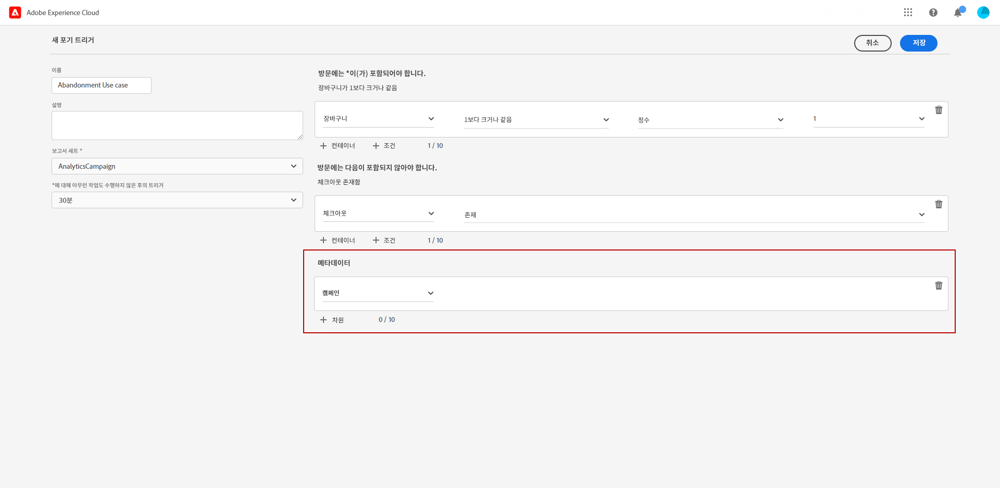
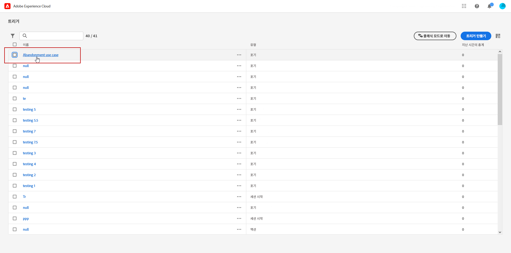
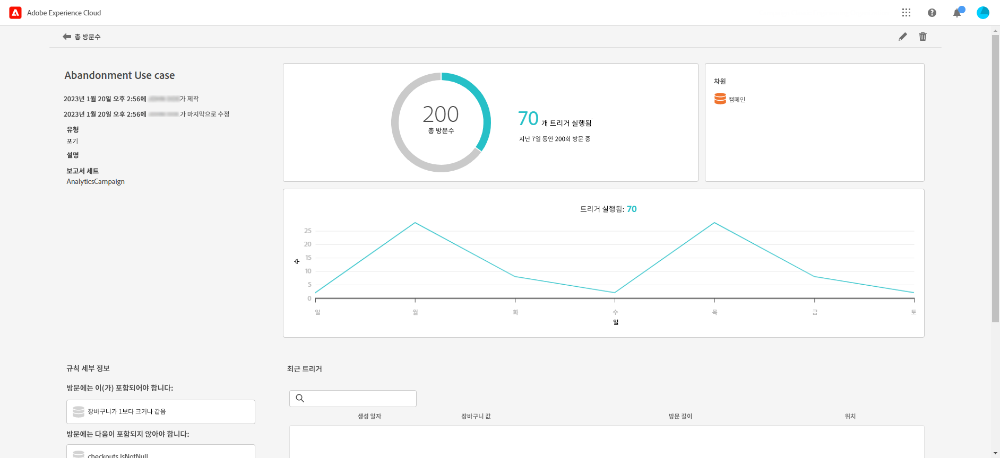

# Experience Cloud 트리거 만들기 {#create-triggers}

>[!NOTE]
>
> Experience Cloud 트리거를 위한 새로운 사용자 인터페이스를 통해서 직관적으로 소비자 행태를 관리하고 사용자 경험을 개인화할 수 있습니다. 이전 인터페이스로 전환하려면 **[!UICONTROL 클래식 모드로 이동]** 버튼을 클릭하십시오.

트리거를 생성하고 트리거 조건을 구성합니다. 예를 들어 장바구니 포기와 같은 지표 또는 제품 이름과 같은 차원과 같이, 방문 중의 트리거 규칙에 대한 기준을 지정할 수 있습니다. 규칙이 충족되면 트리거가 실행됩니다.

1. Experience Cloud에서 솔루션 전환기 메뉴를 선택한 다음 **[!UICONTROL 트리거]**&#x200B;를 선택합니다.

   

1. 사용자의 트리거 홈페이지에서 **[!UICONTROL 트리거 생성]**&#x200B;을 클릭하고 트리거 유형을 지정합니다.

   세 가지 유형의 트리거를 사용할 수 있습니다.

   * **[!UICONTROL 포기]**: 방문자가 제품을 보고 장바구니에 아무 것도 담지 않을 경우에 사용할 트리거를 생성할 수 있습니다.

   * **[!UICONTROL 액션]**: 예를 들면 뉴스레터 신청, 이메일 구독 또는 신용카드 신청(확인) 후에 사용할 트리거를 생성할 수 있습니다. 유통업의 경우 회원 프로그램에 등록한 방문자를 대상으로 트리거를 만들 수 있습니다. 미디어 및 엔터테인먼트에서는 특정 프로그램을 시청하고 설문 조사에 응답하기를 원하는 방문자를 대상으로 트리거를 만들 수 있습니다.

   * **[!UICONTROL 세션 시작 및 세션 종료]**: 세션 시작 및 세션 종료 이벤트를 위한 트리거를 생성합니다.

   

1. 트리거에 **[!UICONTROL 이름]**&#x200B;과 **[!UICONTROL 설명]**&#x200B;을 추가합니다.

1. 이 트리거에 사용된 Analytics **[!UICONTROL 보고서 세트]**&#x200B;를 선택합니다. 이 설정은 사용할 보고 데이터를 식별합니다.

   [보고서 세트에 대해 자세히 알아보십시오](https://experienceleague.adobe.com/docs/analytics/admin/admin-tools/manage-report-suites/c-new-report-suite/t-create-a-report-suite.html){target="_blank"}.

1. 유효 기간 동안 **[!UICONTROL 액션이 없을 경우 트리거]**&#x200B;를 선택합니다.

1. **[!UICONTROL 방문에 반드시 포함]** 및 **[!UICONTROL 방문에 포함하지 않음]** 카테고리에서 원하는 또는 원하지 않는 기준 또는 방문자 행태를 정의할 수 있습니다. 정의하고자 하는 기준에 따라 조건 내 또는 조건 간에 **And** 또는 **Or** 로직을 지정할 수 있습니다.

   예를 들어 다음과 같은 간단한 장바구니 포기 트리거를 위한 규칙을 만들 수 있습니다.

   * **[!UICONTROL 방문에 반드시 포함]**: `Carts (metric) Is greater or equal to 1` 장바구니에 최소 한 개 항목을 담은 방문자를 대상으로 합니다.
   * **[!UICONTROL 방문에 포함하지 않음]**: `Checkout (metric) Exists.` 장바구니에 담긴 항목을 구매한 방문자를 제거합니다.

   

1. **[!UICONTROL 컨테이너]**&#x200B;를 클릭해서 트리거를 정의하는 규칙, 조건 또는 필터를 설정하고 저장합니다. 여러 이벤트가 동시에 진행되도록 하려면 그들을 동일한 컨테이너에 둬야 합니다.

   각 컨테이너의 프로세스가 독립적으로 히트 레벨에서 진행, 즉 두 컨테이너가 **[!UICONTROL And]** 연산자로 결합된 경우 규칙은 두 히트가 요건을 충족할 때만 유효합니다.

1. **[!UICONTROL 메타데이터]** 필드에서 **[!UICONTROL + 차원]**&#x200B;을 클릭해서 특정 캠페인 차원 또는 방문자의 행태와 관련된 변수를 선택합니다.

   

1. **[!UICONTROL 저장]**&#x200B;을 클릭합니다.

1. 목록에서 새로 생성된 **[!UICONTROL 트리거]**&#x200B;를 선택하고 해당 트리거의 상세 보고서에 액세스합니다.

   

1. 해당 트리거의 상세 보기에서 몇 개의 트리거가 작동하였는지에 대한 보고서에 액세스할 수 있습니다. 필요할 경우 연필 아이콘으로 트리거를 편집할 수 있습니다.

   
