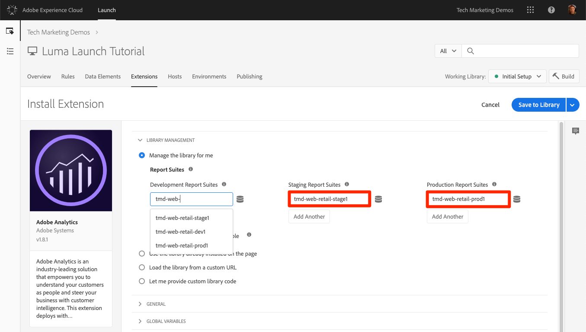
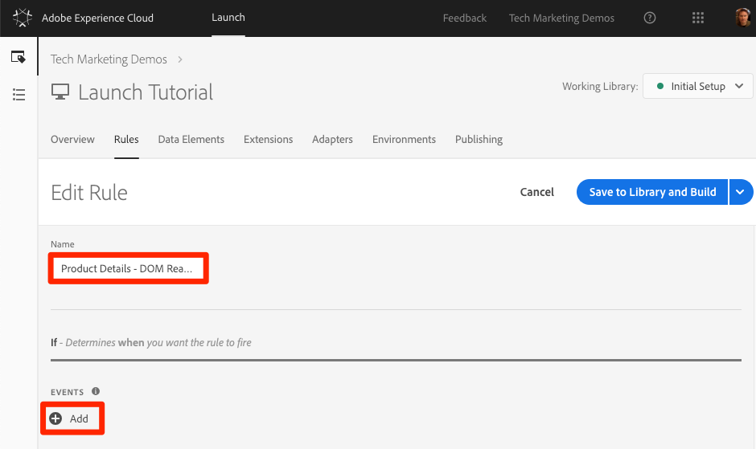
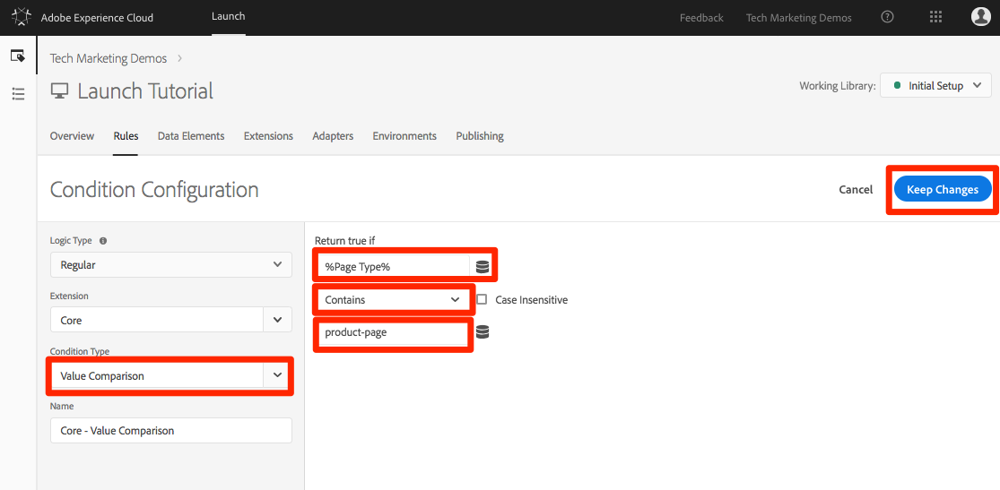
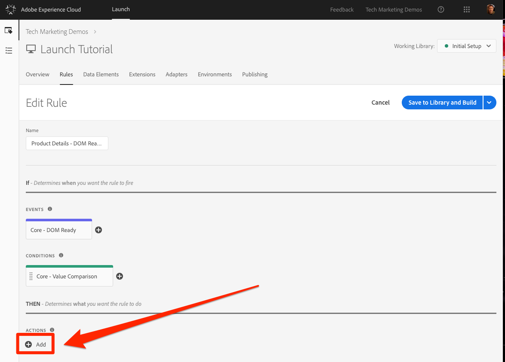
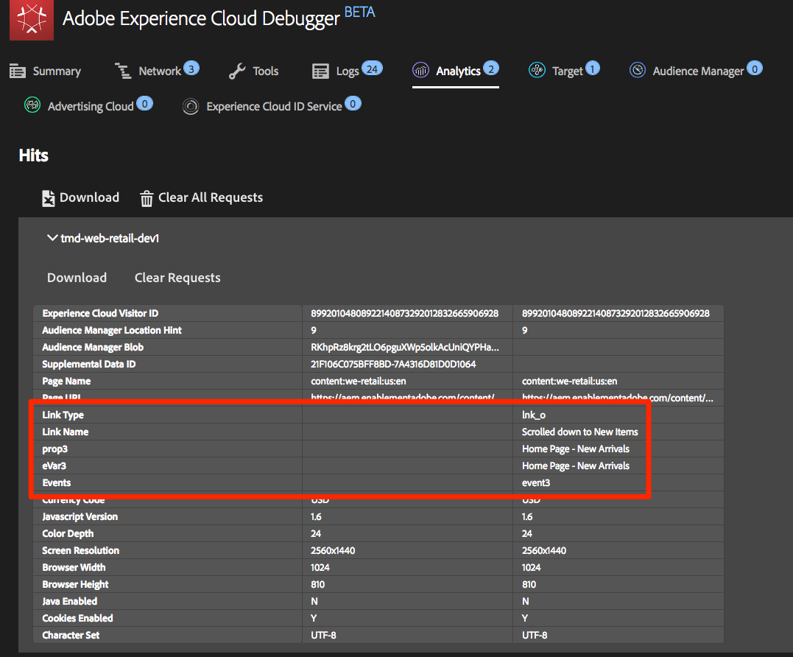

# Adobe Analytics 추가

이 단원에서는 Adobe Analytics 확장 [기능을](https://docs.adobe.com/content/help/en/launch/using/extensions-ref/adobe-extension/analytics-extension/overview.html) 구현하고 Adobe Analytics로 데이터를 전송하는 규칙을 만듭니다.

[Adobe Analytics](https://docs.adobe.com/content/help/en/analytics/landing/home.html)는 고객 인텔리전스로 고객을 사람으로 이해하고 고객 인텔리전스로 비즈니스를 이끌어 나갈 수 있는 업계 선도적인 솔루션입니다.

## 학습 목표

이 단원을 마치면 다음을 수행할 수 있습니다.

1. Adobe Analytics 확장 추가
1. 확장을 사용하여 글로벌 변수 설정
1. 페이지 보기 비콘 추가
1. 규칙을 사용하여 변수 추가
1. 클릭 추적 및 기타 이벤트 기반 비콘 추가
1. Analytics 플러그인 추가

Launch에서 Analytics에 대해 구현할 수 있는 것은 많습니다. 이 단원은 철저하지 않지만, 자신의 사이트에서 구현하는 데 필요한 주요 기술에 대한 명확한 개요를 제공해야 합니다.

## 전제 조건

You should have already completed the lessons in [Configure Launch](launch.md) and [Add the Identity Service](id-service.md).

또한 하나 이상의 보고서 세트 ID와 추적 서버가 필요합니다. 이 튜토리얼에 사용할 수 있는 테스트/개발 보고서 세트가 없는 경우 하나를 만드십시오. 방법을 잘 모르는 경우 [설명서](https://docs.adobe.com/content/help/en/analytics/admin/manage-report-suites/new-report-suite/new-report-suite.html)를 참조하십시오. 현재 구현, Adobe 컨설턴트 또는 고객 지원 센터 담당자로부터 추적 서버를 검색할 수 있습니다.

## Analytics 확장 추가

Analytics 익스텐션은 다음 두 가지 주요 부분으로 구성됩니다.

1. 확장 구성: 코어 AppMeasurement.js 라이브러리 설정을 관리하고 글로벌 변수를 설정할 수 있음
1. 규칙 작업: 다음을 수행합니다.
   1. 변수 설정
   1. 변수 지우기
   1. Analytics 비콘 보내기

**Analytics 확장 기능을 추가하려면**

1. 확장 **[!UICONTROL &gt; 카탈로그로 이동]**
1. Adobe Analytics 확장 프로그램 찾기
1. 설치를 **[!UICONTROL 클릭합니다]**

   

1. 라이브러리 [!UICONTROL 관리 &gt; 보고서 세트에서]각 실행 환경에 사용할 보고서 세트 ID를 입력합니다. 상자에 입력을 시작하면 모든 보고서 세트의 미리 채워진 목록이 표시됩니다. (이 튜토리얼에서는 모든 환경에 대해 하나의 보고서 세트를 사용할 수 있지만 실제 환경에서는 아래 이미지와 같이 별도의 보고서 세트를 사용합니다.)

   

   >[!TIP] 라이브러리를 보다 손쉽게 최신 상태로 유지할 수 [!UICONTROL 있도록 라이브러리 관리]  설정으로 라이브러리 관리 옵션을 `AppMeasurement.js` 사용하는 것이 좋습니다.

1. 일반 [!UICONTROL &gt; 추적]서버에서 추적 서버를 입력합니다(예:"`tmd.sc.omtrdc.net`" Enter your SSL Tracking Server if your site supports `https://`

   

1. 전역 [!UICONTROL 변수 섹션에서]데이터 [!UICONTROL 요소를 사용하여 페이지] 이름 `Page Name` 변수를설정합니다. 데이터 요소 아이콘  `Page Name` 데이터 요소를 선택합니다.

1. 라이브러리에 **[!UICONTROL 저장 및 빌드를 클릭합니다.]**

   

>[!NOTE] 글로벌 변수는 확장 구성 또는 규칙 작업에서 설정할 수 있습니다. Be aware that when setting variables in the extension configuration, the data layer must be defined *before* the Launch embed codes.

## 페이지 보기 비콘 보내기

이제 Analytics 비콘이 실행되는 규칙을 만들어 Extension 구성에 설정된 [!UICONTROL 페이지] 이름 변수를 전송합니다.

You have already created an "All Pages - Library Loaded" rule in the [Add a Data Element, a Rule and a Library](launch-data-elements-rules.md) lesson of this tutorial, which is triggered on every page when the Launch library loads. Analytics에도 이 규칙을 사용할 *수* 있지만, 이 설정은 Analytics 비콘에 사용된 모든 데이터 레이어 특성을 론치 포함 코드 전에 정의해야 합니다. 데이터 수집을 보다 유연하게 하려면 DOM Ready에서 트리거된 새 "모든 페이지" 규칙을 만들어 Analytics 비콘을 실행합니다.

**페이지 보기 비콘 보내기**

1. 상단 **[!UICONTROL 탐색의 규칙]** 섹션으로 이동한 다음 규칙 **[!UICONTROL 추가를 클릭합니다]**

   

1. 규칙 이름을 지정합니다 `All Pages - DOM Ready`
1. Click **[!UICONTROL Events &gt; Add]** to open the `Event Configuration` screen

   

1. [ **[!UICONTROL 이벤트 유형] &gt; [DOM 준비]** ]를 선택합니다(규칙 순서는 "50"입니다).
1. Click **[!UICONTROL Keep Changes]**
   

1. Under Actions, click the  to add a new action

   

1. 확장 **[!UICONTROL &gt; Adobe Analytics를 선택합니다.]**

1. 작업 **[!UICONTROL 유형 &gt; 비콘 전송을 선택합니다.]**

1. 추적을 `s.t()`로 설정된 대로 둡니다. Note that if you wanted to make an `s.tl()` call in a click-event rule you could do that using the Send Beacon action, as well.

1. 변경 내용 **[!UICONTROL 유지 단추를 클릭합니다]** .

   

1. 라이브러리에 **[!UICONTROL 저장 및 빌드를 클릭합니다.]**

   

### 페이지 보기 비콘 유효성 확인

Analytics 비콘을 보내는 규칙을 만들었으므로 이제 Experience Cloud Debugger에서 요청을 볼 수 있습니다.

1. Open the [Luma site](https://luma.enablementadobe.com/content/luma/us/en.html) in your Chrome browser
1. 디버거 아이콘 Experience  열기를 클릭하여 **[!UICONTROL Adobe Experience Cloud Debugger를 엽니다]**
1. Make sure the Debugger is mapping the Launch property to *your* Development environment, as described in the [earlier lesson](launch-switch-environments.md)

   

1. 을 클릭하여 분석 탭을 엽니다.
1. 보고서 세트 이름을 확장하여 모든 요청을 표시합니다.
1. 요청이 페이지 이름 변수 및 값으로 실행되었는지 확인합니다

   

>[!NOTE] 페이지 이름이 표시되지 않는 경우 이 페이지의 이전 단계로 이동하여 아무 것도 놓치지 않았는지 확인하십시오.

## 규칙을 사용하여 변수 추가

When you configured the Analytics Extension, you populated the `pageName` variable in the extension configuration. 이 위치는 Launch 포함 코드가 로드되기 전에 페이지에서 이 값을 사용할 수 있는 경우 eVars 및 props와 같은 다른 글로벌 변수를 입력하기에 적합합니다.

변수(이벤트)를 설정하는 보다 유연한 위치는 `Set Variables` 동작을 사용하는 규칙에 있습니다. 규칙을 사용하면 다른 조건에서 다른 Analytics 변수 및 이벤트를 설정할 수 있습니다. For example, you could set the `prodView` only on product detail pages and the `purchase` event only on order confirmation pages. 이 섹션에서는 규칙을 사용하여 변수를 설정하는 방법을 설명합니다.

### 사용 사례

PDP(Product Detail Page)는 소매 사이트에서 데이터 수집을 위한 중요한 지점입니다. 일반적으로 Analytics에서 제품 보기가 발생하여 본 제품을 등록하도록 합니다. 이는 고객에게 인기 있는 제품을 파악하는 데 도움이 됩니다. 미디어 사이트에서 아티클 또는 비디오 페이지는 이 섹션에서 사용할 추적 기술과 유사한 추적 기술을 사용할 수 있습니다.  When you load a Product Detail Page, you might want to put that value into a "Page Type" `eVar`, as well as set some events and the product id. 이를 통해 분석에서 다음을 볼 수 있습니다.

1. 제품 세부 사항 페이지가 몇 번이나 로드됩니까
1. 어떤 제품을 보았으며, 몇 번이나 보았습니까
1. 사람들이 로드하는 PDP 수에 다른 요소(캠페인, 검색 등)가 어떻게 영향을 줍니까

### 페이지 유형에 대한 데이터 요소 만들기

먼저 제품 세부 사항 페이지를 식별해야 합니다. 데이터 요소를 사용하면 됩니다.

**페이지 유형에 대한 데이터 요소를 만들려면**

1. 위쪽 **[!UICONTROL 탐색에서]** 데이터 요소를 클릭합니다.
1. 데이터 **[!UICONTROL 요소 추가를 클릭합니다.]**

   

1. 데이터 요소에 이름을 지정합니다 `Page Type`
1. 데이터 **[!UICONTROL 요소 유형 &gt; JavaScript 변수 선택]**
1. Use `digitalData.page.category.type` as the `JavaScript variable name`
1. Check the `Clean text` and `Force Lower Case` options
1. 라이브러리에 **[!UICONTROL 저장 및 빌드를 클릭합니다.]**

   

### 제품 ID에 대한 데이터 요소 만들기

그런 다음 데이터 요소를 사용하여 현재 제품 세부 사항 페이지의 제품 ID를 수집합니다

**제품 ID에 대한 데이터 요소를 만들려면**

1. 위쪽 **[!UICONTROL 탐색에서]** 데이터 요소를 클릭합니다.
1. 데이터 **[!UICONTROL 요소 추가를 클릭합니다.]**

   

1. 데이터 요소에 이름을 지정합니다 `Product Id`
1. 데이터 **[!UICONTROL 요소 유형 &gt; JavaScript 변수 선택]**
1. Use `digitalData.product.0.productInfo.sku` as the `JavaScript variable name`
1. Check the `Force lowercase value` option
1. Check the `Clean text` option
1. 라이브러리에 **[!UICONTROL 저장 및 빌드를 클릭합니다.]**

   

### Adobe Analytics 제품 문자열 확장 추가

If you are already familiar with Adobe Analytics implementations, you are probably familiar with the [products variable](https://docs.adobe.com/content/help/en/analytics/components/variables/dimensions-reports/reports-products.html). products 변수는 매우 구체적인 구문을 가지며 컨텍스트에 따라 약간 다른 방식으로 사용됩니다. Launch에서 제품 변수의 인구를 더 쉽게 만들기 위해 Launch 확장 시장에서 이미 세 개의 추가 확장이 만들어졌습니다. 이 섹션에서는 Adobe Consulting에서 만든 익스텐션을 추가하여 제품 세부 사항 페이지에 사용하게 됩니다.

**확장명을 추가하려면`Adobe Analytics Product String`다음을 추가하십시오.**

1. 확장 [!UICONTROL &gt; 카탈로그 페이지로] 이동
1. Adobe Consulting Services에서 `Adobe Analytics Product String` 익스텐션을 찾아 설치를 **[!UICONTROL 클릭합니다]**
   
1. 잠시 지침을 읽어 보십시오
1. 라이브러리에 **[!UICONTROL 저장 및 빌드를 클릭합니다.]**

   

### 제품 세부 사항 페이지에 대한 규칙 만들기

이제 새로운 데이터 요소 및 익스텐션을 사용하여 제품 세부 사항 페이지 규칙을 작성합니다. 이 기능의 경우 DOM Ready에 의해 트리거된 다른 페이지 로드 규칙을 만듭니다. However, you will use a condition so that it only fires on the Product Detail pages and the order setting so that it fires _before_ the rule that sends the beacon.

**제품 세부 사항 페이지 규칙을 만들려면**

1. 상단 **[!UICONTROL 탐색의 규칙]** 섹션으로 이동한 다음 규칙 **[!UICONTROL 추가를 클릭합니다]**

   

1. 규칙 이름을 지정합니다 `Product Details - DOM Ready - 40`
1. Click **[!UICONTROL Events &gt; Add]** to open the `Event Configuration` screen

   

1. [이벤트 **[!UICONTROL 유형] &gt; [DOM 준비]를 선택합니다.]**
1. Set the **[!UICONTROL Order]** to 40, so that the rule will run *before* the rule containing the Analytics &gt; Send Beacon action
1. Click **[!UICONTROL Keep Changes]**
   

1. 조건에서 **[!UICONTROL 더하기]**&#x200B;아이콘을  `Condition Configuration` 화면을 엽니다.
   

   1. 조건 **[!UICONTROL 유형 &gt; 값 비교를 선택합니다.]**
   1. Use the data element picker, choose `Page Type` in the first field
   1. 비교 **[!UICONTROL 연산자]** 드롭다운에서 포함 선택
   1. 다음 필드 유형 `product-page` (PDP의 데이터 레이어에서 가져온 페이지 유형 값의 고유 부분)
   1. Click **[!UICONTROL Keep Changes]**

      

1. Under Actions, click the  to add a new action

   

1. 확장 **[!UICONTROL &gt; Adobe Analytics를 선택합니다.]**
1. 작업 **[!UICONTROL 유형 &gt; 변수 설정을 선택합니다.]**
1. eVar1 **[!UICONTROL &gt; 다음으로]** 설정을 선택하고 `product detail page`
1. Set **[!UICONTROL event1]**, leaving the optional values blank
1. 이벤트에서 다른 **[!UICONTROL 추가 단추를 클릭합니다]**
1. Set the **[!UICONTROL prodView]** event, leaving the optional values blank
1. Click **[!UICONTROL Keep Changes]**

   

1. Under Actions, click the  to add a new action

   

1. 확장 **[!UICONTROL &gt; Adobe Analytics 제품 문자열을 선택합니다.]**
1. 작업 **[!UICONTROL 유형 &gt; s.products 설정을 선택합니다.]**

1. Analytics **[!UICONTROL 전자 상거래 이벤트]** 섹션에서 prodView를 **[!UICONTROL 선택합니다]**

1. 제품 **[!UICONTROL 데이터의]** 데이터 레이어 변수에서 데이터 요소 선택기를 사용하여 `Product Id` 데이터 요소를 선택합니다

1. Click **[!UICONTROL Keep Changes]**

   

1. 라이브러리에 **[!UICONTROL 저장 및 빌드를 클릭합니다.]**

   

### 제품 세부 사항 페이지 데이터 유효성 검사

비콘이 전송되기 전에 변수를 설정하는 규칙을 만들었습니다. 이제 Experience Cloud Debugger의 히트에서 나가는 새 데이터를 볼 수 있습니다.

**제품 세부 사항 페이지 데이터의 유효성을 확인하려면**

1. Open the [Luma site](https://luma.enablementadobe.com/content/luma/us/en.html) in your Chrome browser
1. 제품 세부 사항 페이지로 이동합니다
1. 디버거 아이콘 Experience  열기를 클릭하여 **[!UICONTROL Adobe Experience Cloud Debugger를 엽니다]**
1. Analytics 탭을 클릭합니다.
1. 보고서 세트 확장
1. Notice the Product Detail Variables that are now in the debugger, namely that `eVar1` has been set to "product detail page", that the `Events` variable has been set to "event1" and "prodView", that the products variable is set with the product id of the product you are viewing, and that your Page Name is still set by the Analytics extension

   

## 추적 링크 비콘 보내기

페이지가 로드되면 일반적으로 `s.t()` 함수에 의해 트리거되는 페이지 로드 비콘을 실행합니다. This automatically increments a `page view` metric for the page listed in the `pageName` variable.

하지만 수행되는 작업이 페이지 보기와 "더 작음"(또는 다를 수 있음)이므로 사이트의 페이지 보기를 증가시키지 않을 수도 있습니다. In this case, you will use the `s.tl()` function, which is commonly referred to as a "track link" request. 이것을 추적 링크 요청이라고 하지만, 링크 클릭 시 트리거되지 않아도 됩니다. It can be triggered by *any* of the events that are available to you in the Launch rule builder, including your own custom JavaScript.

이 자습서에서는 가장 멋진 JavaScript 이벤트 중 하나인 `s.tl()` `Enters Viewport` 이벤트를 사용하여 호출을 트리거합니다.

### 사용 사례

이 사용 사례에서는 사람들이 Luma 홈 페이지에서 아래로 스크롤하여 페이지의 *새 도착 섹션을 볼 수* 있는지 알고 싶어합니다. 사람들이 해당 섹션을 보고 있는지 여부에 대한 내부 불화가 있으므로 Analytics를 사용하여 진실을 파악하고자 합니다.

### 론치에서 규칙 만들기

1. 상단 **[!UICONTROL 탐색의 규칙]** 섹션으로 이동한 다음 규칙 **[!UICONTROL 추가를 클릭합니다]**
   
1. 규칙 이름을 지정합니다 `Homepage - New Arrivals enters Viewport`
1. Click **[!UICONTROL Events &gt; Add]** to open the `Event Configuration` screen

   

1. [이벤트 **[!UICONTROL 유형] &gt; [뷰포트에 입장]을 선택합니다]**. 이렇게 하면 CSS 선택기를 입력해야 하는 필드가 표시됩니다. 이 선택기는 페이지에서 규칙이 브라우저에서 뷰에 들어올 때 트리거되어야 하는 항목을 식별합니다.
1. 루마의 홈 페이지로 돌아가서 새 도착 섹션으로 스크롤합니다.
1. NEW ARRIVALS 제목과 이 섹션의 항목 사이에 있는 공백을 마우스 오른쪽 버튼으로 클릭하고 표시되는 메뉴에서 `Inspect`를 선택합니다. 이것은 여러분이 원하는 것에 가깝게 할 것입니다.
1. 바로 그 주변에, 선택한 섹션 바로 아래에서, div를 찾고 `class="we-productgrid aem-GridColumn aem-GridColumn--default--12"`있습니다. 이 요소를 찾습니다.
1. 이 요소를 마우스 오른쪽 버튼으로 클릭하고 복사 &gt; **[!UICONTROL 선택기 복사를 선택합니다.]**

   

1. Launch로 돌아가서 클립보드에서 레이블이 지정된 필드에 이 값을 붙여 넣습니다 `Elements matching the CSS selector`.
   1. 참고로, CSS 선택기를 식별하는 방법을 결정하는 것은 여러분에게 달려 있습니다. 페이지의 특정 변경 사항이 이 선택기를 끊을 수 있으므로 이 방법은 약간 깨집니다. Launch에서 CSS 선택기를 사용할 때 이 옵션을 고려하십시오.
1. Click **[!UICONTROL Keep Changes]**
   

1. 조건에서 더하기  클릭하여 새 조건을 추가합니다
1. 조건 **[!UICONTROL 유형 &gt; 값 비교를 선택합니다.]**
1. Use the data element picker, choose `Page Name` in the first field
1. 비교 **[!UICONTROL 연산자]** 드롭다운에서 같음 선택
1. 다음 필드 유형에서 `content:we-retail:us:en` (이것은 데이터 레이어에서 가져온 홈 페이지의 페이지 이름입니다. 홈 페이지에서만 이 규칙을 실행할 수 있습니다.)
1. Click **[!UICONTROL Keep Changes]**

   

1. Under Actions, click the  to add a new action
1. 확장 **[!UICONTROL &gt; Adobe Analytics를 선택합니다.]**
1. 작업 **[!UICONTROL 유형 &gt; 변수 설정을 선택합니다.]**
1. Set `eVar3` to `Home Page - New Arrivals`
1. Set `prop3` to `Home Page - New Arrivals`
1. Set the `Events` variable to `event3`
1. Click **[!UICONTROL Keep Changes]**

   

1. Under Actions, click the  to add another new action

   

1. 확장 **[!UICONTROL &gt; Adobe Analytics를 선택합니다.]**
1. 작업 **[!UICONTROL 유형 &gt; 비콘 전송을 선택합니다.]**
1. **[!UICONTROL s.tl()]추적 옵션을 선택합니다**
1. 링크 **[!UICONTROL 이름]** 필드에 을 입력합니다 `Scrolled down to New Arrivals`. 이 값은 Analytics의 사용자 지정 링크 보고서에 배치됩니다.
1. Click **[!UICONTROL Keep Changes]**

   

1. 라이브러리에 **[!UICONTROL 저장 및 빌드를 클릭합니다.]**

   

### 추적 링크 비콘 유효성 확인

이제 이 히트가 Adobe 사이트의 홈 페이지(Home Page)의 새 도착 섹션으로 스크롤 다운될 때 발생하는지 확인합니다. 처음 홈 페이지를 로드할 때는 요청을 하지 말아야 하지만 아래로 스크롤하여 섹션이 표시되면, 히트가 새 값으로 실행되어야 합니다.

1. Chrome [브라우저에서 Luma 사이트를](https://luma.enablementadobe.com/content/luma/us/en.html) 열고 홈 페이지의 상단에 있는지 확인합니다.
1. 디버거 아이콘 **** 디버거 열기를 클릭하여 [!UICONTROL Adobe ExperienceCloud Debugger를 엽니다.]
1. Analytics 탭을 클릭합니다.
1. 보고서 세트의 히트 확장
1. 페이지 이름 등이 있는 홈 페이지의 일반 페이지 보기 히트를 확인합니다. (eVar3 또는 prop3에서는 아무 것도 없습니다.)

   

1. 디버거를 열고 사이트에서 아래로 스크롤하여 새 도착 섹션을 볼 수 있습니다
1. 디버거를 다시 보면 다른 Analytics 히트가 표시되어야 합니다. 이 히트에 설정한 s.tl() 히트와 연결된 매개 변수가 있어야 합니다. 즉,
   1. `LinkType = "link_o"` (이것은 히트가 페이지 보기 히트가 아닌 사용자 지정 링크 히트임을 의미합니다.)
   1. `LinkName = "Scrolled down to New Arrivals"`
   1. `prop3 = "Home Page - New Arrivals"`
   1. `eVar3 = "Home Page - New Arrivals"`
   1. `Events = "event3"`

      

## 플러그인 추가

플러그인은 구현에 추가하여 제품에 내장되어 있지 않은 특정 기능을 수행할 수 있는 JavaScript 코드 일부입니다. 플러그인은 귀하, 다른 Adobe 고객/파트너 또는 Adobe 컨설팅 업체가 작성할 수 있습니다.

플러그인을 구현하려면 기본적으로 다음 세 단계가 있습니다.

1. 플러그인을 참조할 doPlugins 함수 포함
1. 플러그인에 대한 main 함수 코드를 추가합니다
1. 함수 호출, 변수 설정 등을 수행하는 코드를 포함합니다.

### Analytics 개체를 전역으로 액세스 가능하게 만들기

doPlugins 함수(아래)를 추가하고 플러그인을 사용하려면 Analytics 구현에서 Analytics "s" 개체를 전체적으로 사용할 수 있도록 확인란을 선택해야 합니다.

1. 확장 **[!UICONTROL &gt; 설치됨으로 이동]**

1. Adobe Analytics 익스텐션에서 구성을 **[!UICONTROL 클릭합니다]**

   

1. 라이브러리 **[!UICONTROL 관리에서]**&#x200B;레이블이 있는 상자를 선택합니다 `Make tracker globally accessible`. 도움말 버블에서 볼 수 있듯이, 이렇게 하면 추적기의 범위가 window.s 아래에 전역적으로 지정됩니다. 이러한 범위는 고객 JavaScript에서 추적기를 참조하는 것과 같이 중요합니다.

### doPlugins 함수 포함

플러그인을 추가하려면 doPlugins라는 함수를 추가해야 합니다. 이 함수는 기본적으로 추가되지 않고 한 번 추가되면 AppMeasurement 라이브러리에서 처리되며 히트가 Adobe Analytics로 전송될 때 마지막으로 호출됩니다. 따라서 이 함수를 사용하여 이 방식으로 쉽게 설정된 변수를 설정하는 일부 JavaScript를 실행할 수 있습니다.

1. While still in the Analytics extension, scroll down and expand the section titled `Configure Tracker Using Custom Code.`
1. Click **[!UICONTROL Open Editor]**
1. 다음 코드를 코드 편집기에 붙여넣습니다.

   ```javascript
   /* Plugin Config */
   s.usePlugins=true
   s.doPlugins=function(s) {
   /* Add calls to plugins here */
   }
   ```

1. 다음 단계를 위해 이 창을 열어 두십시오

### 플러그인에 대한 함수 코드 추가

이 코드에서는 두 플러그인을 실제로 호출하려고 하지만, 그 중 하나가 AppMeasurement 라이브러리에 내장되어 있으므로 호출할 함수를 추가할 필요가 없습니다. 그러나 두 번째 코드에 대해서는 함수 코드도 추가해야 합니다. 이 함수를 getValOnce()라고 합니다.

### getValOnce() 플러그인

이 플러그인의 목적은 방문자가 페이지를 새로 고치거나 브라우저의 뒤로 단추를 사용하여 값이 설정된 페이지로 돌아갈 때 코드에서 값이 잘못 복제되지 않도록 하는 것입니다. 이 단원에서는 이벤트를 복제할 수 없도록 하기 위해 이 `clickthrough` 이벤트를 사용합니다.

이 플러그인의 코드는 [Analytics 설명서](https://docs.adobe.com/content/help/en/analytics/implementation/javascript-implementation/plugins/getvalonce.html)에 나와 있지만 쉽게 복사/붙여넣기를 할 수 있도록 여기에 포함되어 있습니다.

1. 다음 코드를 복사합니다.

   ```javascript
   /*
   * Plugin: getValOnce_v1.11
   */
   s.getValOnce=new Function("v","c","e","t",""
   +"var s=this,a=new Date,v=v?v:'',c=c?c:'s_gvo',e=e?e:0,i=t=='m'?6000"
   +"0:86400000,k=s.c_r(c);if(v){a.setTime(a.getTime()+e*i);s.c_w(c,v,e"
   +"==0?0:a);}return v==k?'':v");
   ```

1. Analytics 확장의 코드 창에 붙여 넣습니다(아직 열지 않은 경우 이전 단계에 따라 다시 열기). doPlugins 함수 **아래** 완전히 제거됩니다.

   

이제 doPlugins 내에서 이 플러그인을 호출할 수 있습니다.

### doPlugins 내에서 플러그인 호출

코드가 있고 참조할 수 있으므로 doPlugins 함수 내에서 플러그인을 호출할 수 있습니다.

먼저 AppMeasurement 라이브러리에 통합되었으며 이를 "유틸리티"라고 하는 플러그인을 호출합니다. It is referred to as `s.Util.getQueryParam`, because it is part of the s object, is a built-in utility, and will grab values (based on a parameter) from the query string in the URL.

1. 다음 코드를 복사합니다.

   ```javascript
   s.campaign = s.Util.getQueryParam("cid");
   ```

1. doPlugins 함수에 붙여 넣습니다. This will look for a parameter called `cid` in the current page URL and place it into the s.campaign variable.
1. 이제 다음 코드를 복사하여 getQueryParam 호출 바로 아래에 붙여 넣어 getValOnce 함수를 호출합니다.

   ```javascript
   s.campaign=s.getValOnce(s.campaign,'s_cmp',30);
   ```

   이 코드는 30일 동안 한 행에 동일한 값이 두 번 이상 전송되지 않도록 합니다(이 코드를 필요에 맞게 사용자 지정하는 방법은 설명서를 참조하십시오).

   

1. 코드 창을 저장합니다
1. 라이브러리에 **[!UICONTROL 저장 및 빌드를 클릭합니다.]**

   

### 플러그인 유효성 검사

이제 플러그인이 작동하는지 확인할 수 있습니다.

**플러그인의 유효성을 확인하려면**

1. Open the [Luma site](https://luma.enablementadobe.com/content/luma/us/en.html) in your Chrome browser
1. 디버거 아이콘 Experience  열기를 클릭하여 **[!UICONTROL Adobe Experience Cloud Debugger를 엽니다]**
1. Analytics 탭을 클릭합니다.
1. 보고서 세트 확장
1. Analytics 히트에 캠페인 변수가 없습니다.
1. Leaving the Debugger open, go back to the Luma site and add  `?cid=1234` to the URL and hit Enter to refresh the page with that query string included

   

1. Check the Debugger and confirm that there is a second Analytics request with a Campaign variable set to `1234`

   

1. 쿼리 문자열이 URL에 있는 상태로 돌아가서 루마 페이지를 다시 새로 고칩니다.
1. getValOnce 플러그인이 중복되지 않도록 하고 캠페인 추적 코드에서 다른 사람이 온 것처럼 보이도록 했으므로 디버거에서 다음 히트를 확인하고 캠페인 변수가 있으면 **안** 됩니다.

   

1. BONUS: You can test this over and over by changing the value of the `cid` parameter in the query string. The Campaign variable should only be there if it is the **first** time you run the page with the value. If you are not seeing the Campaign value in the debugger, simply change the value of the `cid` in the query string of the URL, hit enter, and you should see it again in the debugger.

   >[!NOTE] 실제로 Analytics 확장 구성을 포함하여 URL의 쿼리 문자열에서 매개 변수를 선택하는 몇 가지 방법이 있습니다. 그러나 이러한 다른 비플러그인 옵션에서는 getValOnce 플러그인을 사용해 보았듯이 불필요한 중복을 중지할 수 없습니다. 작성자가 선호하는 방법이지만 사용자와 사용자의 요구 사항에 가장 적합한 방법을 결정해야 합니다.

잘했어! Analytics 단원을 완료했습니다. 물론 Adobe Analytics 구현을 향상시키기 위해 할 수 있는 다른 많은 기능이 있지만 이를 통해 나머지 요구 사항을 해결하는 데 필요한 핵심 기술이 제공될 것입니다.

[다음 "Adobe Audience Manager 추가" &gt;](audience-manager.md)
