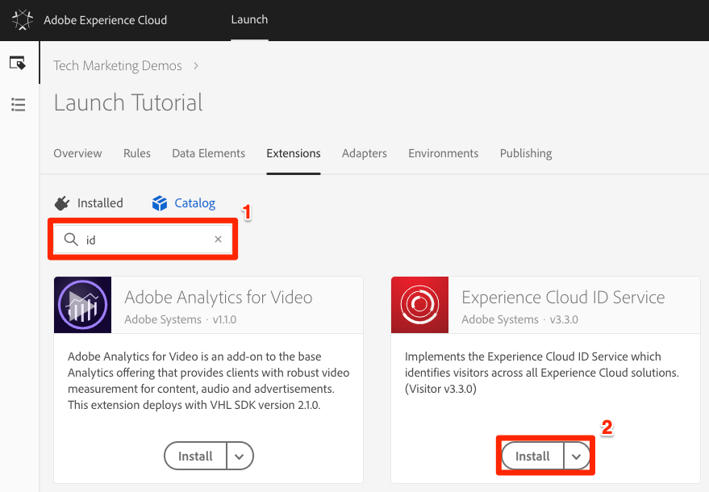
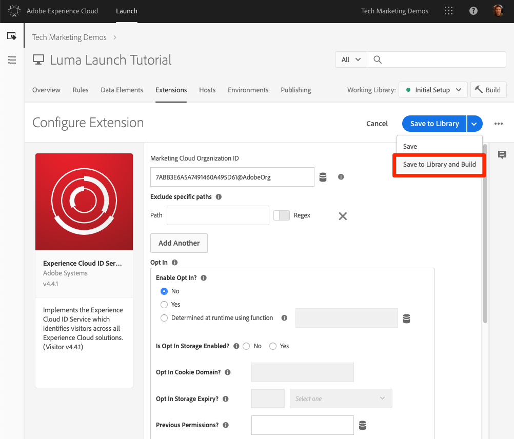

# Adobe Experience Platform ID 서비스 추가

이 단원에서는 Adobe Experience Platform ID 서비스 확장 [](https://docs.adobe.com/content/help/en/launch/using/extensions-ref/adobe-extension/id-service-extension/overview.html) 기능을 구현하고 고객 ID를 전송하는 데 필요한 단계를 안내합니다.

Adobe [Experience Platform Identity Service는](https://docs.adobe.com/content/help/en/id-service/using/home.html) 솔루션 간 대상 공유와 같은 Experience Cloud 기능을 강화하기 위해 모든 Adobe 솔루션에 대해 공통 방문자 ID를 설정합니다.  또한 고객 ID를 서비스로 보내 크로스 디바이스 타깃팅과 CRM(Customer Relationship Management) 시스템과의 통합을 활성화할 수 있습니다.

## 학습 목표

이 단원을 마치면 다음을 수행할 수 있습니다.

* ID 서비스 확장 추가
* 데이터 요소를 만들어 고객 ID 수집
* "고객 ID 설정" 동작을 사용하여 고객 ID를 Adobe로 전송하는 규칙 만들기
* 규칙 순서 지정 기능을 사용하여 동일한 이벤트에서 실행되는 규칙 순서 지정

## 전제 조건

You should have already completed the lessons in the [Configure Launch](launch.md) section.

## ID 서비스 확장 추가

처음 추가하려는 익스텐션이 처음이므로 익스텐션에 대한 간단한 개요를 소개합니다. 익스텐션은 Launch의 핵심 기능 중 하나입니다. 익스텐션은 Adobe, Adobe 파트너 또는 Adobe 고객이 구축한 통합으로, 웹 사이트에 배포할 수 있는 태그에 대한 새롭고 끝없는 옵션이 추가되었습니다. Launch를 운영 체제로 간주하는 경우 익스텐션은 사용자가 설치하는 앱이므로 Launch에서 필요한 작업을 수행할 수 있습니다.

**ID 서비스 확장을 추가하려면**

1. In the top navigation, click **[!UICONTROL Extensions]**

1. [ **[!UICONTROL 카탈로그]** ]를 클릭하여 [확장 카탈로그] 페이지로 이동

   

1. 카탈로그에서 사용할 수 있는 다양한 익스텐션을 확인하십시오

1. 맨 위의 필터에서 "id"를 입력하여 카탈로그를 필터링합니다.

1. Adobe Experience Platform Identity Service용 카드에서 [설치]를 **[!UICONTROL 클릭합니다]**

   

1. Experience Cloud 조직 ID가 자동으로 검색되었습니다.

1. 모든 기본 설정을 그대로 두고 라이브러리에 **[!UICONTROL 저장 및 빌드를 클릭합니다]**

   

>[!NOTE] Identity Service 확장의 각 버전은 익스텐션 설명에 명시된 특정 버전의 VisitorAPI.js와 함께 제공됩니다. Identity Service 확장을 업데이트하여 VisitorAPI.js 버전을 업데이트합니다.

### 확장 기능 확인

ID 서비스 익스텐션은 규칙 작업을 사용하지 않고도 요청을 수행하는 몇 안 되는 시작 익스텐션 중 하나입니다. 익스텐션은 웹 사이트에 대한 첫 번째 방문의 첫 번째 페이지 로드 시 Identity Service에 자동으로 요청됩니다. ID가 요청되면 "AMCV_"로 시작하는 퍼스트 파티 쿠키에 저장됩니다.

**ID 서비스 확장 프로그램의 유효성을 확인하려면**

1. Open the [Luma site](https://luma.enablementadobe.com/content/luma/us/en.html)

1. Make sure the Debugger is mapping the Launch property to *your* Development environment, as described in the [earlier lesson](launch-switch-environments.md).

1. 디버거의 요약 탭에서 실행 섹션은 Adobe Experience Platform ID 서비스 확장이 구현되었음을 나타내야 합니다.

1. 또한 요약 탭에서 Identity Service 섹션이 Launch 인터페이스의 확장 구성 화면에 있는 동일한 조직 ID로 채워야 합니다.

   

1. 방문자 ID를 검색하기 위한 초기 요청이 디버거의 ID 서비스 탭에 나타날 수 있습니다. 이미 요청했을 수도 있으며, 표시되지 않더라도 걱정하지 마십시오:
   

1. 방문자 ID 가져오기에 대한 초기 요청 이후 ID는 `AMCV_`로 시작되는 쿠키에 저장됩니다. 다음을 수행하면 쿠키가 설정되었는지 확인할 수 있습니다.
   1. 브라우저의 개발자 도구를 엽니다
   1. Go to the `Application` tab
   1. Expand `Cookies` on the left side
   1. Click on the domain `https://luma.enablementadobe.com`
   1. 오른쪽의 AMCV_ 쿠키를 찾습니다. 하드 코딩된 론치 속성을 사용하여 루마 사이트를 로드하고 자체 사이트에 매핑한 후 여러 개가 표시될 수 있습니다.
      

그러면 됩니다! 첫 번째 익스텐션을 추가했습니다. ID 서비스의 구성 옵션에 대한 자세한 내용은 설명서를 [참조하십시오](https://docs.adobe.com/content/help/en/id-service/using/id-service-api/configurations/function-vars.html).

## 고객 ID 보내기

그런 다음 고객 ID [를](https://docs.adobe.com/content/help/en/id-service/using/reference/authenticated-state.html) ID 서비스로 보냅니다. This will allow you to [integrate your CRM](https://docs.adobe.com/content/help/en/core-services/interface/customer-attributes/attributes.html) with the Experience Cloud as well as track visitors across devices.

In the earlier lesson, [Add Data Elements, Rules, and Libraries](launch-data-elements-rules.md) you created a data element and used it in a rule. 이제 방문자가 인증될 때 이러한 동일한 기법을 사용하여 고객 ID를 전송합니다.

### 고객 ID에 대한 데이터 요소 만들기

먼저 두 개의 데이터 요소를 만듭니다.

1. `Authentication State`—방문자가 로그인했는지 여부를 캡처하려면
1. `Email (Hashed)`- 데이터 레이어에서 해시 버전의 이메일 주소(고객 ID로 사용)를 캡처하려면

**인증 상태에 대한 데이터 요소를 만들려면**

1. 위쪽 **[!UICONTROL 탐색에서]** 데이터 요소를 클릭합니다.
1. 데이터 요소 **[!UICONTROL 추가 단추를 클릭합니다]** .

   

1. 데이터 요소에 이름을 지정합니다 `Authentication State`
1. 데이터 요소 **[!UICONTROL 유형에]**&#x200B;대해 사용자 **[!UICONTROL 지정 코드를 선택합니다.]**
1. 편집기 **[!UICONTROL 열기]** 단추

   

1. 코드 [!UICONTROL 편집] 창에서 다음 코드를 사용하여 Luma 사이트의 데이터 레이어의 속성을 기반으로 "로그인" 또는 "로그아웃" 값을 반환합니다.

   ```javascript
   if (digitalData.user[0].profile[0].attributes.loggedIn)
       return "logged in"
   else
       return "logged out"
   ```

1. Click **[!UICONTROL Save]** to save the custom code

   

1. 다른 모든 설정은 기본값으로 둡니다.
1. 라이브러리에 **[!UICONTROL 저장 및 빌드를]** 클릭하여 데이터 요소를 저장하고 데이터 요소 페이지로 돌아갑니다.

   

사용자의 인증 상태를 알면 ID 서비스로 전송할 고객 ID가 페이지에 있어야 하는 경우를 알 수 있습니다. 다음 단계는 고객 ID 자체에 대한 데이터 요소를 만드는 것입니다. Luma 데모 사이트에서는 방문자의 이메일 주소의 해시 버전을 사용합니다.

**해시된 이메일에 대한 데이터 요소를 추가하려면**

1. 데이터 요소 **[!UICONTROL 추가 단추를 클릭합니다]** .

   

1. 데이터 요소에 이름을 지정합니다 `Email (Hashed)`
1. 데이터 요소 **[!UICONTROL 유형에]**&#x200B;대해 JavaScript **[!UICONTROL 변수를 선택합니다.]**
1. JavaScript **[!UICONTROL 변수 이름으로]** Luma 사이트의 데이터 레이어에서 변수에 대한 다음 포인터를 사용합니다. `digitalData.user.0.profile.0.attributes.username`
1. 다른 모든 설정은 기본값으로 둡니다.
1. 라이브러리에 **[!UICONTROL 저장 및 빌드를]** 클릭하여 데이터 요소를 저장합니다

   

### 고객 ID를 전송하는 규칙 추가

Adobe Experience Platform Identity Service는 "고객 ID 설정"이라는 작업을 사용하여 규칙의 고객 ID를 전달합니다.  이제 방문자가 인증될 때 이 작업을 트리거하는 규칙을 만듭니다.

**고객 ID를 전송하는 규칙을 만들려면**

1. In the top navigation, click **[!UICONTROL Rules]**
1. 규칙 **[!UICONTROL 추가를]** 클릭하여 규칙 빌더를 엽니다

   

1. 규칙 이름을 지정합니다 `All Pages - Library Loaded - Authenticated - 10`

   >[!TIP] 이 이름 지정 규칙은 사용자가 인증될 때 이 규칙을 모든 페이지 맨 위에서 실행하고 있으며 주문률이 "10"임을 나타냅니다. 이와 같은 이름 지정 규칙을 사용하여 작업에 트리거된 솔루션에 대해 이름을 지정하는 대신 구현에 필요한 전체 규칙 수를 최소화할 수 있습니다.

1. Under **[!UICONTROL Events]** click **[!UICONTROL Add]**

   

   1. For the **[!UICONTROL Event Type]** select **[!UICONTROL Library Loaded (Page Top)]**
   1. For the  **[!UICONTROL Order]** enter `10`. 이 순서는 동일한 이벤트에 의해 트리거되는 규칙의 순서를 제어합니다. 순서가 낮은 규칙은 주문이 높은 규칙보다 먼저 실행됩니다. In this case, you want to set the customer ID before you fire the Target request, which you will do in the next lesson with a rule with an order of `50` .
   1. 변경 **[!UICONTROL 내용]** 유지 단추를 클릭하여 규칙 빌더로 돌아갑니다.
   

1. 조건에서 **[!UICONTROL 추가를]** **[!UICONTROL 클릭합니다]**

   

   1. 조건 **[!UICONTROL 유형의 경우]** 값 **[!UICONTROL 비교를 선택합니다.]**
   1. Click the  icon to open the Data Element modal

      

   1. 데이터 요소 모달에서 인증 **[!UICONTROL 상태를]** 클릭한 다음 선택을 **[!UICONTROL 클릭합니다]**

      

1. Make sure `Equals` is the operator
1. 텍스트 필드에 "로그인"을 입력하면 데이터 요소 "인증 상태"의 값이 "로그인"일 때마다 규칙이 실행됩니다.

1. Click **[!UICONTROL Keep Changes]**

   

1. 작업 **[!UICONTROL 아래에서]** 추가를 **[!UICONTROL 클릭합니다]**

   

   1. 익스텐션의 **[!UICONTROL 경우]** Adobe **[!UICONTROL Experience Platform Identity Service 선택]**
   1. 작업 **[!UICONTROL 유형에 대해 고객]** ID **[!UICONTROL 설정을 선택합니다.]**
   1. 통합 **[!UICONTROL 코드의]** 경우 `crm_id`
   1. 값의 **[!UICONTROL 경우]** 데이터 요소 선택기 양식을 열고 `Email (Hashed)`
   1. 인증 **[!UICONTROL 상태의 경우 인증된]** 상태를 **[!UICONTROL 선택합니다]**
   1. Click the **[!UICONTROL Keep Changes]** button to save the action and return to the Rule Builder

      

1. 라이브러리에 **[!UICONTROL 저장 및]** 빌드 단추를 클릭하여 규칙을 저장합니다

   

이제 방문자가 인증되었을 `crm_id` 때 고객 ID를 변수로 전송하는 규칙을 만들었습니다. Order를 `10` 이 규칙으로 지정했으므로, 기본 주문 값을 사용하는 데이터 요소, 규칙 및 라이브러리 추가 `All Pages - Library Loaded` 레슨에서 만든 [규칙이 실행되기 전에](launch-data-elements-rules.md) `50`실행됩니다.

### 고객 ID 확인

작업을 확인하기 위해 Luma 사이트에 로그인하여 새 규칙의 동작을 확인합니다.

**루마 사이트에 로그인하려면**

1. Open the [Luma site](https://luma.enablementadobe.com/content/luma/us/en.html)

1. Make sure the Debugger is mapping the Launch property to *your* Development environment, as described in the [earlier lesson](launch-switch-environments.md)

   

1. 루마 **[!UICONTROL 사이트의]** 오른쪽 위 모서리에 있는 로그인 링크를 클릭합니다.

   

1. 사용자 이름으로 `test@adobe.com` 입력
1. 암호로 `test` 입력
1. [로그인] **[!UICONTROL 단추]** 클릭

   

1. 홈 페이지로 돌아갑니다

이제 Debugger 확장 기능을 사용하여 고객 ID가 서비스로 전송되었는지 확인합니다.

**ID 서비스가 고객 ID를 전달하는지 확인하려면**

1. 루마 사이트에 포커스가 있는 탭 확인
1. 디버거에서 Adobe Experience Platform ID 서비스 탭으로 이동합니다.
1. 조직 ID 확장
1. Click on the cell with the `Customer ID - crm_id` value
1. In the modal, note the customer id value and that the `AUTHENTICATED` state is reflected:

   

1. Luma 페이지의 소스 코드를 보고 사용자 이름 속성을 확인하여 해시된 이메일 값을 확인할 수 있습니다. 디버거에 표시되는 값과 일치해야 합니다.

   

### 추가 유효성 검사 팁

Launch에는 풍부한 콘솔 로깅 기능도 있습니다. 이를 켜려면 디버거의 **[!UICONTROL 도구]** 탭으로 이동하여 콘솔 로깅 **[!UICONTROL 토글을]** 켜십시오.


그러면 브라우저 콘솔과 디버거의 로그 탭에서 콘솔 로깅이 설정됩니다. 지금까지 만든 모든 규칙에 대한 기록이 표시됩니다! 새 로그 항목은 목록 맨 위에 추가되므로 규칙 "모든 페이지 - 라이브러리 로딩됨 - 인증됨 - 10"이 "모든 페이지 - 라이브러리 로딩됨" 규칙 앞에 실행되고 디버거의 콘솔 로깅에 표시됩니다.


[다음 "Adobe Target 추가" &gt;](target.md)
