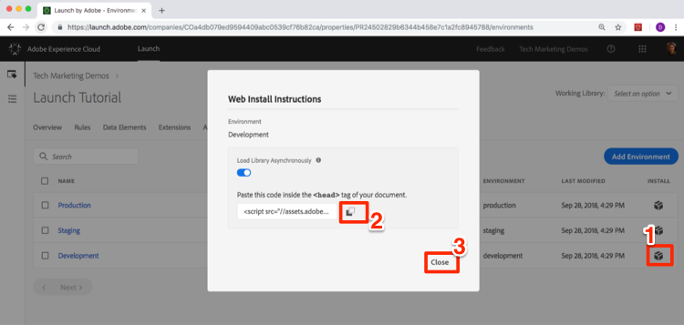

# Launch 포함 코드 추가

이 단원에서는 Launch 속성의 개발 환경의 비동기 포함 코드를 구현합니다. 이 과정에서 Launch의 두 가지 주요 개념(환경 및 포함 코드)에 대해 알아봅니다.

## 학습 목표

이 단원을 마치면 다음을 수행할 수 있습니다.

* Launch 속성에 대한 포함 코드 얻기
* 개발, 스테이징 및 프로덕션 환경의 차이점 이해
* html 문서에 Launch 포함 코드 추가
* Explain the optimal location of the Launch embed code in relation to other code in the `<head>` of an html document

## 포함 코드 복사

The embed code is a `<script>` tag that you put on your webpages to load and execute the logic you build in Launch. 라이브러리를 비동기식으로 로드하면 브라우저가 페이지를 계속 로드하고 Launch 라이브러리를 검색하여 동시에 실행합니다. 이 경우 `<head>`에 지정하는 포함 코드가 한 개만 있습니다. (When Launch is deployed synchronously, there are two embed codes, one which you put in the `<head>` and another which you put before the `</body>`).

속성 개요 화면에서 `Environments` 탭을 클릭하여 환경 페이지로 이동합니다. 개발, 스테이징 및 프로덕션 환경은 미리 만들어져 있습니다.


개발, 스테이징 및 프로덕션 환경은 코드 개발 및 릴리스 프로세스에서 일반적인 환경에 해당합니다. 코드는 개발 환경에서 개발자가 처음 작성합니다. 개발자가 코드 작업을 마치면 QA 및 다른 팀이 검토할 수 있도록 스테이징 환경으로 보냅니다. QA와 다른 팀이 만족하면 코드가 프로덕션 환경에 게시됩니다. 프로덕션 환경은 방문자가 웹 사이트를 방문할 때 경험하는 공개 환경입니다.

Launch는 여러 개발자가 동시에 서로 다른 프로젝트에서 작업하고 있는 대규모 조직에서 유용한 추가 개발 환경을 제공합니다.

튜토리얼을 완료하는 데 필요한 유일한 환경입니다. 환경을 사용하면 서로 다른 URL에 호스팅된 Launch 라이브러리의 서로 다른 작업 버전을 사용할 수 있으므로 새로운 기능을 안전하게 추가하고 올바른 사용자(예: 개발자, QA 엔지니어, 공개 등)에게 제공할 수 있습니다. 정확한 타이밍에

이제 포함 코드를 복사해 보겠습니다.

1. In the **[!UICONTROL Development]** row, click the Install icon  to open the modal.

1. 론치는 기본적으로 비동기 포함 코드로 설정됩니다

1. 복사 아이콘 복사  클릭하여 포함 코드를 클립보드에 복사합니다.

1. Click **[!UICONTROL Close]** to close the modal.

   

## Implement the Embed Code in the `<head>` of the Sample HTML Page

The embed code should be implemented in the `<head>` element of all HTML pages that will share the property. You might have one or several template files which control the `<head>` globally across the site, making it a straightforward process to add Launch.

아직 [샘플 html 페이지를](https://www.enablementadobe.com/multi/web/basic-sample.html) 다운로드하지 않은 경우(이 링크를 마우스 오른쪽 버튼으로 클릭하고 다른 이름으로 링크 저장"을 클릭) 코드 편집기에서 엽니다. [Brackets](http://brackets.io/) 는 필요한 경우 무료로 오픈 소스 편집기를 제공합니다.

34행 또는 그 주위에 있는 기존 포함 코드를 클립보드의 내장 코드로 바꾸고 페이지를 저장합니다. 이제 웹 브라우저에서 페이지를 엽니다. If you are loading the page using the `file://` protocol, you will need to add "https:" at the beginning of the embed code URL in your code editor). 샘플 페이지의 33~36라인은 다음과 비슷합니다.

```html
    <!--Launch Header Embed Code: REPLACE LINE 39 WITH THE EMBED CODE FROM YOUR OWN DEVELOPMENT ENVIRONMENT-->
    <script src="https://assets.adobedtm.com/launch-ENa21cfed3f06f4ddf9690de8077b39e81-development.min.js" async></script>
    <!--/Launch Header Embed Code-->
```

웹 브라우저의 개발자 도구를 열고 네트워크 탭으로 이동합니다. At this point you should see a 404 error for the Launch environment URL:


404 오류는 아직 이 실행 환경에서 라이브러리를 빌드하지 않았기 때문에 발생할 수 있습니다. 다음 단원에서 이 작업을 수행합니다. 404 오류 대신 "failed" 메시지가 표시되는 경우 포함 코드에 `https://` 프로토콜을 추가하는 것을 잊어버렸을 수 있습니다. 즉, `file://` 프로토콜을 사용하여 샘플 페이지를 로드하는 경우에만 `https://` 프로토콜을 지정해야 합니다. 404 오류가 나타날 때까지 페이지를 변경하고 다시 로드합니다.

## 구현 우수 사례 실행

샘플 페이지에 제시된 Launch 구현 우수 사례 중 일부를 잠시 살펴보겠습니다.

* **데이터 레이어**:

   * We *strongly* recommend creating a digital data layer on your site containing all of the attributes needed to populate variables in Analytics, Target, and other marketing solutions. 이 샘플 페이지에는 매우 간단한 데이터 계층만 들어 있지만, 실제 데이터 계층에는 페이지, 방문자, 장바구니 세부 사항 등에 대한 여러 가지 자세한 내용이 들어 있을 수 있습니다. For more info on data layers, please see [Customer Experience Digital Data Layer 1.0](https://www.w3.org/2013/12/ceddl-201312.pdf)

   * Target, 고객 속성 및 Analytics에서 수행할 수 있는 작업을 최대화하려면 Launch 포함 코드 앞에 데이터 레이어를 정의합니다.

* **JavaScript 도우미 라이브러리**:JQuery와 같은 라이브러리가 이미 페이지 `<head>` 전체에 구현되어 있는 경우 Launch 및 Target에서 해당 구문을 활용하려면 Launch 전에 로드하십시오

* **HTML5 doctype**:Target에서 HTML5 doctype이 필요합니다.

* **preconnect and dns-prefetch**: preconnect 및 dns-prefetch를 사용하여 페이지 로드 시간을 개선합니다. 참고 항목: [https://w3c.github.io/resource-hints/](https://w3c.github.io/resource-hints/)

* **비동기 Target 구현을**&#x200B;위한 코드 조각 미리 숨기기:Target 수업에서는 이 방법에 대해 자세히 알아보도록 하지만 Target이 비동기 Launch 포함 코드를 통해 배포되면 컨텐츠 깜박임을 관리하기 위해 Launch 포함 코드 전에 페이지에 사전 숨김 코드 조각을 하드 코딩해야 합니다

다음은 이러한 모범 사례의 상태를 제안된 순서로 보여주는 요약 내용입니다. 계정별 세부 정보에 대한 일부 자리 표시자가 있습니다.

```html
<!doctype html>
<html lang="en">
<head>
    <title>Basic Demo</title>
    <!--Preconnect and DNS-Prefetch to improve page load time. REPLACE "techmarketingdemos" WITH YOUR OWN AAM PARTNER ID, TARGET CLIENT CODE, AND ANALYTICS TRACKING SERVER-->
    <link rel="preconnect" href="//dpm.demdex.net">
    <link rel="preconnect" href="//fast.techmarketingdemos.demdex.net">
    <link rel="preconnect" href="//techmarketingdemos.demdex.net">
    <link rel="preconnect" href="//cm.everesttech.net">
    <link rel="preconnect" href="//techmarketingdemos.tt.omtrdc.net">
    <link rel="preconnect" href="//techmarketingdemos.sc.omtrdc.net">
    <link rel="dns-prefetch" href="//dpm.demdex.net">
    <link rel="dns-prefetch" href="//fast.techmarketingdemos.demdex.net">
    <link rel="dns-prefetch" href="//techmarketingdemos.demdex.net">
    <link rel="dns-prefetch" href="//cm.everesttech.net">
    <link rel="dns-prefetch" href="//techmarketingdemos.tt.omtrdc.net">
    <link rel="dns-prefetch" href="//techmarketingdemos.sc.omtrdc.net">
    <!--/Preconnect and DNS-Prefetch-->
    <!--Data Layer to enable rich data collection and targeting-->
    <script>
    var digitalData = {
        "page": {
            "pageInfo" : {
                "pageName": "Home"
                }
            }
    };
    </script>
    <!--/Data Layer-->
    <!--jQuery or other helper libraries-->
    <script src="https://code.jquery.com/jquery-3.3.1.min.js"></script>
    <!--/jQuery-->
    <!--prehiding snippet for Adobe Target with asynchronous Launch deployment-->
    <script>
        (function(g,b,d,f){(function(a,c,d){if(a){var e=b.createElement("style");e.id=c;e.innerHTML=d;a.appendChild(e)}})(b.getElementsByTagName("head")[0],"at-body-style",d);setTimeout(function(){var a=b.getElementsByTagName("head")[0];if(a){var c=b.getElementById("at-body-style");c&&a.removeChild(c)}},f)})(window,document,"body {opacity: 0 !important}",3E3);
    </script>
    <!--/prehiding snippet for Adobe Target with asynchronous Launch deployment-->
    <!--Launch Header Embed Code: REPLACE LINE 39 WITH THE INSTALL CODE FROM YOUR OWN DEVELOPMENT ENVIRONMENT-->
    <script src="//assets.adobedtm.com/launch-EN93497c30fdf0424eb678d5f4ffac66dc.min.js" async></script>
    <!--/Launch Header Embed Code-->
</head>
<body>
    <h1>Launch by Adobe: Basic Demo</h1>
    <p>This is a very simple page to demonstrate basic concepts of Launch by Adobe</p>
</body>
</html>
```

이제 시작 포함 코드를 사이트에 추가하는 방법을 알 수 있습니다.

[다음 "데이터 요소, 규칙 및 라이브러리 추가" &gt;](launch-data-elements-rules.md)