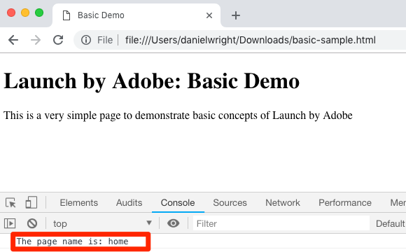

# 데이터 요소, 규칙 및 라이브러리 추가

이 단원에서는 첫 번째 데이터 요소, 규칙 및 라이브러리를 만듭니다.

데이터 요소 및 규칙은 Launch의 기본 구성 요소입니다. 데이터 요소는 마케팅 및 광고 솔루션으로 전송할 속성을 저장하는 반면, 규칙은 적절한 조건에서 해당 솔루션에 대한 요청을 실행합니다.  라이브러리는 모든 작업을 수행하기 위해 페이지에서 로드되는 JavaScript 파일입니다. 이 단원에서는 세 가지 방법을 모두 사용하여 샘플 페이지를 만들어 봅니다.

## 학습 목표

이 단원을 마치면 다음을 수행할 수 있습니다.

* 데이터 요소 만들기
* 규칙 만들기
* 라이브러리 만들기
* 라이브러리에 변경 사항 추가
* 웹 브라우저에 라이브러리가 로드되는지 확인
* "작업 라이브러리" 기능을 사용하여 보다 효율적으로 작업

## 페이지 이름에 대한 데이터 요소 만들기

데이터 요소는 Launch의 데이터 레이어 버전입니다. 또한 고유한 데이터 레이어 개체, 쿠키, 로컬 저장소 개체, 쿼리 문자열 매개 변수, 페이지 요소, 메타 태그 등의 값을 저장할 수 있습니다. 이 연습에서는 나중에 Target 및 Analytics 구현에서 사용할 페이지 이름에 대한 데이터 요소를 만듭니다.

**데이터 요소를 만들려면**

1. 위쪽 탐색에서 데이터 **[!UICONTROL 요소를 클릭합니다]**

1. 이 속성에 아직 데이터 요소를 만들지 않았으므로 이 항목에 대한 추가 정보가 있는 간단한 비디오가 나타납니다. 원하는 경우 이 비디오를 시청할 수 있습니다.

1. Click the **[!UICONTROL Create New Data Element]** button:

   

1. 데이터 요소 이름 지정(예: `Page Name`

1. Use the [!UICONTROL JavaScript Variable] Data Element type to point to a value in your sample page's data layer: `digitalData.page.pageInfo.pageName`

1. Use "`not available`" as the [!UICONTROL Default Value]. The [!UICONTROL Default Value] tells Launch what value to use for the data element if your JavaScript Variable specified above is not found.

1. **[!UICONTROL 소문자 값 강제 적용]** 및 **[!UICONTROL 클린 텍스트]** 상자를 체크하여 케이스를 표준화하고 외부 공백을 제거합니다

1. 이 **[!UICONTROL 값은]** 일반적으로 모든 **[!UICONTROL 페이지에서 달라지므로 [저장소 지속 시간]]** 설정으로 [없음]을 유지합니다.

1. 저장 **[!UICONTROL 단추를]** 클릭하여 데이터 요소를 저장합니다

   만듭니다.

>[!NOTE]**** DTM 마이그레이션:새 데이터 요소 유형이 Launch에 추가되어 DTM에 없습니다. 일부 새로운 데이터 요소 유형에는 로컬 저장소, 세션 저장소, 페이지 정보 및 난수가 포함됩니다.
<!-- -->
>[!NOTE]데이터 요소 기능은 익스텐션을 사용하여 확장할 _수 있습니다_. 예를 들어 ContextHub 확장을 사용하면 확장 기능을 사용하여 데이터 요소를 추가할 수 있습니다.

## 규칙 만들기

그런 다음 이 데이터 요소를 간단한 규칙에 사용합니다. 규칙은 Launch에서 가장 강력한 기능 중 하나이며 방문자가 웹 사이트와 상호 작용할 때 어떤 일이 일어나는지 지정할 수 있습니다. 규칙에 설명된 기준이 충족되면 규칙은 지정한 작업을 트리거합니다.

페이지 이름 데이터 요소 값을 브라우저 콘솔로 출력하는 규칙을 만듭니다.

**규칙을 만들려면**

1. In the top navigation, click **[!UICONTROL Rules]**

1. 이 속성에 아직 규칙을 만들지 않았으므로 주제에 대한 추가 정보가 포함된 간단한 비디오가 나타납니다. 원하는 경우 이 비디오를 시청할 수 있습니다.

1. Click the **[!UICONTROL Create New Rule]** button:

   

1. Name the Rule `All Pages - Library Loaded`. 이 이름 지정 규칙은 규칙이 실행되는 위치와 시간을 나타내므로 론치 속성 기능으로 쉽게 식별하고 다시 사용할 수 있습니다.

1. 이벤트 아래에서 **[!UICONTROL 추가]**&#x200B;를 클릭합니다. 이벤트는 규칙이 실행되어야 하는 시기를 Launch에 알리며 페이지 로드, 클릭, 사용자 지정 JavaScript 이벤트 등 많은 것이 될 수 있습니다.

   

   1. 이벤트 유형으로 **[!UICONTROL 로드된 라이브러리(페이지 상단)]**&#x200B;를 선택합니다. [이벤트 유형]을 선택하면 [시작]이 선택한 항목을 사용하여 이벤트의 이름을 미리 채웁니다. 또한 이벤트의 기본 순서는 50입니다. 순서 지정은 Launch의 강력한 기능으로, 동일한 이벤트에 의해 트리거되는 여러 규칙이 있을 때 작업 순서를 정확하게 제어할 수 있습니다. 이 기능은 튜토리얼의 후반부에서 사용하게 됩니다.

   1. 변경 내용 **[!UICONTROL 유지 단추를 클릭합니다]** .
   

1. 이 규칙은 모든 페이지에서 실행되어야 하므로 조건을 **[!UICONTROL 비워둡니다]** . 조건 모달을 열면 URL, 데이터 요소 값, 날짜 범위 등 다양한 옵션을 기준으로 하여 조건에서 제한과 예외를 모두 추가할 수 있음을 알 수 있습니다.

1. Under Actions, click **[!UICONTROL Add]**

1. 작업 **[!UICONTROL 유형 &gt; 사용자]**&#x200B;지정 코드를 선택합니다. 이 옵션만 있습니다. 튜토리얼의 후반부에 확장을 추가하면 더 많은 옵션을 사용할 수 있게 됩니다.

1. &lt;/&gt; 편집기 **[!UICONTROL 열기를]** 선택하여 코드 편집기 열기

   

1. 코드 편집기에 다음을 추가합니다. 이 코드는 페이지 이름 데이터 요소의 값을 브라우저 콘솔로 출력하여 효과가 있는지 확인합니다.

   ```javascript
   console.log('The page name is '+_satellite.getVar('Page Name'));
   ```

1. 코드 편집기 저장

   

1. On the Action configuration screen click **[!UICONTROL Keep Changes]**

1. Click **[!UICONTROL Save]** to save the rule

>[!NOTE]**** DTM 마이그레이션:론치에서 대부분의 마케팅 픽셀을 실행하려면 규칙이 필요합니다. 예를 들어 Adobe Analytics 비콘을 실행하려면 규칙을 사용하여 Launch에 이를 지시해야 합니다.
>
> 규칙 빌더가 Launch에서 크게 다시 디자인되고 다시 빌드되었습니다.
> 주요 변경 사항 중 일부는 다음과 같습니다.
>
> * 규칙 빌더는 하나만 있습니다. "Page Bottom", "Click" 및 "Direct Call"과 같은 DTM 규칙 유형은 모두 규칙 빌더의 이벤트 유형일 뿐입니다. 따라서 트리거를 DOM Ready 이벤트에서 사용자 정의 이벤트로 변경하려는 경우 규칙을 보다 쉽게 업데이트할 수 있습니다.
> * 새로운 "사용자 지정 코드" 이벤트 유형이 있습니다.
> * 확장은 새 이벤트 유형을 규칙 빌더에 추가할 수 있습니다. 예를 들어 Target 확장은 [at.js 사용자 지정 이벤트](https://docs.adobe.com/content/help/en/target/using/implement-target/client-side/functions-overview/atjs-custom-events.html)에 대한 기본 제공 지원을 추가할 수 있으므로 이 기능을 사용하기 위해 사용자 지정 코드가 필요하지 않습니다.
> * 익스텐션은 규칙 빌더에 새 작업을 추가하여 사용자 지정 코드에 대한 의존도를 낮추어 문제를 줄일 수 있습니다. 이 자습서에서는 이러한 확장 작업 중 많은 것을 사용하게 됩니다.
> * 규칙은 대부분의 마케팅 도구와 연관된 요청을 실행하는 데 필요합니다. 이를 위해서는 고객 ID 설정, Analytics 비콘 실행 및 Target 요청 실행과 같은 상황에 대한 마인드 조정이 필요합니다.


## 라이브러리에 변경 내용 저장

Launch 인터페이스에서 확장, 데이터 요소 및 규칙 컬렉션을 구성한 후 방문자가 사이트를 방문할 때 마케팅 태그가 실행되도록 웹 사이트에 배포할 수 있는 JavaScript 코드 세트로 이러한 기능과 논리를 패키지해야 합니다. 라이브러리는 이를 수행할 JavaScript 코드 세트입니다.

이전 단원에서 샘플 페이지에 개발 환경의 포함 코드를 구현했습니다. 샘플 페이지를 로드할 때 포함 코드 URL에 대한 404 오류가 반환되었습니다. 이는 론치 라이브러리가 아직 빌드되어 환경에 할당되지 않았기 때문입니다. 이제 새로운 데이터 요소 및 규칙을 라이브러리에 배치하여 샘플 페이지에서 작업을 수행할 수 있습니다.

**라이브러리 추가 및 빌드**

1. Go to the [!UICONTROL Publishing] tab

1. Click **[!UICONTROL Add New Library]**

   

1. 라이브러리 이름을 "초기 설정"으로 지정합니다.

1. 환경 **[!UICONTROL &gt; 개발을 선택합니다.]**

1. 변경된 모든 리소스 추가&#x200B;**[!UICONTROL 를 클릭합니다]**

   

1. 변경된 모든 리소스 **[!UICONTROL 추가를 클릭하면]** 방금 수행한 변경 사항이 요약됩니다.

1. **[!UICONTROL 개발을 위한 저장 및 구축]**&#x200B;을 클릭합니다

   

잠시 후 상태 점이 녹색으로 바뀝니다. 이는 라이브러리가 성공적으로 빌드되었음을 나타냅니다.


## 작업 내용 확인

이제 규칙이 예상대로 작동하는지 확인합니다.

샘플 페이지를 다시 로드합니다. 개발자 도구 -&gt; 네트워크 탭을 보면 이제 실행 라이브러리에 대한 200개의 응답이 표시됩니다.


개발자 도구 -&gt; 콘솔을 보면 "페이지 이름이 home"이라는 텍스트가 표시됩니다.


축하합니다. 첫 번째 데이터 요소와 규칙을 만들어 첫 번째 실행 라이브러리를 만들었습니다!

## 작업 라이브러리 기능 사용

Launch에서 많은 변경 작업을 수행하는 경우 게시 탭으로 이동하여 변경 사항을 추가하고 결과를 보려는 때마다 라이브러리를 빌드해야 하는 것이 불편합니다.  "초기 설정" 라이브러리를 만들었으므로 "작업 라이브러리"라는 기능을 사용하여 변경 사항을 신속하게 저장하고 라이브러리를 한 번에 다시 만들 수 있습니다.

"모든 페이지 - 라이브러리가 로드됨" 규칙을 약간 변경합니다. In the top navigation, click **[!UICONTROL Rules]** and then click on the `All Pages - Library Loaded` rule to open it up.


페이지에서 작업 `Edit Rule` 라이브러리 ***[!UICONTROL 드롭다운을 클릭하고]*** `Initial Setup` 라이브러리를 선택합니다.


라이브러리를 선택하면 이제 저장 단추가 **[!UICONTROL 라이브러리에 저장 및 빌드로]** 기본 **[!UICONTROL 설정되었음을 확인할 수 있습니다]**. Launch에서 변경한 경우 이 옵션을 사용하여 작업 라이브러리에 변경 사항을 자동으로 추가하고 다시 빌드할 수 있습니다.

테스트해 보십시오. 사용자 지정 코드 작업을 열고 "페이지 이름은 다음"이라는 텍스트 뒤에 콜론을 추가하면 전체 코드 블록이 읽습니다.

```javascript
console.log('The page name is: '+_satellite.getVar('Page Name'));
```

코드를 저장하고 변경 내용을 액션에 저장한 다음 라이브러리에 저장 및 **[!UICONTROL 작성 단추를 클릭합니다]** .


작업 라이브러리 드롭다운 옆에 녹색 점이 다시 나타날 때까지 [!UICONTROL 잠시 기다립니다] . 이제 샘플 페이지를 다시 로드하면 콘솔 메시지에 반영된 변경 사항이 표시됩니다(페이지 변경을 보려면 브라우저 캐시를 지우고 다시 로드해야 할 수 있음).



이 방법은 보다 신속하게 작업하므로 이 튜토리얼의 나머지 부분에서 이 방법을 사용할 수 있습니다.

[다음 "Experience Cloud Debugger를 사용하여 환경 전환" &gt;](launch-switch-environments.md)
