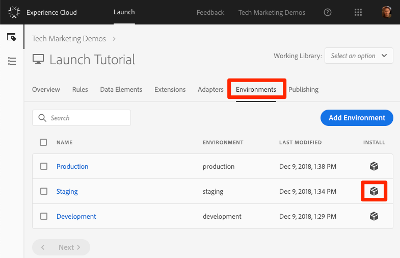

# 론치 속성 게시

개발 환경에서 Adobe Experience Cloud의 몇 가지 주요 솔루션을 구현했으므로 이제 출판 워크플로우를 배울 때입니다.

## 학습 목표

이 단원을 마치면 다음을 수행할 수 있습니다.

1. 스테이징 환경에 개발 라이브러리 게시
1. 디버거를 사용하여 스테이징 라이브러리를 프로덕션 웹 사이트에 매핑
1. 프로덕션 환경에 스테이징 라이브러리 게시

## 스테이징에 게시

개발 환경에서 라이브러리를 만들고 유효성을 검사했으므로 이제 스테이징에 게시할 때입니다.

1. Go to the **[!UICONTROL Publishing]** page

1. 라이브러리 옆의 드롭다운을 열고 승인을 위해 **[!UICONTROL 제출을 선택합니다.]**

   

1. 대화 상자에서 **[!UICONTROL [제출]** ] 단추를 클릭합니다.

   

1. 이제 라이브러리가 [제출됨] [!UICONTROL 열에] [작성됨] 상태로 표시됩니다.

1. 드롭다운을 열고 스테이징용 **[!UICONTROL 빌드를 선택합니다]**.

   

1. 녹색 점이 있는 아이콘이 나타나면 스테이징 환경에서 라이브러리를 미리 볼 수 있습니다.

실제 시나리오에서는 프로세스의 다음 단계에서 QA 팀이 스테이징 라이브러리의 변경 사항에 대한 유효성을 검사하도록 해야 합니다. 디버거를 사용하여 수행할 수 있습니다.

**스테이징 라이브러리에서 변경 내용의 유효성 검사를 수행하려면**

1. Launch 속성에서 환경 [!UICONTROL 페이지를 엽니다]

1. 스테이징 [!UICONTROL 행에서] 설치 아이콘 설치 아이콘을  클릭하여 모달을 엽니다

   

1. 복사 아이콘  클릭하여 포함 코드를 클립보드에 복사합니다

1. Click **[!UICONTROL Close]** to close the modal

   

1. Open the [Luma demo site](https://luma.enablementadobe.com/content/luma/us/en.html) in your Chrome browser

1. 디버거 [아이콘](https://chrome.google.com/webstore/detail/adobe-experience-cloud-de/ocdmogmohccmeicdhlhhgepeaijenapj) 아이콘을 클릭하여  열기

   

1. 도구 탭으로 이동

1. Adobe **[!UICONTROL Launch &gt; 동적으로 시작 삽입 &gt; 포함 코드]** 버튼을 클릭하여 텍스트 입력 필드를 엽니다(현재 개발 포함 코드의 URL이 있을 수 있음).

   

1. 클립보드에 있는 스테이징 포함 코드를 붙여넣습니다.

1. 디스크 아이콘을 클릭하여 저장합니다

   

1. 디버거의 요약 탭을 다시 로드하고 확인합니다. 이제 시작 섹션에서 속성 이름(예:"Launch Tutorial" 또는 속성에 이름을 지정한 모든 것)!

   

실시간으로 QA 팀이 스테이징 환경에서 변경 사항을 검토하여 서명하면 프로덕션에 게시할 때입니다.

## 프로덕션에 게시

1. Go to the [!UICONTROL Publishing] page

1. 드롭다운에서 게시를 **[!UICONTROL 위한 승인을 클릭합니다]**.

   

1. 대화 상자에서 **[!UICONTROL 승인]** 단추를 클릭합니다.

   

1. 이제 라이브러리가 빌드되지 않은 상태( [!UICONTROL 노란색 점] )의 승인됨 열에 표시됩니다.

1. 드롭다운을 열고 **[!UICONTROL **제작 및 프로덕션에 게시를 선택합니다]**.

   

1. 대화 **[!UICONTROL 상자에서]** 게시를 클릭합니다.

   를 클릭합니다

1. 이제 라이브러리가 게시된 열에 [!UICONTROL 표시됩니다] .

   

그거야! 튜토리얼을 완료하고 Launch에서 첫 번째 속성을 게시했습니다.