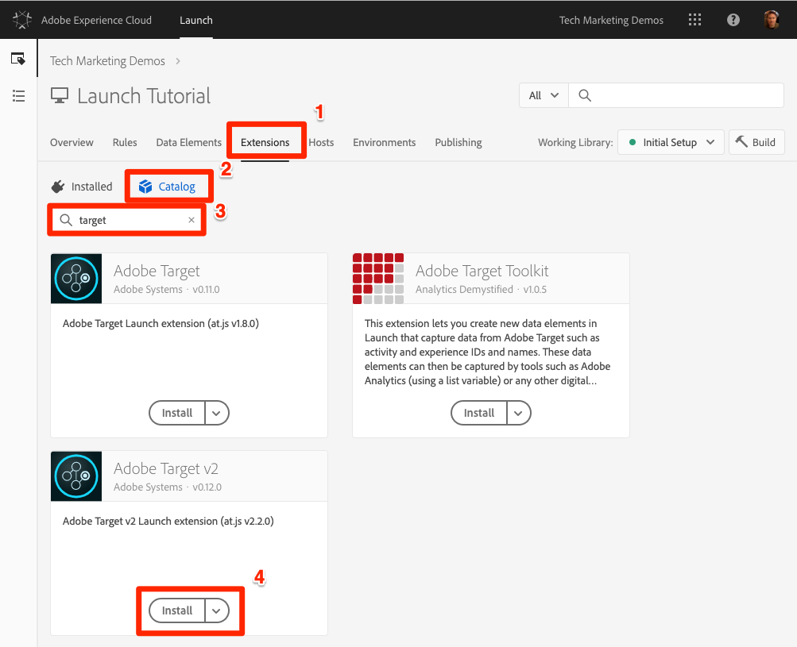
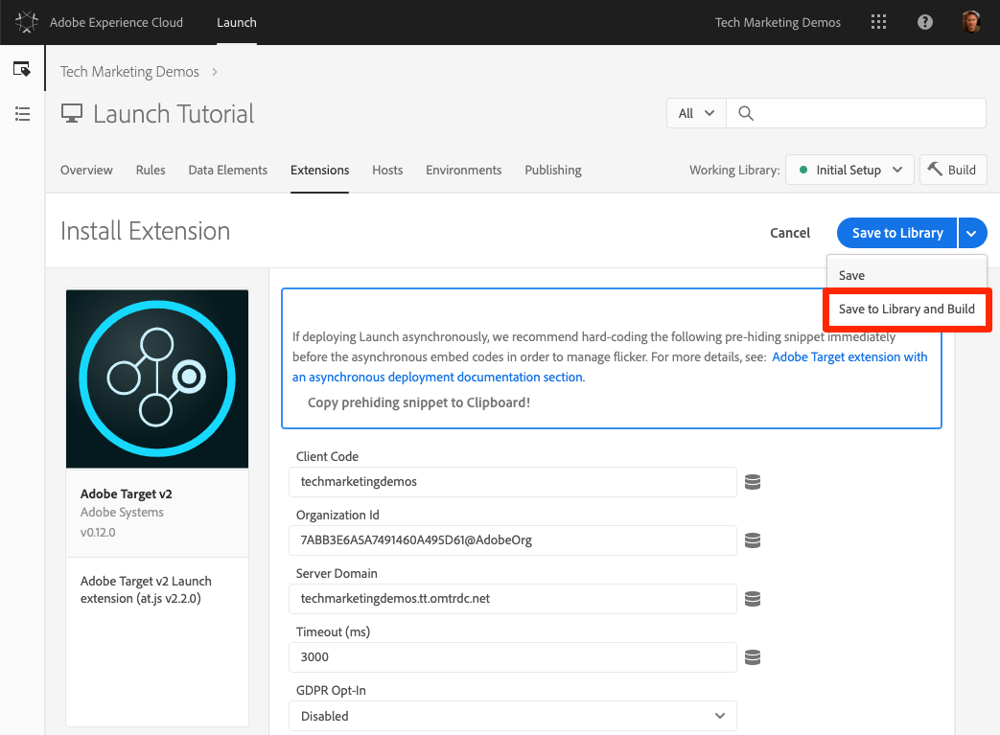
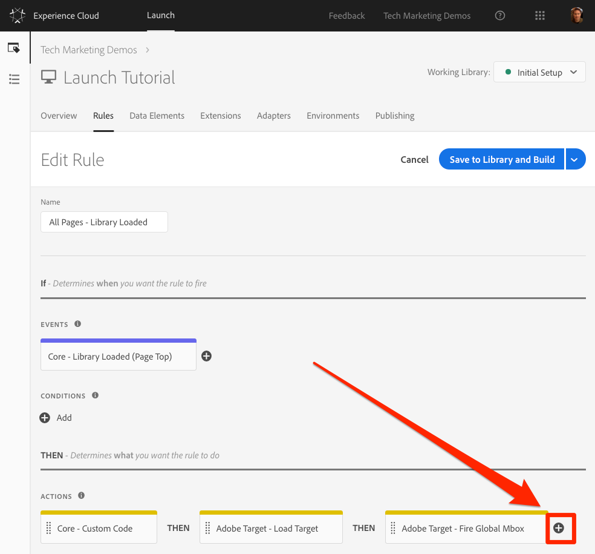

# Adobe Target 추가

이 단원에서는 페이지 로드 요청 및 [사용자 지정 매개 변수와 함께 Adobe Target 확장을](https://docs.adobe.com/content/help/en/launch/using/extensions-ref/adobe-extension/target-extension/overview.html) 구현합니다.

[Adobe](https://docs.adobe.com/content/help/en/target/using/target-home.html) Target은 고객의 경험을 맞춤화하고 개인화하는 데 필요한 모든 것을 제공하는 Adobe Marketing Cloud 솔루션으로, 웹 및 모바일 사이트, 앱, 소셜 미디어 및 기타 디지털 채널에서 매출을 극대화할 수 있습니다.

## 학습 목표

이 단원을 마치면 다음을 수행할 수 있습니다.

* 비동기 Launch 포함 코드와 함께 Target을 사용할 때 깜박임을 관리하는 데 사용되는 사전 숨김 코드 추가
* Target v2 확장 추가
* 페이지 로드 요청(이전의 "전역 mbox"라고 함)을 실행합니다.
* 페이지 로드 요청에 매개 변수 추가
* 프로필 및 개체 매개 변수를 페이지 로드 요청에 추가하는 방법을 설명합니다.
* 필수 매개 변수로 주문 확인 요청을 실행합니다.
* 라이브러리 머리글 및 라이브러리 바닥글 코드와 같은 고급 구성을 추가하는 방법을 설명합니다
* Target 구현 유효성 확인

## 전제 조건

To complete the lessons in this section, you must first complete the lessons in [Configure Launch](launch.md) and [Add the Identity Service](id-service.md).

## 타겟 사전 숨김 조각 추가

시작하기 전에 Launch 포함 코드에 대한 약간의 업데이트를 해야 합니다. 론치 포함 코드가 비동기식으로 로드되면 페이지가 Target 라이브러리가 완전히 로드되고 컨텐츠 교환을 수행하기 전에 렌더링을 완료할 수 있습니다. 이렇게 하면 "깜박임"이라고 하는 것으로 발전할 수 있습니다. 여기서 기본 컨텐츠는 Target에서 지정한 개인화된 컨텐츠로 대체되기 전에 잠깐 표시됩니다. 이러한 깜박임을 방지하려면 Launch의 비동기 포함 코드 바로 전에 특별한 사전 숨김 조각을 하드 코딩하는 것이 좋습니다.

이 작업은 이미 Luma 사이트에서 수행되었지만 샘플 페이지에서 수행해 보면 구현을 이해할 수 있습니다. 다음 코드 줄을 복사합니다.

```html
<script>
    //prehiding snippet for Adobe Target with asynchronous Launch deployment
    (function(g,b,d,f){(function(a,c,d){if(a){var e=b.createElement("style");e.id=c;e.innerHTML=d;a.appendChild(e)}})(b.getElementsByTagName("head")[0],"at-body-style",d);setTimeout(function(){var a=b.getElementsByTagName("head")[0];if(a){var c=b.getElementById("at-body-style");c&&a.removeChild(c)}},f)})(window,document,"body {opacity: 0 !important}",3E3);
</script>
```

샘플 페이지를 열고 아래 그림과 같이 Launch 포함 코드 바로 앞에 붙여 넣습니다(줄 번호가 다른 경우 걱정하지 마십시오.).확장자

샘플 페이지를 다시 로드합니다. 페이지가 표시되기 3초 동안 숨겨집니다. 이 동작은 일시적이며 Target을 배포한 후에 사라집니다. 이러한 사전 숨김 동작은 코드 조각 맨 끝에 있는 두 가지 구성으로 제어되며, 이는 사용자 정의할 수 있지만, 일반적으로 기본 설정에 가장 많이 남습니다.

* `body {opacity: 0 !important}` target이 로드될 때까지 사전 숨기기에 사용할 css 정의를 지정합니다. 기본적으로 전체 바디가 숨겨집니다. 예를 들어 내비게이션 아래의 모든 컨텐츠를 둘러싸는 쉽게 식별 가능한 컨테이너 요소가 있는 일관된 DOM 구조를 가지고 있고 내비게이션을 테스트하거나 개인화하지 않으려는 경우 이 설정을 사용하여 사전 숨김을 해당 컨테이너 요소로 제한할 수 있습니다.
* `3E3` 사전 숨기기에 대한 시간 초과 설정을 지정합니다. 기본적으로 Target이 3초 내에 로드되지 않은 경우 페이지가 표시됩니다. 이는 매우 드문 경우입니다.

For more details and to obtain the un-minified pre-hiding snippet, please see [the Adobe Target extension with an asynchronous deployment&#x200B;](https://docs.adobe.com/content/help/en/launch/using/extensions-ref/adobe-extension/target-extension/overview.html#adobe-target-extension-with-an-asynchronous-deployment).

## 타겟 확장 추가

Adobe Target 익스텐션은 최신 웹 at.js에 대해 Target의 JavaScript SDK를 사용하여 클라이언트측 구현을 지원합니다. Customers still using Target's older library, mbox.js, [should upgrade to at.js 2.x](https://docs.adobe.com/content/help/en/target/using/implement-target/client-side/mbox-implement/migrate-mbox/target-atjs-implementation.html) in order to use Launch.

Target v2 익스텐션은 다음 두 가지 주요 부분으로 구성됩니다.

1. 코어 라이브러리 설정을 관리하는 확장 구성
1. 규칙 작업: 다음을 수행합니다.
   1. Load Target (at.js 2.x)
   1. 페이지 로드 요청에 매개 변수 추가
   1. 모든 요청에 매개 변수 추가
   1. 페이지 로드 요청 실행

이 첫 번째 연습에서는 익스텐션을 추가하고 구성을 살펴봅니다. 나중에 연습할 때 우리는 그 행동을 할 것이다.

**확장명을 추가하려면**

1. 확장 **[!UICONTROL &gt; 카탈로그로 이동]**
1. 필터를 `target` 입력하여 Adobe Target 익스텐션을 신속하게 찾습니다. Adobe Target과 Adobe Target v2의 두 가지 익스텐션이 있습니다. 이 자습서는 기존 웹 사이트와 단일 페이지 애플리케이션(SPA) 모두에 적합한 최신 버전의 at.js(현재 2.x)를 사용하는 v2 익스텐션의 버전을 사용합니다.
1. 설치를 **[!UICONTROL 클릭합니다]**

   

1. 확장 기능을 추가하면 아래 그림과 같이 Target 인터페이스에서 많은 설정을 가져오지만 모든 at.js 설정은 가져오지 않습니다. 가져올 수 없는 한 가지 설정은 시간 초과입니다. 이 시간 제한은 확장을 추가한 후 항상 3000ms입니다. 자습서에서 기본 설정을 그대로 둡니다. 왼쪽에는 현재 버전의 익스텐션과 함께 제공되는 at.js 버전이 표시됩니다.

1. 라이브러리에 **[!UICONTROL 저장 및 빌드를 클릭합니다.]**

   

현재 Target은 아무 작업도 하지 않으므로 확인할 것이 없습니다.

>[!NOTE] 각 버전의 Target 익스텐션은 확장명 설명에 나열되는 특정 버전의 at.js와 함께 제공됩니다. Target 확장을 업데이트하여 at.js 버전을 업데이트합니다.

## Target 로드 및 페이지 로드 요청 실행

마케터는 컨텐츠를 테스트하고 타깃팅할 때 Target을 사용하여 페이지의 방문자 경험을 제어합니다. 페이지 표시에서 이 중요한 역할 때문에 페이지 가시성에 미치는 영향을 최소화하려면 가능한 한 빨리 Target을 로드해야 합니다. 이 섹션에서는 Target JavaScript 라이브러리(at.js)를 로드하고 페이지 로드 요청(이전 버전의 at.js에서는 "전역 mbox"라고 함)을 실행합니다.

"데이터 요소, 규칙 및 라이브러리 추가" 단원에서 만든 `All Pages - Library Loaded` 규칙을[사용하여](launch-data-elements-rules.md)Target은 페이지 로드 시 가능한 한 빨리 트리거되므로 구현할 수 있습니다.

**대상을 로드하려면**

1. 위쪽 탐색에서 **[!UICONTROL Rules]**&#x200B;로 이동한 다음 `All Pages - Library Loaded`를 클릭하여 규칙 편집기를 엽니다

   

1. Under Actions, click the  to add a new action

   

1. 확장 **[!UICONTROL &gt; Adobe Target v2를 선택합니다.]**

1. 작업 **[!UICONTROL 유형 &gt; 대상 로드를 선택합니다.]**

1. Click **[!UICONTROL Keep Changes]**

   

작업이 추가되면 at.js가 페이지에 로드됩니다. `Load Target` 그러나 Target 요청은 `Fire Page Load Request` 작업을 추가할 때까지 실행되지 않습니다.

**페이지 로드 요청을 실행하려면**

1. 작업에서 더하기 아이콘을  .

   

1. 확장 **[!UICONTROL &gt; Adobe Target v2를 선택합니다.]**

1. 작업 **[!UICONTROL 유형 &gt; 페이지 로드 요청 실행을 선택합니다.]**

1. 페이지 로드 요청에 사용할 수 있는 구성이 있습니다. 이 구성은 페이지 및 CSS 선택기를 숨김에 사용할지 여부와 관련되어 있습니다. 이러한 설정은 페이지의 사전 숨김 코드 조각과 함께 작동합니다. 기본 설정을 그대로 둡니다.

1. Click **[!UICONTROL Keep Changes]**

   

1. 새 작업은 작업 후에 차례로 추가되고 `Load Target` 작업은 이 순서로 실행됩니다. 작업을 드래그 앤 드롭하여 순서를 다시 정렬할 수 있지만 이 시나리오에서는 먼저 수행해야 `Load Target` 합니다 `Fire Page Load Request`.

1. 라이브러리에 **[!UICONTROL 저장 및 빌드를 클릭합니다.]**

   

### 페이지 로드 요청 유효성 확인

이제 Target v2 확장을 추가하고 `Load Target` 및 `Fire Page Load Request` 작업을 실행했으므로 Launch 속성이 사용되는 모든 페이지에서 페이지 로드 요청이 수행되어야 합니다.

**Load Target 및 Fire 페이지 로드 요청 작업의 유효성을 확인하려면**

1. 샘플 페이지를 다시 로드합니다. 페이지가 표시되기 전에 지연 시간 3초가 더 이상 표시되지 않습니다. If you are loading the sample page using the `file://` protocol, you should do this step in Firefox or Safari browsers since Chrome will not fire a Target request when using the `file://` protocol.

1. Open the [Luma site](https://luma.enablementadobe.com/content/luma/us/en.html)

1. Make sure the Debugger is mapping the Launch property to *your* Development environment, as described in the [earlier lesson](launch-switch-environments.md)

   

1. 디버거의 요약 탭으로 이동

1. In the `Launch` section, confirm that `Target` appears under the `Extensions` heading

1. 섹션에서 at.js 라이브러리 버전이 `Target` 나타나는지 확인합니다.

   

1. 마지막으로 `Target` 탭으로 이동하여 클라이언트 코드를 확장하고 페이지 로드 요청이 표시되는지 확인합니다.

   

축하합니다! Target을 구현했습니다!

## 매개 변수 추가

Target 요청에서 매개 변수를 전달하면 타깃팅, 테스트 및 개인화 활동에 강력한 기능이 추가됩니다. Launch 익스텐션은 매개 변수를 전달하는 두 가지 작업을 제공합니다.

1. `Add Params to Page Load Request`를 사용하여 페이지 로드 요청에 매개 변수를 추가합니다(targetPageParams() [](https://docs.adobe.com/content/help/en/target/using/implement-target/client-side/functions-overview/cmp-atjs-functions.html) 메서드에 해당합니다).

1. `Add Params to All Requests`를 추가하여 페이지 로드 요청과 사용자 지정 코드 작업 또는 사이트에 하드코딩된 추가 요청(targetPageParamsAll() [](https://docs.adobe.com/content/help/en/target/using/implement-target/client-side/functions-overview/cmp-atjs-functions.html) 메서드와 같음)과 같은 모든 Target 요청의 매개 변수를 추가합니다.

These actions can be used *before* the `Load Target` action and can set different parameters on different pages based on your rule configurations. 규칙이 페이지 로드 요청을 실행하기 전에 고객 ID를 ID 서비스로 설정할 때 사용한 규칙 순서 지정 기능을 사용하여 이벤트에 대한 추가 매개 변수를 `Library Loaded` 설정합니다.
>[!TIP] 대부분의 구현은 활동 전달을 위해 페이지 로드 요청을 사용하기 때문에 일반적으로 `Add Params to Page Load Requests` 작업을 사용하기에 충분합니다.

### 요청(mbox) 매개 변수

매개 변수는 사용자 지정 데이터를 Target으로 전달하여 개인화 기능을 향상시키는 데 사용됩니다. 페이지 이름, 템플릿 등과 같은 검색 세션 중에 자주 변경되는 속성에 적합합니다. 지속되지 않습니다.

이전에 만든 `Page Name` 데이터 요소를 요청 매개 변수로 데이터 요소, [규칙 및 라이브러리](launch-data-elements-rules.md) 추가 단원에서 추가해 보겠습니다.

**요청 매개 변수를 추가하려면**

1. 위쪽 탐색에서 **[!UICONTROL Rules]**&#x200B;로 이동한 다음 `All Pages - Library Loaded`를 클릭하여 규칙 편집기를 엽니다.

   

1. Under Actions, click the  to add a new action

   

1. 확장 **[!UICONTROL &gt; Adobe Target v2를 선택합니다.]**

1. 작업 **[!UICONTROL 유형 &gt; 페이지 로드 요청에 매개 변수 추가를 선택합니다.]**

1. 이름을 `pageName` 입력합니다 ****

1. Click the  to open the data element modal

1. 데이터 요소를 `Page Name` 클릭합니다.

1. 선택 **[!UICONTROL 단추를]** 클릭합니다

   

1. Click **[!UICONTROL Keep Changes]**

   

1. 동작의 왼쪽 가장자리를 클릭-드래그하면 작업 전 또는 그 뒤의 동작을 다시 정렬할 수 있습니다( `Add Params to Page Load Request` 작업 전 `Fire Page Load Request` `Load Target`).

1. 라이브러리에 **[!UICONTROL 저장 및 빌드를 클릭합니다.]**

   

#### 요청 매개 변수 유효성 확인

당분간은 at.js 2.x 요청과 함께 전달된 사용자 지정 매개 변수가 디버거에 쉽게 표시되지 않으므로 브라우저의 개발자 도구를 사용할 것입니다.

**pageName 요청 매개 변수의 유효성을 확인하려면**

1. Luma 사이트가 자체 Launch 속성에 매핑되었는지 확인하여 다시 로드하십시오
1. 브라우저의 개발자 도구를 엽니다
1. 네트워크 탭을 클릭합니다.
1. 요청 필터링 대상 `tt.omtrdc` (또는 Target 요청에 대한 CNAME 도메인)
1. &gt; `Headers` &gt; `Request Payload` &gt; `execute.pageLoad.parameters` 섹션을 확장하여 `pageName` 매개 변수와 값의 유효성을 확인합니다
   

<!--Now go to the **[!UICONTROL Target]** tab in the Debugger. Expand your client code and look at the requests. You should see the new `pageName` parameter passed in the request:

-->

### 프로필 매개 변수

요청 매개 변수와 마찬가지로 프로필 매개 변수도 Target 요청을 통해 전달됩니다. However, profile parameters get stored in Target's visitor profile database and will persist for the [duration of the visitor's profile](https://docs.adobe.com/content/help/en/target/using/audiences/visitor-profiles/visitor-profile-lifetime.html). 사이트의 한 페이지에서 설정하고 다른 페이지의 Target 활동에서 사용할 수 있습니다. 다음은 자동차 웹 사이트의 예입니다. 방문자가 차량 페이지로 이동할 때 프로필 매개 변수 "profile.lastViewed=sportarter"를 전달하여 특정 차량에 대한 관심을 기록할 수 있습니다. 방문자가 다른 비차량 페이지를 탐색할 때 마지막으로 본 자동차를 기반으로 컨텐츠를 타깃팅할 수 있습니다.  프로필 매개 변수는 거의 변경되지 않거나 특정 페이지에서만 사용할 수 있는 속성에 이상적입니다

You won't pass any profile parameters in this tutorial, but the workflow is almost identical to what you just did when passing the `pageName` parameter. 한 가지 차이점은 프로필 매개 변수 이름에 `profile.` 접두사를 지정해야 한다는 것입니다. "userType"이라는 프로필 매개 변수는 `Add Params to Page Load Request` 다음과 같이 동작에서 표시됩니다.


### 엔티티 매개 변수

엔티티 매개 변수는 다음과 같은 세 가지 주된 이유로 [추천 구현](https://docs.adobe.com/content/help/en/target/using/recommendations/plan-implement.html)에 사용되는 특수 매개 변수입니다.

1. 제품 추천을 트리거할 키로. 예를 들어 "제품 X를 보고, Y도 본 사람"과 같은 추천 알고리즘을 사용할 때 "X"는 추천 "키"입니다. 일반적으로 방문자가 현재 보고 있는 제품 sku(`entity.id`) 또는 카테고리(`entity.categoryId`)입니다.
1. 방문자 행동을 수집하여 "최근에 본 제품" 또는 "가장 많이 본 제품"과 같은 추천 알고리즘에 연결합니다.
1. 추천 카탈로그를 채우기 위해. Recommendations에는 웹 사이트에 있는 모든 제품 또는 아티클의 데이터베이스가 포함되어 있으므로 권장 사항 오퍼에서 해당 구성 요소를 제공할 수 있습니다. 예를 들어 제품을 추천할 때 일반적으로 제품 이름(`entity.name`) 및 이미지(`entity.thumbnailUrl`) 와 같은 속성을 표시할 수 있습니다. 일부 고객은 백엔드 피드를 사용하여 카탈로그를 채우지만 Target 요청에서 개체 매개 변수를 사용하여 채울 수도 있습니다.

이 자습서에서는 프로필 매개 변수를 전달할 필요가 없지만, 이 워크플로우는 `pageName` 요청 매개 변수를 전달할 때 이전에 수행한 작업과 동일하며 매개 변수에 "entity"가 접두사로 붙은 이름을 지정하기만 하면 됩니다. 관련 데이터 요소에 매핑합니다. 일부 공통 엔티티에는 사용해야 하는 예약 이름이 있습니다(예: 제품 SKU의 entity.id). 다음은 `Add Params to Page Load Request` 작업에서 개체 매개 변수를 설정하는 모습입니다.


### 고객 ID 매개 변수 추가

Adobe Experience Platform ID 서비스를 통해 고객 ID를 수집하면 Adobe Experience Cloud의 고객 속성 [기능을 사용하여 CRM](https://docs.adobe.com/content/help/en/target/using/audiences/visitor-profiles/working-with-customer-attributes.html) 데이터를 Target으로 손쉽게 가져올 수 있습니다. It also enables [cross-device visitor stitching](https://docs.adobe.com/content/help/en/target/using/integrate/experience-cloud-device-co-op.html), allowing you to maintain a consistent user experience as your customers switch between their laptops and their mobile devices.

페이지 로드 요청을 실행하기 전에 ID 서비스의 `Set Customer IDs` 작업에서 고객 ID를 설정해야 합니다. 이렇게 하려면 사이트에 다음과 같은 기능이 있는지 확인하십시오.

* 고객 ID 파섹
* Adobe Experience Platform Identity Service 익스텐션이 설치되어 있어야 합니다.
* You must use the `Set Customer IDs` action in a rule that fires at the "Library Loaded (Page Top)" event
* Use the `Fire Page Load Request` action in a rule that fires *after* the "Set Customer IDs" action

이전 단원에서는 [Adobe Experience Platform ID 서비스](id-service.md)추가를 `All Pages - Library Loaded - Authenticated - 10` 통해 "고객 ID 설정" 동작을 실행합니다. 이 규칙에는 `Order` 설정이 `10`있으므로, 페이지 로드 요청이 해당 `All Pages - Library Loaded` 설정으로 `Order` 규칙에서 실행되기 전에 고객 ID가 설정됩니다 `50`. 따라서 이미 Target용 고객 ID 컬렉션을 구현했습니다.

#### 고객 ID 확인

당분간은 at.js 2.x 요청과 함께 전달된 사용자 지정 매개 변수가 디버거에 쉽게 표시되지 않으므로 브라우저의 개발자 도구를 사용할 것입니다.

**고객 ID의 유효성을 확인하려면**

1. Open the [Luma site](https://luma.enablementadobe.com/content/luma/us/en.html)

1. Make sure the Debugger is mapping the Launch property to *your* Development environment, as described in the [earlier lesson](launch-switch-environments.md)

   

1. 자격 증명 `test@adobe.com`/`test`
1. Return to the [Luma homepage](https://luma.enablementadobe.com/content/luma/us/en.html)

1. 브라우저의 개발자 도구를 엽니다
1. 네트워크 탭을 클릭합니다.
1. 요청 필터링 대상 `tt.omtrdc` (또는 Target 요청에 대한 CNAME 도메인)
1. &gt; `Headers` &gt; `Request Payload` &gt; `id.customerIds.0` 섹션을 확장하여 고객 ID 설정 및 값을 확인합니다.
   
<!--
1. Open the Debugger
1. Go to the Target tab
1. Expand your client code
1. You should see parameters in the latest Target request for `vst.crm_id.id` and `vst.crm_id.authState`. `vst.crm_id.id` should have a value of the hashed email address and `vst.crm_id.authState` should have a value of `1` to represent `authenticated`. Note that `crm_id` is the `Integration Code` you specified in the Identity Service configuration and must align with the key you use in your [Customer Attributes data file](https://docs.adobe.com/content/help/en/core-services/interface/customer-attributes/t-crs-usecase.html):

-->

>[!WARNING] Adobe Experience Platform Identity Service를 사용하면 여러 ID를 서비스로 전송할 수 있지만, 첫 번째 ID만 Target으로 전송됩니다.

### 속성 토큰 매개 변수 추가

>[!NOTE] Target Premium 고객을 위한 선택 사항입니다.

The property token is a reserved parameter used with the Target Premium [Enterprise User Permissions](https://docs.adobe.com/content/help/en/target/using/administer/manage-users/enterprise/property-channel.html) feature. Experience Cloud 조직의 다른 구성원이 각 속성에 대해 다른 권한을 할당할 수 있도록 서로 다른 디지털 속성을 정의하는 데 사용됩니다. 예를 들어, 사용자 그룹 중 한 명이 웹 사이트에서 Target 활동을 설정할 수 있지만 모바일 응용 프로그램에서는 설정할 수 없도록 할 수 있습니다.

Target 속성은 Launch 속성 및 Analytics 보고서 세트와 유사합니다. 여러 브랜드, 웹 사이트 및 마케팅 팀이 있는 기업은 각 웹 사이트 또는 모바일 앱에 대해 다른 Target 속성, Launch 속성 및 Analytics 보고서 세트를 사용할 수 있습니다. 시작 속성은 임베드 코드로 구분되고, Analytics 보고서 세트는 보고서 세트 ID로 구분되며, Target 속성은 속성 토큰 매개 변수에 의해 구분됩니다.

속성 토큰은 요청 매개 변수처럼 구현됩니다. 매개 변수 이름을 "at_property"로 지정하고 Target 인터페이스에 제공된 값에 붙여넣으면 됩니다.  단일 Launch 속성을 사용하여 여러 사이트를 구현하는 경우 데이터 요소를 통해 at_property 값을 관리할 수 있습니다.

다음은 Target Premium 고객이며 자습서 속성에서 속성 토큰을 구현하려는 경우 선택 사항입니다.

1. 별도의 탭에서 Target 사용자 인터페이스를 엽니다

1. 설정 **[!UICONTROL &gt; 속성으로 이동]**

1. 사용할 속성을 확인하고 **[!UICONTROL &lt;/&gt;]** 또는 새 속성을 만듭니다.

1. Copy the `at_property` value to your clipboard

   

1. In your Launch tab, go to the **[!UICONTROL Rules]** in the top navigation and then click on `All Pages - Library Loaded` to open the rule editor.

   

1. 작업에서 `Adobe Target - Add Params to Page Load Request` 작업을 클릭하여 `Action Configuration`

   

1. 매개 `pageName` 변수에서 추가 **[!UICONTROL 단추를 클릭합니다]**

   

1. Name the parameter `at_property` and paste in the value you copied from the Target interface

1. Click **[!UICONTROL Keep Changes]**

   

1. 라이브러리에 **[!UICONTROL 저장 및 빌드를 클릭합니다.]**
   

#### 속성 토큰 유효성 검사

당분간은 at.js 2.x 요청과 함께 전달된 사용자 지정 매개 변수가 디버거에 쉽게 표시되지 않으므로 브라우저의 개발자 도구를 사용할 것입니다.

**속성 토큰 매개 변수의 유효성을 확인하려면**

1. Open the [Luma site](https://luma.enablementadobe.com/content/luma/us/en.html)
1. Make sure the Debugger is mapping the Launch property to *your* Development environment, as described in the [earlier lesson](launch-switch-environments.md)

   

1. 브라우저의 개발자 도구를 엽니다
1. 네트워크 탭을 클릭합니다.
1. 요청 필터링 대상 `tt.omtrdc` (또는 Target 요청에 대한 CNAME 도메인)
1. &gt; `Headers` &gt; `Request Payload` &gt; `property.token` 섹션을 확장하여 값의 유효성을 검사합니다.
   

<!--
1. Go to the `Target` tab
1. Expand your client code
1. You should see the parameter for "at_property" in every page load request request as you browse the site:

-->

## 사용자 지정 요청 추가

### 주문 확인 요청 추가

주문 확인 요청은 Target으로 주문 세부 정보를 전송하는 데 사용되는 특별한 유형의 요청입니다. orderId, orderTotal 및 productPurchasedId와 같은 세 가지 특정 요청 매개 변수가 포함되어 일반 Target 요청이 주문 요청으로 바뀝니다. 주문 요청에서는 매출 보고 외에도 다음을 수행합니다.

1. 우발적 주문 재제출 시 중복 제거
1. 예외적인 주문(합계가 평균의 표준 편차보다 4 이상 많은 주문) 필터링
1. 다른 알고리즘을 사용하여 통계적 신뢰도 계산
1. 개별 주문 세부 사항에 대한 다운로드 가능한 특별 감사 보고서 만들기

가장 좋은 방법은 비소매 사이트에서도 모든 주문 단계에서 확인 요청을 사용하고 주문하는 것입니다. 예를 들어 리드 생성 사이트에는 일반적으로 끝에 고유한 "리드 ID"가 생성되는 리드 유입 경로가 있습니다. 이러한 사이트는 정적 값(예:orderTotal에 대해 "1")을 추가했습니다.

A4T는 아직 자동 할당, 자동화된 개인화 및 자동 타겟과 같은 활동 유형과 호환되지 않으므로 대부분의 보고에 대해 Analytics for Target(A4T) 통합을 사용하는 고객도 주문 요청을 구현해야 합니다. 또한 주문 요청은 Recommendations 구현에서 중요한 요소로서 구매 행동을 기반으로 알고리즘을 강화합니다.

주문 확인 요청은 주문 확인 페이지 또는 이벤트에서만 트리거되는 규칙에서 실행해야 합니다. 종종 Adobe Analytics 구매 이벤트의 규칙 설정과 결합될 수 있습니다. Core 확장의 사용자 지정 코드 작업을 사용하여 적절한 데이터 요소를 사용하여 orderId, orderTotal 및 productPurchasedId 매개 변수를 설정해야 합니다.

데이터 요소 및 규칙을 추가하여 Luma 사이트에서 주문 확인 요청을 실행해야 합니다. 이미 여러 데이터 요소를 만들었으므로 이러한 지침은 약어로 표시됩니다.

**주문 ID에 대한 데이터 요소를 만들려면**

1. 위쪽 **[!UICONTROL 탐색에서]** 데이터 요소를 클릭합니다.
1. 데이터 **[!UICONTROL 요소 추가를 클릭합니다.]**
1. 데이터 요소에 이름을 지정합니다 `Order Id`
1. 데이터 **[!UICONTROL 요소 유형 &gt; JavaScript 변수 선택]**
1. Use `digitalData.cart.orderId` as the `JavaScript variable name`
1. Check the `Clean text` option
1. 라이브러리에 **[!UICONTROL 저장을 클릭합니다]**(주문 확인 요청을 모두 변경할 때까지 라이브러리를 빌드하지 않습니다.)

**장바구니 금액에 대한 데이터 요소를 만들려면**

1. 데이터 **[!UICONTROL 요소 추가를 클릭합니다.]**
1. 데이터 요소에 이름을 지정합니다 `Cart Amount`
1. 데이터 **[!UICONTROL 요소 유형 &gt; JavaScript 변수 선택]**
1. Use `digitalData.cart.cartAmount` as the `JavaScript variable name`
1. Check the `Clean text` option
1. 라이브러리에 **[!UICONTROL 저장을 클릭합니다.]**

**장바구니 SKU(Target)에 대한 데이터 요소를 만들려면**

1. 데이터 **[!UICONTROL 요소 추가를 클릭합니다.]**
1. 데이터 요소에 이름을 지정합니다 `Cart SKUs (Target)`
1. 데이터 **[!UICONTROL 요소 유형 &gt; 사용자 지정 코드를 선택합니다.]**
1. Target에서 skus는 쉼표로 구분된 목록이어야 합니다. 이 사용자 지정 코드는 데이터 레이어 배열을 올바른 형식으로 다시 지정합니다. 사용자 지정 코드 편집기에서 다음을 붙여넣습니다.

   ```javascript
   var targetProdSkus="";
   for (var i=0; i<digitalData.cart.cartEntries.length; i++) {
     if(i>0) {
       targetProdSkus = targetProdSkus + ",";
     }
     targetProdSkus = targetProdSkus + digitalData.cart.cartEntries[i].sku;
   }
   return targetProdSkus;
   ```

1. Check the `Force lowercase value` option
1. Check the `Clean text` option
1. 라이브러리에 **[!UICONTROL 저장을 클릭합니다.]**

이제 주문 확인 페이지에서 이러한 데이터 요소를 매개 변수로 사용하여 주문 확인 요청을 실행하기 위한 규칙을 만들어야 합니다.

**주문 확인 페이지에 대한 규칙을 만들려면**

1. Click **[!UICONTROL Rules]** in the top navigation
1. **[!UICONTROL 규칙 추가를 클릭합니다]**
1. 규칙 이름을 지정합니다 `Order Confirmation Page - Library Loaded - 60`
1. 이벤트 **[!UICONTROL &gt; 추가를 클릭합니다]**
   1. 이벤트 **[!UICONTROL 유형 &gt; 라이브러리 불러오기(페이지 상단)를 선택합니다.]**
   1. 작업 후( `Order` 설정된 `60` Adobe `Load Target` 규칙에 `All Pages - Library Loaded` 있음)가 실행되도록 를 `Order` `50`변경합니다.
   1. Click **[!UICONTROL Keep Changes]**
1. 조건 **[!UICONTROL &gt; 추가를 클릭합니다]**
   1. 조건 **[!UICONTROL 유형 &gt; 쿼리 문자열 없이 경로 선택]**
   1. Enter `Path equals` 키 `thank-you.html`
   1. Regex 옵션을 켜서 논리를 에서 `equals` 로 변경합니다( `contains` 이 `Test` 기능을 사용하여 테스트가 URL과 함께 통과되는지 확인할 수 있습니다. `https://luma.enablementadobe.com/content/luma/us/en/user/checkout/order/thank-you.html`

      

   1. Click **[!UICONTROL Keep Changes]**
1. 작업 **[!UICONTROL &gt; 추가를 클릭합니다]**
   1. 작업 **[!UICONTROL 유형 &gt; 사용자 지정 코드를 선택합니다.]**
   1. Click **[!UICONTROL Open Editor]**
   1. Paste the following code into the `Edit Code` modal

      ```javascript
      adobe.target.getOffer({
        "mbox": "orderConfirmPage",
        "params":{
           "orderId": _satellite.getVar('Order Id'),
           "orderTotal": _satellite.getVar('Cart Amount'),
          "productPurchasedId": _satellite.getVar('Cart SKUs (Target)')
        },
        "success": function(offer) {
          adobe.target.applyOffer({
            "mbox": "orderConfirmPage",
            "offer": offer
          });
        },
        "error": function(status, error) {
          console.log('Error', status, error);
        }
      });
      ```

   1. Click **[!UICONTROL Save]** to save the custom code
   1. 변경 **[!UICONTROL 내용]** 유지를 클릭하여 작업을 유지합니다.
1. 라이브러리에 **[!UICONTROL 저장 및 빌드를 클릭합니다.]**

#### 주문 확인 요청 유효성 확인

당분간은 at.js 2.x 요청과 함께 전달된 사용자 지정 매개 변수가 디버거에 쉽게 표시되지 않으므로 브라우저의 개발자 도구를 사용할 것입니다.

1. Open the [Luma site](https://luma.enablementadobe.com/content/luma/us/en.html)

1. Make sure the Debugger is mapping the Launch property to *your* Development environment, as described in the [earlier lesson](launch-switch-environments.md)

   

1. 사이트를 탐색하고 장바구니에 여러 제품을 추가합니다
1. 체크아웃을 계속합니다
1. During the checkout process the only required fields are `First Name` and `Last Name`

   

1. On the Review Order page, be sure to click the `Place Order` button
1. 브라우저의 개발자 도구를 엽니다
1. 네트워크 탭을 클릭합니다.
1. 요청 필터링 대상 `tt.omtrdc` (또는 Target 요청에 대한 CNAME 도메인)
1. 두 번째 요청을 클릭합니다.
1. &gt; `Headers` &gt; `Request Payload` &gt; `execute.mboxes.0` 섹션을 확장하여 요청 이름과 주문 매개 변수의 유효성을 확인합니다.
   
<!--
1. Look in the Debugger
1. Go to the Target tab
1. Expand your client code
1. You should see the `orderConfirmPage` request as the latest Target request with the orderId, orderTotal, and productPurchasedId parameters populated with the details of your order

   -->

### 사용자 지정 요청

페이지 로드 및 주문 확인 요청 이외의 Target 요청을 해야 하는 경우는 드물게 발생합니다. 예를 들어 개인화에 사용하려는 중요한 데이터가 론치 포함 코드 이전에 페이지에 정의되지 않은 경우가 있습니다. 이 데이터는 페이지 하단에 하드코딩되거나 비동기 API 요청에서 반환될 수 있습니다. 이 데이터는 추가 요청을 사용하여 Target으로 여전히 전송될 수 있지만, 페이지가 이미 표시되므로 컨텐츠 전달에 이 요청을 사용하는 것은 좋지 않습니다. 나중에 사용하기 위해(프로필 매개 변수 사용) 방문자 프로필을 강화하거나 Recommendations 카탈로그를 채우는 데 사용할 수 있습니다.

In these circumstances, use the Custom Code action in the Core extension to fire a request using the
[getOffer()](https://docs.adobe.com/content/help/en/target/using/implement-target/client-side/functions-overview/adobe-target-getoffer.html)/[applyOffer()](https://docs.adobe.com/content/help/en/target/using/implement-target/client-side/functions-overview/adobe-target-applyoffer.html) and [trackEvent()](https://docs.adobe.com/content/help/en/target/using/implement-target/client-side/functions-overview/adobe-target-trackevent.html)
methods. This is very similar to what you just did in the [Order
Confirmation request](#order-confirmation-request) exercise, but you will just use a different request name and will not use the special order parameters. Be sure to use the **[!UICONTROL Load Target]** action before making Target requests from custom code.

## 라이브러리 머리글 및 라이브러리 바닥글

Target 사용자 인터페이스의 at.js 편집 화면에는 at.js 파일 바로 앞 또는 뒤의 사용자 지정 JavaScript를 붙여넣을 수 있는 위치가 있습니다. The Library Header is sometimes used to override at.js settings via the
[targetGlobalSettings()](https://docs.adobe.com/content/help/en/target/using/implement-target/client-side/functions-overview/targetgobalsettings.html) function or pass data from third parties using the [Data Providers](https://docs.adobe.com/content/help/en/target-learn/tutorials/integrations/use-data-providers-to-integrate-third-party-data.html) feature. 라이브러리 바닥글은 경우에 따라 [at.js 사용자 지정 이벤트](https://docs.adobe.com/content/help/en/target/using/implement-target/client-side/functions-overview/atjs-custom-events.html) 리스너를 추가하는 데 사용됩니다.

Launch에서 이 기능을 복제하려면 Core 확장의 사용자 지정 코드 작업을 사용하고 Load Target 작업 전(라이브러리 머리글) 또는 이후(라이브러리 바닥글) 작업의 시퀀스를 지정하기만 하면 됩니다. This can be done in the same rule as the `Load Target` action (as pictured below) or in separate rules with events or order settings that will reliably fire before or after the rule containing `Load Target`:


사용자 지정 머리글과 바닥글에 대한 사용 사례에 대해 자세히 알아보려면 다음 리소스를 참조하십시오.

* [dataProviders를 사용하여 Adobe Target에 타사 데이터 통합](https://docs.adobe.com/content/help/en/target-learn/tutorials/integrations/use-data-providers-to-integrate-third-party-data.html)
* [dataProviders를 구현하여 Adobe Target에 타사 데이터 통합](https://docs.adobe.com/content/help/en/target-learn/tutorials/integrations/implement-data-providers-to-integrate-third-party-data.html)
* [Adobe Target에서 응답 토큰 및 at.js 사용자 지정 이벤트 사용](https://docs.adobe.com/content/help/en/target-learn/tutorials/integrations/use-response-tokens-and-atjs-custom-events.html)

[다음 "Adobe Analytics 추가" &gt;](analytics.md)
